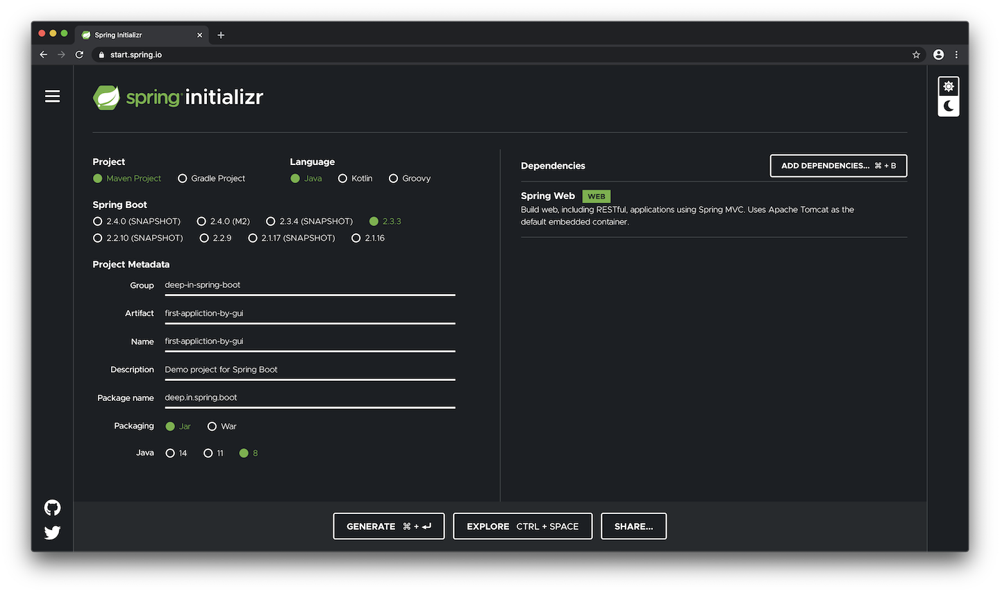
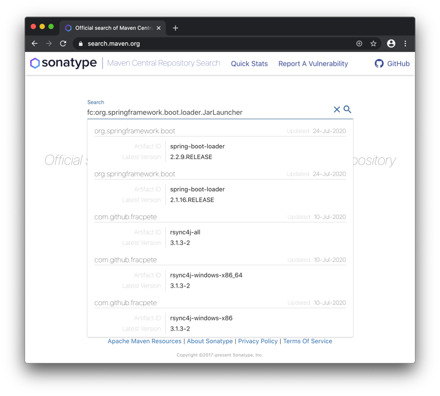
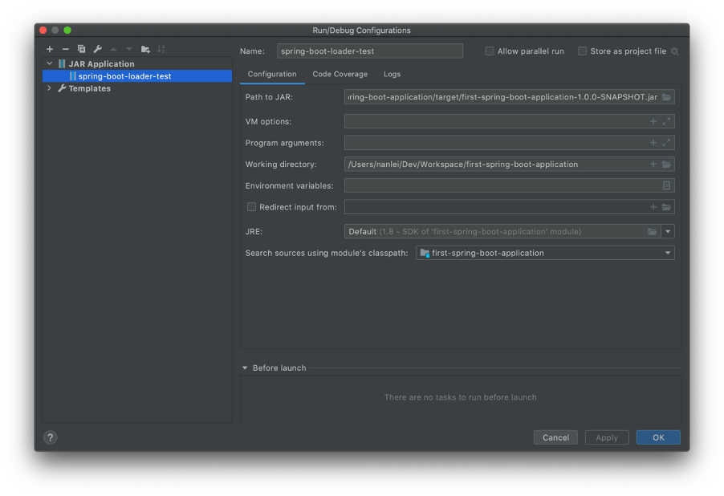
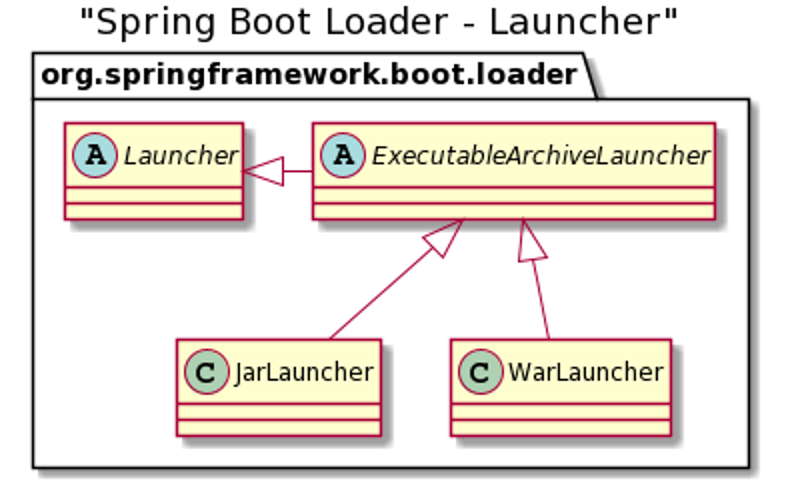

<h3 align="center"><b>01 - Spring Boot 应用程序</b></h3>

#### 1. 使用Maven命令行构建项目
```cmd
$ mvn archetype:generate -DgroupId=deep-in-spring-boot -DartifactId=first-spring-boot-application -Dversion=1.0.0-SNAPSHOT -DinteractiveMode=false -Dpackage=deep.in.spring.boot
```
类似结果：
```cmd
[INFO] Scanning for projects...
([INFO] 
[INFO] ------------------< org.apache.maven:standalone-pom >-------------------
[INFO] Building Maven Stub Project (No POM) 1
[INFO] --------------------------------[ pom ]---------------------------------
[INFO] 
[INFO] >>> maven-archetype-plugin:3.2.0:generate (default-cli) > generate-sources @ standalone-pom >>>
[INFO] 
[INFO] <<< maven-archetype-plugin:3.2.0:generate (default-cli) < generate-sources @ standalone-pom <<<
[INFO] 
[INFO] )
[INFO] --- maven-archetype-plugin:3.2.0:generate (default-cli) @ standalone-pom ---
[INFO] Generating project in Batch mode
[WARNING] No archetype found in remote catalog. Defaulting to internal catalog
[INFO] No archetype defined. Using maven-archetype-quickstart (org.apache.maven.archetypes:maven-archetype-quickstart:1.0)
[INFO] ----------------------------------------------------------------------------
[INFO] Using following parameters for creating project from Old (1.x) Archetype: maven-archetype-quickstart:1.0
[INFO] ----------------------------------------------------------------------------
[INFO] Parameter: basedir, Value: /Users/nanlei/Dev/Workspace
[INFO] Parameter: package, Value: deep.in.spring.boot
[INFO] Parameter: groupId, Value: deep-in-spring-boot
[INFO] Parameter: artifactId, Value: first-spring-boot-application
[INFO] Parameter: packageName, Value: deep.in.spring.boot
[INFO] Parameter: version, Value: 1.0.0-SNAPSHOT
[INFO] project created from Old (1.x) Archetype in dir: /Users/nanlei/Dev/Workspace/first-spring-boot-application
[INFO] ------------------------------------------------------------------------
[INFO] BUILD SUCCESS
[INFO] ------------------------------------------------------------------------
[INFO] Total time:  1.475 s
[INFO] Finished at: 2020-08-01T23:51:37+08:00
```

`archetype`是Maven插件`maven-archetype-plugin`的简称  
插件目标：`archetype:generate`   
插件参数：GAV信息`groupId`，`artifactId`，`version`和包名`package`    
交互式参数：`interactiveMode`为`false`，使用静默方式

查看项目结构：
```cmd
$ cd first-spring-boot-application/
$ ls -ls
total 8
8 -rw-r--r--  1 nanlei  staff  692 Aug  1 23:51 pom.xml
0 drwxr-xr-x  4 nanlei  staff  128 Aug  1 23:51 src
```

安装tree组件并再次查看：
```cmd
$ brew install tree
==> Downloading https://mirrors.aliyun.com/homebrew/homebrew-bottles/bottles/tree-1.8.0.catalina.bottle.tar.
######################################################################## 100.0%
==> Pouring tree-1.8.0.catalina.bottle.tar.gz
🍺  /usr/local/Cellar/tree/1.8.0: 8 files, 121.1KB
$ tree
.
├── pom.xml
└── src
    ├── main
    │   └── java
    │       └── deep
    │           └── in
    │               └── spring
    │                   └── boot
    │                       └── App.java
    └── test
        └── java
            └── deep
                └── in
                    └── spring
                        └── boot
                            └── AppTest.java

13 directories, 3 files
```

`App.java`是引导类，`AppTest.java`是单元测试类  
在`pom.xml`中，`archetype`插件添加了`junit`的依赖

在`pom.xml`中添加Spring Boot的web依赖：
```xml
<dependency>
  <groupId>org.springframework.boot</groupId>
  <artifactId>spring-boot-starter-web</artifactId>
  <version>2.3.1.RELEASE</version>
</dependency>
```

查看项目`dependency`树的变化：
```cmd
$ mvn dependency:tree -Dincludes=org.springframework*
[INFO] Scanning for projects...
[INFO] 
[INFO] ---------< deep-in-spring-boot:first-spring-boot-application >----------
[INFO] Building first-spring-boot-application 1.0.0-SNAPSHOT
[INFO] --------------------------------[ jar ]---------------------------------
[INFO] 
[INFO] --- maven-dependency-plugin:2.8:tree (default-cli) @ first-spring-boot-application ---
[INFO] deep-in-spring-boot:first-spring-boot-application:jar:1.0.0-SNAPSHOT
[INFO] \- org.springframework.boot:spring-boot-starter-web:jar:2.3.1.RELEASE:compile
[INFO]    +- org.springframework.boot:spring-boot-starter:jar:2.3.1.RELEASE:compile
[INFO]    |  +- org.springframework.boot:spring-boot:jar:2.3.1.RELEASE:compile
[INFO]    |  +- org.springframework.boot:spring-boot-autoconfigure:jar:2.3.1.RELEASE:compile
[INFO]    |  +- org.springframework.boot:spring-boot-starter-logging:jar:2.3.1.RELEASE:compile
[INFO]    |  \- org.springframework:spring-core:jar:5.2.7.RELEASE:compile
[INFO]    |     \- org.springframework:spring-jcl:jar:5.2.7.RELEASE:compile
[INFO]    +- org.springframework.boot:spring-boot-starter-json:jar:2.3.1.RELEASE:compile
[INFO]    +- org.springframework.boot:spring-boot-starter-tomcat:jar:2.3.1.RELEASE:compile
[INFO]    +- org.springframework:spring-web:jar:5.2.7.RELEASE:compile
[INFO]    |  \- org.springframework:spring-beans:jar:5.2.7.RELEASE:compile
[INFO]    \- org.springframework:spring-webmvc:jar:5.2.7.RELEASE:compile
[INFO]       +- org.springframework:spring-aop:jar:5.2.7.RELEASE:compile
[INFO]       +- org.springframework:spring-context:jar:5.2.7.RELEASE:compile
[INFO]       \- org.springframework:spring-expression:jar:5.2.7.RELEASE:compile
[INFO] ------------------------------------------------------------------------
[INFO] BUILD SUCCESS
[INFO] ------------------------------------------------------------------------
[INFO] Total time:  0.802 s
[INFO] Finished at: 2020-08-02T00:45:55+08:00
[INFO] ------------------------------------------------------------------------
```

编写`App.java`代码：
```java
@RestController
@SpringBootApplication
public class App {

    @RequestMapping("/")
    public String index() {
        return "Welcome to Spring Boot!";
    }

    public static void main(String[] args) {
        SpringApplication.run(App.class, args);
    }
}
```

使用Maven插件方式`mvn spring-boot:run`运行项目：
```cmd
$ mvn spring-boot:run
[INFO] Scanning for projects...
Downloading from aliyun-maven: http://maven.aliyun.com/nexus/content/groups/public/org/apache/maven/plugins/maven-metadata.xml
Downloading from aliyun-maven: http://maven.aliyun.com/nexus/content/groups/public/org/codehaus/mojo/maven-metadata.xml
Downloaded from aliyun-maven: http://maven.aliyun.com/nexus/content/groups/public/org/apache/maven/plugins/maven-metadata.xml (9.9 kB at 4.4 kB/s)
Downloaded from aliyun-maven: http://maven.aliyun.com/nexus/content/groups/public/org/codehaus/mojo/maven-metadata.xml (21 kB at 8.7 kB/s)
[INFO] ------------------------------------------------------------------------
[INFO] BUILD FAILURE
[INFO] ------------------------------------------------------------------------
[INFO] Total time:  2.835 s
[INFO] Finished at: 2020-08-02T01:00:07+08:00
[INFO] ------------------------------------------------------------------------
[ERROR] No plugin found for prefix 'spring-boot' in the current project and in the plugin groups [org.apache.maven.plugins, org.codehaus.mojo] available from the repositories [local (/Users/nanlei/.m2/repository), aliyun-maven (http://maven.aliyun.com/nexus/content/groups/public/)] -> [Help 1]
[ERROR] 
[ERROR] To see the full stack trace of the errors, re-run Maven with the -e switch.
[ERROR] Re-run Maven using the -X switch to enable full debug logging.
[ERROR] 
[ERROR] For more information about the errors and possible solutions, please read the following articles:
[ERROR] [Help 1] http://cwiki.apache.org/confluence/display/MAVEN/NoPluginFoundForPrefixException
```

查看官方文档  
https://docs.spring.io/spring-boot/docs/current/reference  

有如下内容：
>2.4.4. Running the Example  
At this point, your application should work. Since you used the `spring-boot-starter-parent` POM, you have a useful run goal that you can use to start the application. Type `mvn spring-boot:run` from the root project directory to start the application. 

在`pom.xml`中添加`spring-boot-starter-parent`：
```xml
<parent>
    <groupId>org.springframework.boot</groupId>
    <artifactId>spring-boot-starter-parent</artifactId>
    <version>2.3.1.RELEASE</version>
</parent>
```

再次运行：
```cmd
$ mvn spring-boot:run
[INFO] Scanning for projects...
[INFO] 
[INFO] ---------< deep-in-spring-boot:first-spring-boot-application >----------
[INFO] Building first-spring-boot-application 1.0.0-SNAPSHOT
[INFO] --------------------------------[ jar ]---------------------------------
[INFO] 
[INFO] >>> spring-boot-maven-plugin:2.3.1.RELEASE:run (default-cli) > test-compile @ first-spring-boot-application >>>
[INFO] 
[INFO] --- maven-resources-plugin:3.1.0:resources (default-resources) @ first-spring-boot-application ---
[INFO] Using 'UTF-8' encoding to copy filtered resources.
[INFO] skip non existing resourceDirectory /Users/nanlei/Dev/Workspace/first-spring-boot-application/src/main/resources
[INFO] skip non existing resourceDirectory /Users/nanlei/Dev/Workspace/first-spring-boot-application/src/main/resources
[INFO] 
[INFO] --- maven-compiler-plugin:3.8.1:compile (default-compile) @ first-spring-boot-application ---
[INFO] Nothing to compile - all classes are up to date
[INFO] 
[INFO] --- maven-resources-plugin:3.1.0:testResources (default-testResources) @ first-spring-boot-application ---
[INFO] Using 'UTF-8' encoding to copy filtered resources.
[INFO] skip non existing resourceDirectory /Users/nanlei/Dev/Workspace/first-spring-boot-application/src/test/resources
[INFO] 
[INFO] --- maven-compiler-plugin:3.8.1:testCompile (default-testCompile) @ first-spring-boot-application ---
[INFO] Nothing to compile - all classes are up to date
[INFO] 
[INFO] <<< spring-boot-maven-plugin:2.3.1.RELEASE:run (default-cli) < test-compile @ first-spring-boot-application <<<
[INFO] 
[INFO] 
[INFO] --- spring-boot-maven-plugin:2.3.1.RELEASE:run (default-cli) @ first-spring-boot-application ---
[INFO] Attaching agents: []

  .   ____          _            __ _ _
 /\\ / ___'_ __ _ _(_)_ __  __ _ \ \ \ \
( ( )\___ | '_ | '_| | '_ \/ _` | \ \ \ \
 \\/  ___)| |_)| | | | | || (_| |  ) ) ) )
  '  |____| .__|_| |_|_| |_\__, | / / / /
 =========|_|==============|___/=/_/_/_/
 :: Spring Boot ::        (v2.3.1.RELEASE)

2020-08-02 01:13:46.642  INFO 6736 --- [           main] deep.in.spring.boot.App                  : Starting App on nanleis-MacBook-Pro.local with PID 6736 (/Users/nanlei/Dev/Workspace/first-spring-boot-application/target/classes started by nanlei in /Users/nanlei/Dev/Workspace/first-spring-boot-application)
2020-08-02 01:13:46.644  INFO 6736 --- [           main] deep.in.spring.boot.App                  : No active profile set, falling back to default profiles: default
2020-08-02 01:13:47.141  INFO 6736 --- [           main] o.s.b.w.embedded.tomcat.TomcatWebServer  : Tomcat initialized with port(s): 8080 (http)
2020-08-02 01:13:47.147  INFO 6736 --- [           main] o.apache.catalina.core.StandardService   : Starting service [Tomcat]
2020-08-02 01:13:47.148  INFO 6736 --- [           main] org.apache.catalina.core.StandardEngine  : Starting Servlet engine: [Apache Tomcat/9.0.36]
2020-08-02 01:13:47.181  INFO 6736 --- [           main] o.a.c.c.C.[Tomcat].[localhost].[/]       : Initializing Spring embedded WebApplicationContext
2020-08-02 01:13:47.181  INFO 6736 --- [           main] w.s.c.ServletWebServerApplicationContext : Root WebApplicationContext: initialization completed in 507 ms
2020-08-02 01:13:47.268  INFO 6736 --- [           main] o.s.s.concurrent.ThreadPoolTaskExecutor  : Initializing ExecutorService 'applicationTaskExecutor'
2020-08-02 01:13:47.352  INFO 6736 --- [           main] o.s.b.w.embedded.tomcat.TomcatWebServer  : Tomcat started on port(s): 8080 (http) with context path ''
2020-08-02 01:13:47.359  INFO 6736 --- [           main] deep.in.spring.boot.App                  : Started App in 0.917 seconds (JVM running for 1.155)
```

检查HTTP服务和所写代码：
```cmd
$ curl http://127.0.0.1:8080/
Welcome to Spring Boot
```

#### 2. 图形化构建Spring Boot应用
https://start.spring.io/



拷贝生成好的zip包到项目目录：
```cmd
$ cp ~/Downloads/first-application-by-gui.zip .
```

解压缩该文件：
```cmd
$ unzip first-application-by-gui.zip 
Archive:  first-application-by-gui.zip
   creating: first-application-by-gui/
   creating: first-application-by-gui/.mvn/
   creating: first-application-by-gui/.mvn/wrapper/
  inflating: first-application-by-gui/.mvn/wrapper/maven-wrapper.properties  
  inflating: first-application-by-gui/.mvn/wrapper/MavenWrapperDownloader.java  
  inflating: first-application-by-gui/.mvn/wrapper/maven-wrapper.jar  
  inflating: first-application-by-gui/mvnw  
  inflating: first-application-by-gui/.gitignore  
  inflating: first-application-by-gui/HELP.md  
  inflating: first-application-by-gui/mvnw.cmd  
   creating: first-application-by-gui/src/
   creating: first-application-by-gui/src/main/
   creating: first-application-by-gui/src/main/resources/
   creating: first-application-by-gui/src/main/resources/templates/
  inflating: first-application-by-gui/src/main/resources/application.properties  
   creating: first-application-by-gui/src/main/resources/static/
   creating: first-application-by-gui/src/main/java/
   creating: first-application-by-gui/src/main/java/deep/
   creating: first-application-by-gui/src/main/java/deep/in/
   creating: first-application-by-gui/src/main/java/deep/in/spring/
   creating: first-application-by-gui/src/main/java/deep/in/spring/boot/
  inflating: first-application-by-gui/src/main/java/deep/in/spring/boot/FirstApplicationByGuiApplication.java  
   creating: first-application-by-gui/src/test/
   creating: first-application-by-gui/src/test/java/
   creating: first-application-by-gui/src/test/java/deep/
   creating: first-application-by-gui/src/test/java/deep/in/
   creating: first-application-by-gui/src/test/java/deep/in/spring/
   creating: first-application-by-gui/src/test/java/deep/in/spring/boot/
  inflating: first-application-by-gui/src/test/java/deep/in/spring/boot/FirstApplicationByGuiApplicationTests.java  
  inflating: first-application-by-gui/pom.xml  
```

使用`tree`命令查看：
```cmd
$ tree -a first-application-by-gui
first-application-by-gui
├── .gitignore
├── .mvn
│   └── wrapper
│       ├── MavenWrapperDownloader.java
│       ├── maven-wrapper.jar
│       └── maven-wrapper.properties
├── HELP.md
├── mvnw
├── mvnw.cmd
├── pom.xml
└── src
    ├── main
    │   ├── java
    │   │   └── deep
    │   │       └── in
    │   │           └── spring
    │   │               └── boot
    │   │                   └── FirstApplicationByGuiApplication.java
    │   └── resources
    │       ├── application.properties
    │       ├── static
    │       └── templates
    └── test
        └── java
            └── deep
                └── in
                    └── spring
                        └── boot
                            └── FirstApplicationByGuiApplicationTests.java

18 directories, 11 files
```

`.gitignore` 文件定义了常见的文件或目录的版本控制忽略名单，比如：
```cmd
HELP.md
target/
!.mvn/wrapper/maven-wrapper.jar
!**/src/main/**/target/
!**/src/test/**/target/

### STS ###
.apt_generated
.classpath
.factorypath
.project
.settings
.springBeans
.sts4-cache

### IntelliJ IDEA ###
.idea
*.iws
*.iml
*.ipr

### NetBeans ###
/nbproject/private/
/nbbuild/
/dist/
/nbdist/
/.nb-gradle/
build/
!**/src/main/**/build/
!**/src/test/**/build/

### VS Code ###
.vscode/
```

Maven Wrapper文件包含`.mvn`目录、`mvnw`和`mvnw.cmd`文件，  
参考：https://github.com/takari/maven-wrapper  
可以不安装Maven而直接使用，比如：
>Normally you instruct users to install a specific version of Apache Maven, put it on the PATH and then run the mvn command like the following:  
>```cmd
>mvn clean install
>```  
>But now, with a Maven Wrapper setup, you can instruct users to run wrapper scripts:  
>```cmd
>./mvnw clean install
>```

`application.properties`文件  是Spring Boot默认的应用外部配置文件，其配置属性可以影响应用程序的行为。

`FirstApplicationByGuiApplicationTests.java`文件  是Spring Boot单元测试的模版JUnit文件，其路径和对应的引导文件`FirstApplicationByGuiApplication.java`对应。

启动项目并访问：
```cmd
$ curl http://127.0.0.1:8080/
{"timestamp":"2020-08-02T08:57:15.817+00:00","status":404,"error":"Not Found","message":"","path":"/"}
```

因项目没有编写默认服务而报404错误  

安装`jsonpp`查看JSON响应：
```cmd
$ brew install jsonpp
==> Downloading https://mirrors.aliyun.com/homebrew/homebrew-bottles/bottles/jsonpp-1.3.0_1.catalina.bottle.tar.gz
######################################################################## 100.0%
==> Pouring jsonpp-1.3.0_1.catalina.bottle.tar.gz
🍺  /usr/local/Cellar/jsonpp/1.3.0_1: 5 files, 2.4MB
```

再次访问：
```cmd
$ curl http://127.0.0.1:8080 | jsonpp
  % Total    % Received % Xferd  Average Speed   Time    Time     Time  Current
                                 Dload  Upload   Total   Spent    Left  Speed
100   102    0   102    0     0  20400      0 --:--:-- --:--:-- --:--:-- 20400
{
  "timestamp": "2020-08-02T09:03:24.359+00:00",
  "status": 404,
  "error": "Not Found",
  "message": "",
  "path": "/"
}
```

#### 3. 创建Spring Boot应用程序的可执行JAR

>2.4.5. Creating an Executable Jar  
We finish our example by creating a completely self-contained executable jar file that we could run in production. Executable jars (sometimes called “fat jars”) are archives containing your compiled classes along with all of the jar dependencies that your code needs to run.

 可执行的JAR又称为“fat jars”

>To create an executable jar, we need to add the `spring-boot-maven-plugin` to our `pom.xml`. To do so, insert the following lines just below the `dependencies` section:

根据官方文档解释，添加如下内容到`pom.xml`中：
```xml
<build>
    <plugins>
        <plugin>
            <groupId>org.springframework.boot</groupId>
            <artifactId>spring-boot-maven-plugin</artifactId>
        </plugin>
    </plugins>
</build>
```

然后执行`mvn package`命令：
```cmd
$ mvn package
[INFO] Scanning for projects...
[INFO] 
[INFO] ------------< deep-in-spring-boot:first-application-by-gui >------------
[INFO] Building first-application-by-gui 0.0.1-SNAPSHOT
[INFO] --------------------------------[ jar ]---------------------------------
(省略部分内容...)
[INFO] -------------------------------------------------------
[INFO]  T E S T S
[INFO] -------------------------------------------------------
(省略部分内容...)
  .   ____          _            __ _ _
 /\\ / ___'_ __ _ _(_)_ __  __ _ \ \ \ \
( ( )\___ | '_ | '_| | '_ \/ _` | \ \ \ \
 \\/  ___)| |_)| | | | | || (_| |  ) ) ) )
  '  |____| .__|_| |_|_| |_\__, | / / / /
 =========|_|==============|___/=/_/_/_/
 :: Spring Boot ::        (v2.3.2.RELEASE)

2020-08-02 17:15:06.025  INFO 4060 --- [           main] .b.FirstApplicationByGuiApplicationTests : Starting FirstApplicationByGuiApplicationTests on nanleis-MacBook-Pro.local with PID 4060 (started by nanlei in /Users/nanlei/Dev/Workspace/first-application-by-gui)
2020-08-02 17:15:06.026  INFO 4060 --- [           main] .b.FirstApplicationByGuiApplicationTests : No active profile set, falling back to default profiles: default
2020-08-02 17:15:06.709  INFO 4060 --- [           main] o.s.s.concurrent.ThreadPoolTaskExecutor  : Initializing ExecutorService 'applicationTaskExecutor'
2020-08-02 17:15:06.958  INFO 4060 --- [           main] .b.FirstApplicationByGuiApplicationTests : Started FirstApplicationByGuiApplicationTests in 1.075 seconds (JVM running for 1.706)
[INFO] Tests run: 1, Failures: 0, Errors: 0, Skipped: 0, Time elapsed: 1.508 s - in deep.in.spring.boot.FirstApplicationByGuiApplicationTests
2020-08-02 17:15:07.127  INFO 4060 --- [extShutdownHook] o.s.s.concurrent.ThreadPoolTaskExecutor  : Shutting down ExecutorService 'applicationTaskExecutor'
[INFO] 
[INFO] Results:
[INFO] 
[INFO] Tests run: 1, Failures: 0, Errors: 0, Skipped: 0
[INFO] 
[INFO] 
[INFO] --- maven-jar-plugin:3.2.0:jar (default-jar) @ first-application-by-gui ---
[INFO] Building jar: /Users/nanlei/Dev/Workspace/first-application-by-gui/target/first-application-by-gui-0.0.1-SNAPSHOT.jar
[INFO] 
[INFO] --- spring-boot-maven-plugin:2.3.2.RELEASE:repackage (repackage) @ first-application-by-gui ---
[INFO] Replacing main artifact with repackaged archive
[INFO] ------------------------------------------------------------------------
[INFO] BUILD SUCCESS
[INFO] ------------------------------------------------------------------------
[INFO] Total time:  3.535 s
[INFO] Finished at: 2020-08-02T17:15:07+08:00
[INFO] ------------------------------------------------------------------------
```

最终生成的`first-application-by-gui-0.0.1-SNAPSHOT.jar`就在`target`目录下，使用`java -jar`命令运行JAR：
```cmd
$ java -jar target/first-application-by-gui-0.0.1-SNAPSHOT.jar

  .   ____          _            __ _ _
 /\\ / ___'_ __ _ _(_)_ __  __ _ \ \ \ \
( ( )\___ | '_ | '_| | '_ \/ _` | \ \ \ \
 \\/  ___)| |_)| | | | | || (_| |  ) ) ) )
  '  |____| .__|_| |_|_| |_\__, | / / / /
 =========|_|==============|___/=/_/_/_/
 :: Spring Boot ::        (v2.3.2.RELEASE)

2020-08-02 17:24:33.034  INFO 4219 --- [           main] d.i.s.b.FirstApplicationByGuiApplication : Starting FirstApplicationByGuiApplication v0.0.1-SNAPSHOT on nanleis-MacBook-Pro.local with PID 4219 (/Users/nanlei/Dev/Workspace/first-application-by-gui/target/first-application-by-gui-0.0.1-SNAPSHOT.jar started by nanlei in /Users/nanlei/Dev/Workspace/first-application-by-gui)
2020-08-02 17:24:33.036  INFO 4219 --- [           main] d.i.s.b.FirstApplicationByGuiApplication : No active profile set, falling back to default profiles: default
2020-08-02 17:24:33.800  INFO 4219 --- [           main] o.s.b.w.embedded.tomcat.TomcatWebServer  : Tomcat initialized with port(s): 8080 (http)
2020-08-02 17:24:33.809  INFO 4219 --- [           main] o.apache.catalina.core.StandardService   : Starting service [Tomcat]
2020-08-02 17:24:33.810  INFO 4219 --- [           main] org.apache.catalina.core.StandardEngine  : Starting Servlet engine: [Apache Tomcat/9.0.37]
2020-08-02 17:24:33.865  INFO 4219 --- [           main] o.a.c.c.C.[Tomcat].[localhost].[/]       : Initializing Spring embedded WebApplicationContext
2020-08-02 17:24:33.865  INFO 4219 --- [           main] w.s.c.ServletWebServerApplicationContext : Root WebApplicationContext: initialization completed in 785 ms
2020-08-02 17:24:34.031  INFO 4219 --- [           main] o.s.s.concurrent.ThreadPoolTaskExecutor  : Initializing ExecutorService 'applicationTaskExecutor'
2020-08-02 17:24:34.221  INFO 4219 --- [           main] o.s.b.w.embedded.tomcat.TomcatWebServer  : Tomcat started on port(s): 8080 (http) with context path ''
2020-08-02 17:24:34.231  INFO 4219 --- [           main] d.i.s.b.FirstApplicationByGuiApplication : Started FirstApplicationByGuiApplication in 1.523 seconds (JVM running for 1.894)
```

`java -jar`方式和`mvn spring-boot:run`方式基本无异

#### 4. Spring Boot可执行JAR资源结构

在`target`目录下执行`tree -h`
```cmd
$ tree -h
.
├── [ 128]  classes
│   ├── [   1]  application.properties
│   └── [  96]  deep
│       └── [  96]  in
│           └── [  96]  spring
│               └── [  96]  boot
│                   └── [ 790]  FirstApplicationByGuiApplication.class
├── [ 16M]  first-application-by-gui-0.0.1-SNAPSHOT.jar
├── [3.0K]  first-application-by-gui-0.0.1-SNAPSHOT.jar.original
├── [  96]  generated-sources
│   └── [  64]  annotations
├── [  96]  generated-test-sources
│   └── [  64]  test-annotations
├── [  96]  maven-archiver
│   └── [  87]  pom.properties
├── [  96]  maven-status
│   └── [ 128]  maven-compiler-plugin
│       ├── [  96]  compile
│       │   └── [ 128]  default-compile
│       │       ├── [  59]  createdFiles.lst
│       │       └── [ 125]  inputFiles.lst
│       └── [  96]  testCompile
│           └── [ 128]  default-testCompile
│               ├── [  64]  createdFiles.lst
│               └── [ 130]  inputFiles.lst
├── [ 128]  surefire-reports
│   ├── [ 18K]  TEST-deep.in.spring.boot.FirstApplicationByGuiApplicationTests.xml
│   └── [ 363]  deep.in.spring.boot.FirstApplicationByGuiApplicationTests.txt
└── [  96]  test-classes
    └── [  96]  deep
        └── [  96]  in
            └── [  96]  spring
                └── [  96]  boot
                    └── [ 588]  FirstApplicationByGuiApplicationTests.class

22 directories, 12 files
```

`first-application-by-gui-0.0.1-SNAPSHOT.jar.original`是未包含第三方依赖的本地资源(编译后的`classes`目录下的资源)，所占空间仅3K，而可执行JAR的大小为16M。

解压缩`first-application-by-gui-0.0.1-SNAPSHOT.jar`到临时目录temp并查看：
```cmd
$ unzip first-application-by-gui-0.0.1-SNAPSHOT.jar -d temp
Archive:  first-application-by-gui-0.0.1-SNAPSHOT.jar
   creating: temp/META-INF/
  inflating: temp/META-INF/MANIFEST.MF  
   creating: temp/org/
   creating: temp/org/springframework/
   creating: temp/org/springframework/boot/
   creating: temp/org/springframework/boot/loader/
(省略部分内容)
 extracting: temp/BOOT-INF/lib/tomcat-embed-websocket-9.0.37.jar  
 extracting: temp/BOOT-INF/lib/spring-web-5.2.8.RELEASE.jar  
 extracting: temp/BOOT-INF/lib/spring-beans-5.2.8.RELEASE.jar  
 extracting: temp/BOOT-INF/lib/spring-webmvc-5.2.8.RELEASE.jar  
 extracting: temp/BOOT-INF/lib/spring-aop-5.2.8.RELEASE.jar  
 extracting: temp/BOOT-INF/lib/spring-context-5.2.8.RELEASE.jar  
 extracting: temp/BOOT-INF/lib/spring-expression-5.2.8.RELEASE.jar  
 extracting: temp/BOOT-INF/lib/slf4j-api-1.7.30.jar  
 extracting: temp/BOOT-INF/lib/spring-core-5.2.8.RELEASE.jar  
 extracting: temp/BOOT-INF/lib/spring-jcl-5.2.8.RELEASE.jar  
  inflating: temp/BOOT-INF/classpath.idx 
```

查看temp目录的结构：
```cmd
$ tree temp/
temp/
├── BOOT-INF
│   ├── classes
│   │   ├── application.properties
│   │   └── deep
│   │       └── in
│   │           └── spring
│   │               └── boot
│   │                   └── FirstApplicationByGuiApplication.class
│   ├── classpath.idx
│   └── lib
│       ├── ...
│       ├── spring-aop-5.2.8.RELEASE.jar
│       ├── spring-beans-5.2.8.RELEASE.jar
│       ├── spring-boot-2.3.2.RELEASE.jar
│       ├── spring-boot-autoconfigure-2.3.2.RELEASE.jar
│       ├── ...
│       ├── tomcat-embed-core-9.0.37.jar
│       └── tomcat-embed-websocket-9.0.37.jar
├── META-INF
│   ├── MANIFEST.MF
│   └── maven
│       └── deep-in-spring-boot
│           └── first-application-by-gui
│               ├── pom.properties
│               └── pom.xml
└── org
    └── springframework
        └── boot
            └── loader
                ├── ClassPathIndexFile.class
                ├── ExecutableArchiveLauncher.class
                ├── JarLauncher.class
                ├── ...

20 directories, 100 files
```

其中

+ `BOOT-INT/classes` 目录存放应用编译后的class文件
+ `BOOT-INF/lib` 目录存放应用依赖的jar包
+ `META-INF` 目录存放应用相关的元信息，比如`MANIFEST.MF`文件
+ `org` 目录存放Spring Boot框架相关的class文件

解压缩`first-application-by-gui-0.0.1-SNAPSHOT.jar.original`文件并比较二者目录差异：
```cmd
$ unzip first-application-by-gui-0.0.1-SNAPSHOT.jar.original -d original
Archive:  first-application-by-gui-0.0.1-SNAPSHOT.jar.original
  inflating: original/META-INF/MANIFEST.MF  
   creating: original/deep/
   creating: original/deep/in/
   creating: original/deep/in/spring/
   creating: original/deep/in/spring/boot/
   creating: original/META-INF/maven/
   creating: original/META-INF/maven/deep-in-spring-boot/
   creating: original/META-INF/maven/deep-in-spring-boot/first-application-by-gui/
  inflating: original/deep/in/spring/boot/FirstApplicationByGuiApplication.class  
  inflating: original/application.properties  
  inflating: original/META-INF/maven/deep-in-spring-boot/first-application-by-gui/pom.xml  
  inflating: original/META-INF/maven/deep-in-spring-boot/first-application-by-gui/pom.properties  
$ tree original/
original/
├── META-INF
│   ├── MANIFEST.MF
│   └── maven
│       └── deep-in-spring-boot
│           └── first-application-by-gui
│               ├── pom.properties
│               └── pom.xml
├── application.properties
└── deep
    └── in
        └── spring
            └── boot
                └── FirstApplicationByGuiApplication.class

8 directories, 5 files
```

除了`META-INF`目录，其余均发生了变化，将class文件和`application.properties`放到了`BOOT-INF/classes`下，将所有依赖的jar包都放到了`BOOT-INF/lib`下。这和传统Java Web项目是类似的，所有class文件放在`WEB-INF/classes`下，而所有依赖在`WEB-INF/lib`下。

#### 5. JAR执行模块`spring-boot-loader`

可执行JAR包被`java -jar`命令执行时，其并不能感知jar文件是否是Spring Boot插件打包而来，执行按照标准JAR文件来进行。

Java标准参考：  
https://docs.oracle.com/javase/8/docs/technotes/tools/windows/java.html
>If the -jar option is specified, its argument is the name of the JAR file containing class and resource files for the application. The startup class must be indicated by the Main-Class manifest header in its source code.

也就是`MANIFEST.MF`文件必须在`META-INF`目录下，查看该文件:
```cmd
$ cd temp
$ cat META-INF/MANIFEST.MF 
Manifest-Version: 1.0
Spring-Boot-Classpath-Index: BOOT-INF/classpath.idx
Implementation-Title: first-application-by-gui
Implementation-Version: 0.0.1-SNAPSHOT
Start-Class: deep.in.spring.boot.FirstApplicationByGuiApplication
Spring-Boot-Classes: BOOT-INF/classes/
Spring-Boot-Lib: BOOT-INF/lib/
Build-Jdk-Spec: 1.8
Spring-Boot-Version: 2.3.2.RELEASE
Created-By: Maven Jar Plugin 3.2.0
Main-Class: org.springframework.boot.loader.JarLauncher
```

发现`Main-Class`属性为`org.springframework.boot.loader.JarLauncher`，而项目的引导类在`Start-Class`属性中，参考官方文档介绍：
>You need to specify an appropriate Launcher as the Main-Class attribute of META-INF/MANIFEST.MF. The actual class that you want to launch (that is, the class that contains a main method) should be specified in the Start-Class attribute.  
>The following example shows a typical MANIFEST.MF for an executable jar file:
>```
>Main-Class: org.springframework.boot.loader.JarLauncher
>Start-Class: com.mycompany.project.MyApplication
>```
>For a war file, it would be as follows:
>```
>Main-Class: org.springframework.boot.loader.WarLauncher
>Start-Class: com.mycompany.project.MyApplication
>```
可以看到，JAR和WAR对应了不同的`Launcher`实现.

因为`org.springframework.boot.loader.JarLauncher`并非项目中的文件，那么它是由`spring-boot-maven-plugin`插件在打包时引入的，为了研究，先去查找它的所属，在 https://search.maven.org/ 中，可以直接按类全名搜索，找到GAV信息



```xml
<dependency>
  <groupId>org.springframework.boot</groupId>
  <artifactId>spring-boot-loader</artifactId>
  <version>2.3.2.RELEASE</version>
</dependency>
```

既然`org.springframework.boot.loader.JarLauncher`是`MANIFEAST.MF`定义的主引导类，那么直接运行该文件也能启动项目：
```cmd
$ java org.springframework.boot.loader.JarLauncher

  .   ____          _            __ _ _
 /\\ / ___'_ __ _ _(_)_ __  __ _ \ \ \ \
( ( )\___ | '_ | '_| | '_ \/ _` | \ \ \ \
 \\/  ___)| |_)| | | | | || (_| |  ) ) ) )
  '  |____| .__|_| |_|_| |_\__, | / / / /
 =========|_|==============|___/=/_/_/_/
 :: Spring Boot ::        (v2.3.2.RELEASE)

2020-08-02 19:53:47.440  INFO 4807 --- [           main] d.i.s.b.FirstApplicationByGuiApplication : Starting FirstApplicationByGuiApplication v0.0.1-SNAPSHOT on nanleis-MacBook-Pro.local with PID 4807 (/Users/nanlei/Dev/Workspace/first-application-by-gui/target/temp/BOOT-INF/classes started by nanlei in /Users/nanlei/Dev/Workspace/first-application-by-gui/target/temp)
2020-08-02 19:53:47.442  INFO 4807 --- [           main] d.i.s.b.FirstApplicationByGuiApplication : No active profile set, falling back to default profiles: default
2020-08-02 19:53:48.060  INFO 4807 --- [           main] o.s.b.w.embedded.tomcat.TomcatWebServer  : Tomcat initialized with port(s): 8080 (http)
2020-08-02 19:53:48.069  INFO 4807 --- [           main] o.apache.catalina.core.StandardService   : Starting service [Tomcat]
2020-08-02 19:53:48.069  INFO 4807 --- [           main] org.apache.catalina.core.StandardEngine  : Starting Servlet engine: [Apache Tomcat/9.0.37]
2020-08-02 19:53:48.122  INFO 4807 --- [           main] o.a.c.c.C.[Tomcat].[localhost].[/]       : Initializing Spring embedded WebApplicationContext
2020-08-02 19:53:48.123  INFO 4807 --- [           main] w.s.c.ServletWebServerApplicationContext : Root WebApplicationContext: initialization completed in 645 ms
2020-08-02 19:53:48.286  INFO 4807 --- [           main] o.s.s.concurrent.ThreadPoolTaskExecutor  : Initializing ExecutorService 'applicationTaskExecutor'
2020-08-02 19:53:48.439  INFO 4807 --- [           main] o.s.b.w.embedded.tomcat.TomcatWebServer  : Tomcat started on port(s): 8080 (http) with context path ''
2020-08-02 19:53:48.448  INFO 4807 --- [           main] d.i.s.b.FirstApplicationByGuiApplication : Started FirstApplicationByGuiApplication in 1.288 seconds (JVM running for 1.585)
```

从输出中也能看到`deep.in.spring.boot.FirstApplicationByGuiApplication`被`JarLauncher`装载并执行，也就是`META-INF/MANIFEST.MF`中的`Start-Class`被`JarLauncher`执行。若直接使用java命令执行`deep.in.spring.boot.FirstApplicationByGuiApplication`：

```cmd
$ cd BOOT-INF/classes
$ java deep.in.spring.boot.FirstApplicationByGuiApplication
Exception in thread "main" java.lang.NoClassDefFoundError: org/springframework/boot/SpringApplication
	at deep.in.spring.boot.FirstApplicationByGuiApplication.main(FirstApplicationByGuiApplication.java:10)
Caused by: java.lang.ClassNotFoundException: org.springframework.boot.SpringApplication
	at java.net.URLClassLoader.findClass(URLClassLoader.java:382)
	at java.lang.ClassLoader.loadClass(ClassLoader.java:418)
	at sun.misc.Launcher$AppClassLoader.loadClass(Launcher.java:355)
	at java.lang.ClassLoader.loadClass(ClassLoader.java:351)
	... 1 more
```

提示找不到类`org.springframework.boot.SpringApplication`，这是由于java命令没有指定`classpath`，加上`classpath`参数之后，也能启动程序：
```cmd
$ java -classpath ".:../lib/*" deep.in.spring.boot.FirstApplicationByGuiApplication
```

#### 6. JarLauncher的实现原理

在`pom.xml`中添加如下内容，用于源码分析：
```xml
<!-- spring-boot-loader 分析 -->
<dependency>
    <groupId>org.springframework.boot</groupId>
    <artifactId>spring-boot-loader</artifactId>
    <scope>provided</scope>
</dependency>
```

>以下分析均基于org.springframework.boot:spring-boot-loader:2.3.1.RELEASE

因为运行时`spring-boot-loader`在JAR文件中存在，所以这里`scope`定为`provided`。

在IDEA中对`spring-boot-loader`开启断点调试：
+ 将项目打包
+ 在IDEA的`Run/Debug Configuration`中新建`JAR Application`
+ 填写相关信息，如下图


在IDEA中按`command+O`查找`org.springframework.boot.loader.JarLauncher`，即可从`main()`方法开始跟踪调试。

`JarLauncher`继承自`org.springframework.boot.loader.Launcher`，关系如下图所示：



`JarLauncher`的`main()`方法为：
```java
	public static void main(String[] args) throws Exception {
		new JarLauncher().launch(args);
	}
```

`Launcher#launch(args)`实现为：
```java
	protected void launch(String[] args) throws Exception {
		if (!isExploded()) {
			JarFile.registerUrlProtocolHandler();
		}
		ClassLoader classLoader = createClassLoader(getClassPathArchivesIterator());
		String jarMode = System.getProperty("jarmode");
		String launchClass = (jarMode != null && !jarMode.isEmpty()) ? JAR_MODE_LAUNCHER : getMainClass();
		launch(args, launchClass, classLoader);
	}
```

其中`JarFile.registerUrlProtocolHandler()`方法为：
```java
	private static final String PROTOCOL_HANDLER = "java.protocol.handler.pkgs";

	private static final String HANDLERS_PACKAGE = "org.springframework.boot.loader";

	/**
	 * Register a {@literal 'java.protocol.handler.pkgs'} property so that a
	 * {@link URLStreamHandler} will be located to deal with jar URLs.
	 */
	public static void registerUrlProtocolHandler() {
		String handlers = System.getProperty(PROTOCOL_HANDLER, "");
		System.setProperty(PROTOCOL_HANDLER,
				("".equals(handlers) ? HANDLERS_PACKAGE : handlers + "|" + HANDLERS_PACKAGE));
		resetCachedUrlHandlers();
	}

	/**
	 * Reset any cached handlers just in case a jar protocol has already been used. We
	 * reset the handler by trying to set a null {@link URLStreamHandlerFactory} which
	 * should have no effect other than clearing the handlers cache.
	 */
	private static void resetCachedUrlHandlers() {
		try {
			URL.setURLStreamHandlerFactory(null);
		}
		catch (Error ex) {
			// Ignore
		}
	}
```

该方法将`org.springframework.boot.loader`追加到Java系统属性`java.protocol.handler.pkgs`中，也就是`org.springframework.boot.loader`包下存在一个`Handler`类，即`org.springframework.boot.loader.jar.Handler`，它扩展了`URLStreamHandler`，这是`java.net.URLStreamHandler`的扩展机制实现的，由`URL#getURLStreamHandler(String protocol)`方法提供：
```java
    private static final String protocolPathProp = "java.protocol.handler.pkgs";

    /**
     * A table of protocol handlers.
     */
    static Hashtable<String,URLStreamHandler> handlers = new Hashtable<>();
    private static Object streamHandlerLock = new Object();

    /**
     * Returns the Stream Handler.
     * @param protocol the protocol to use
     */
    static URLStreamHandler getURLStreamHandler(String protocol) {

        URLStreamHandler handler = handlers.get(protocol);
        if (handler == null) {

            boolean checkedWithFactory = false;

            // Use the factory (if any)
            if (factory != null) {
                handler = factory.createURLStreamHandler(protocol);
                checkedWithFactory = true;
            }

            // Try java protocol handler
            if (handler == null) {
                String packagePrefixList = null;

                packagePrefixList
                    = java.security.AccessController.doPrivileged(
                    new sun.security.action.GetPropertyAction(
                        protocolPathProp,""));
                if (packagePrefixList != "") {
                    packagePrefixList += "|";
                }

                // REMIND: decide whether to allow the "null" class prefix
                // or not.
                packagePrefixList += "sun.net.www.protocol";

                StringTokenizer packagePrefixIter =
                    new StringTokenizer(packagePrefixList, "|");

                while (handler == null &&
                       packagePrefixIter.hasMoreTokens()) {

                    String packagePrefix =
                      packagePrefixIter.nextToken().trim();
                    try {
                        String clsName = packagePrefix + "." + protocol +
                          ".Handler";
                        Class<?> cls = null;
                        try {
                            cls = Class.forName(clsName);
                        } catch (ClassNotFoundException e) {
                            ClassLoader cl = ClassLoader.getSystemClassLoader();
                            if (cl != null) {
                                cls = cl.loadClass(clsName);
                            }
                        }
                        if (cls != null) {
                            handler  =
                              (URLStreamHandler)cls.newInstance();
                        }
                    } catch (Exception e) {
                        // any number of exceptions can get thrown here
                    }
                }
            }

            synchronized (streamHandlerLock) {

                URLStreamHandler handler2 = null;

                // Check again with hashtable just in case another
                // thread created a handler since we last checked
                handler2 = handlers.get(protocol);

                if (handler2 != null) {
                    return handler2;
                }

                // Check with factory if another thread set a
                // factory since our last check
                if (!checkedWithFactory && factory != null) {
                    handler2 = factory.createURLStreamHandler(protocol);
                }

                if (handler2 != null) {
                    // The handler from the factory must be given more
                    // importance. Discard the default handler that
                    // this thread created.
                    handler = handler2;
                }

                // Insert this handler into the hashtable
                if (handler != null) {
                    handlers.put(protocol, handler);
                }

            }
        }

        return handler;

    }
```

其中JDK内建协议放在`sun.net.www.protocol`包下，类全名模式为`sun.net.www.protocol.${protocol}.Handler`，`${protocol}`为协议名，常见协议有：

+ FILE : `sun.net.www.protocol.file.Handler`
+ JAR : `sun.net.www.prorocol.jar.Handler`
+ HTTP : `sun.net.www.prorocol.http.Handler`
+ HTTPS : `sun.net.www.prorocol.https.Handler`
+ FTP : `sun.net.www.prorocol.ftp.Handler`

回到`org.springframework.boot.loader.jar.Handler`中，按照类名模式，实现协议为JAR，覆盖了JDK的内建实现，因为Spring Boot的FAT JAR包含了传统的java JAR资源，还包含了依赖的JAR文件，它是一个独立的应用归档文件，当使用`java -jar`命令来引导时，内部的JAR文件无法被内建的`sun.net.www.prorocol.jar.Handler`当作`classpath`，所以需要替换实现。
>具体可以参考`org.springframework.boot.loader.jar.JarURLConnection#get(URL url, JarFile jarFile)`方法和`org.springframework.boot.loader.jar.JarFile`类。

`Launcher#launch(args)`方法的第二步为`createClassLoader(getClassPathArchivesIterator())`，其中`getClassPathArchivesIterator()`方法由`ExecutableArchiveLauncher`提供：
```java
	@Override
	protected Iterator<Archive> getClassPathArchivesIterator() throws Exception {
		Archive.EntryFilter searchFilter = this::isSearchCandidate;
		Iterator<Archive> archives = this.archive.getNestedArchives(searchFilter,
				(entry) -> isNestedArchive(entry) && !isEntryIndexed(entry));
		if (isPostProcessingClassPathArchives()) {
			archives = applyClassPathArchivePostProcessing(archives);
		}
		return archives;
	}
```

而`isNestedArchive(Archive.Entry entry)`方法则由子类`JarLauncher`或`WarLauncher`提供，在`JarLauncher`中：
```java
    static final EntryFilter NESTED_ARCHIVE_ENTRY_FILTER = (entry) -> {
		if (entry.isDirectory()) {
			return entry.getName().equals("BOOT-INF/classes/");
		}
		return entry.getName().startsWith("BOOT-INF/lib/");
	};

	@Override
	protected boolean isNestedArchive(Archive.Entry entry) {
		return NESTED_ARCHIVE_ENTRY_FILTER.matches(entry);
	}
```

也就是过滤`Archive.Entry`所匹配的名称是`BOOT-INF/classes/`还是`BOOT-INF/lib/`前缀，而`getClassPathArchivesIterator()`方法返回结果还是取决于`archive`属性的内容：
```java
	public ExecutableArchiveLauncher() {
		try {
			this.archive = createArchive();
			this.classPathIndex = getClassPathIndex(this.archive);
		}
		catch (Exception ex) {
			throw new IllegalStateException(ex);
		}
	}
```

此处`archive`源于父类`Launcher`的`createArchive()`方法：
```java
	protected final Archive createArchive() throws Exception {
		ProtectionDomain protectionDomain = getClass().getProtectionDomain();
		CodeSource codeSource = protectionDomain.getCodeSource();
		URI location = (codeSource != null) ? codeSource.getLocation().toURI() : null;
		String path = (location != null) ? location.getSchemeSpecificPart() : null;
		if (path == null) {
			throw new IllegalStateException("Unable to determine code source archive");
		}
		File root = new File(path);
		if (!root.exists()) {
			throw new IllegalStateException("Unable to determine code source archive from " + root);
		}
		return (root.isDirectory() ? new ExplodedArchive(root) : new JarFileArchive(root));
	}
```

这里主要通过`Launcher`所在的媒介，判断是`JarFileArchive`还是`ExplodedArchive`(解压目录)，因为该方法是`final`类型，所以子类`JarLauncher`或`WarLauncher`均继承该实现。

再往后就是根据获取到的archives去创建`ClassLoader`，在`ExecutableArchiveLauncher`中：
```java
	@Override
	protected ClassLoader createClassLoader(Iterator<Archive> archives) throws Exception {
		List<URL> urls = new ArrayList<>(guessClassPathSize());
		while (archives.hasNext()) {
			urls.add(archives.next().getUrl());
		}
		if (this.classPathIndex != null) {
			urls.addAll(this.classPathIndex.getUrls());
		}
		return createClassLoader(urls.toArray(new URL[0]));
	}
```

最后调用`Launcher`中的`createClassLoader(URL[] urls)`方法创建`ClassLoader`：
```java
	protected ClassLoader createClassLoader(URL[] urls) throws Exception {
		return new LaunchedURLClassLoader(isExploded(), getArchive(), urls, getClass().getClassLoader());
	}
```

之后确定`launchClass`的内容，就是从`MANIFEST.MF`中获取`Start-Class`的内容，在`ExecutableArchiveLauncher`中：
```java
    private static final String START_CLASS_ATTRIBUTE = "Start-Class";

	@Override
	protected String getMainClass() throws Exception {
		Manifest manifest = this.archive.getManifest();
		String mainClass = null;
		if (manifest != null) {
			mainClass = manifest.getMainAttributes().getValue(START_CLASS_ATTRIBUTE);
		}
		if (mainClass == null) {
			throw new IllegalStateException("No 'Start-Class' manifest entry specified in " + this);
		}
		return mainClass;
	}
```

紧接着调用实际的引导类`launch(String[] args, String launchClass, ClassLoader classLoader)`
```java
    protected void launch(String[] args, String launchClass, ClassLoader classLoader) throws Exception {
		Thread.currentThread().setContextClassLoader(classLoader);
		createMainMethodRunner(launchClass, args, classLoader).run();
	}

    protected MainMethodRunner createMainMethodRunner(String mainClass, String[] args, ClassLoader classLoader) {
		return new MainMethodRunner(mainClass, args);
	}
```

实际执行的方法为`MainMethodRunner#run()`：
```java
public class MainMethodRunner {

	private final String mainClassName;

	private final String[] args;

	public MainMethodRunner(String mainClass, String[] args) {
		this.mainClassName = mainClass;
		this.args = (args != null) ? args.clone() : null;
	}

	public void run() throws Exception {
		Class<?> mainClass = Class.forName(this.mainClassName, false, Thread.currentThread().getContextClassLoader());
		Method mainMethod = mainClass.getDeclaredMethod("main", String[].class);
		mainMethod.setAccessible(true);
		mainMethod.invoke(null, new Object[] { this.args });
	}

}
```

最后将`mainClass`中的`main(String[])`方法按静态方法调用，最终`JarLauncher`是在同进程内调用`Start-Class`的`main(String[])`方法，并且在这之前准备好Class Path。

#### 7. WarLauncher的差异

和`JarLauncher`差异不大，二者都是继承自`ExecutableArchiveLauncher`：
```java
public class WarLauncher extends ExecutableArchiveLauncher {

	public WarLauncher() {
	}

	protected WarLauncher(Archive archive) {
		super(archive);
	}

	@Override
	protected boolean isPostProcessingClassPathArchives() {
		return false;
	}

	@Override
	protected boolean isSearchCandidate(Entry entry) {
		return entry.getName().startsWith("WEB-INF/");
	}

	@Override
	public boolean isNestedArchive(Archive.Entry entry) {
		if (entry.isDirectory()) {
			return entry.getName().equals("WEB-INF/classes/");
		}
		return entry.getName().startsWith("WEB-INF/lib/") || entry.getName().startsWith("WEB-INF/lib-provided/");
	}

	public static void main(String[] args) throws Exception {
		new WarLauncher().launch(args);
	}

}
```

主要区别在于和JAR的Class Path不同，`WEB-INF/classes/`和`WEB-INF/lib/`是传统Servlet应用的Class Path路径，`WEB-INF/lib-provided/`是Spring Boot的`WarLauncher`定制实现。

将`pom.xml`的`<packaging>`元素改为`war`：
```xml
<packaging>war</packaging>
```

再次使用Maven进行打包：
```cmd
$ mvn clean package
[INFO] Scanning for projects...
[INFO] 
[INFO] ---------< deep-in-spring-boot:first-spring-boot-application >----------
[INFO] Building first-spring-boot-application 1.0.0-SNAPSHOT
[INFO] --------------------------------[ war ]---------------------------------
[INFO] 
[INFO] --- maven-clean-plugin:3.1.0:clean (default-clean) @ first-spring-boot-application ---
[INFO] Deleting /Users/nanlei/Dev/Workspace/first-spring-boot-application/target
[INFO] 
[INFO] --- maven-resources-plugin:3.1.0:resources (default-resources) @ first-spring-boot-application ---
[INFO] Using 'UTF-8' encoding to copy filtered resources.
[INFO] skip non existing resourceDirectory /Users/nanlei/Dev/Workspace/first-spring-boot-application/src/main/resources
[INFO] skip non existing resourceDirectory /Users/nanlei/Dev/Workspace/first-spring-boot-application/src/main/resources
[INFO] 
[INFO] --- maven-compiler-plugin:3.8.1:compile (default-compile) @ first-spring-boot-application ---
[INFO] Changes detected - recompiling the module!
[INFO] Compiling 1 source file to /Users/nanlei/Dev/Workspace/first-spring-boot-application/target/classes
[INFO] 
[INFO] --- maven-resources-plugin:3.1.0:testResources (default-testResources) @ first-spring-boot-application ---
[INFO] Using 'UTF-8' encoding to copy filtered resources.
[INFO] skip non existing resourceDirectory /Users/nanlei/Dev/Workspace/first-spring-boot-application/src/test/resources
[INFO] 
[INFO] --- maven-compiler-plugin:3.8.1:testCompile (default-testCompile) @ first-spring-boot-application ---
[INFO] Changes detected - recompiling the module!
[INFO] Compiling 1 source file to /Users/nanlei/Dev/Workspace/first-spring-boot-application/target/test-classes
[INFO] 
[INFO] --- maven-surefire-plugin:2.22.2:test (default-test) @ first-spring-boot-application ---
[INFO] 
[INFO] -------------------------------------------------------
[INFO]  T E S T S
[INFO] -------------------------------------------------------
[INFO] Running deep.in.spring.boot.AppTest
[INFO] Tests run: 1, Failures: 0, Errors: 0, Skipped: 0, Time elapsed: 0.003 s - in deep.in.spring.boot.AppTest
[INFO] 
[INFO] Results:
[INFO] 
[INFO] Tests run: 1, Failures: 0, Errors: 0, Skipped: 0
[INFO] 
[INFO] 
[INFO] --- maven-war-plugin:3.2.3:war (default-war) @ first-spring-boot-application ---
[INFO] Packaging webapp
[INFO] Assembling webapp [first-spring-boot-application] in [/Users/nanlei/Dev/Workspace/first-spring-boot-application/target/first-spring-boot-application-1.0.0-SNAPSHOT]
[INFO] Processing war project
[INFO] Webapp assembled in [102 msecs]
[INFO] Building war: /Users/nanlei/Dev/Workspace/first-spring-boot-application/target/first-spring-boot-application-1.0.0-SNAPSHOT.war
[INFO] 
[INFO] --- spring-boot-maven-plugin:2.3.1.RELEASE:repackage (repackage) @ first-spring-boot-application ---
[INFO] Replacing main artifact with repackaged archive
[INFO] ------------------------------------------------------------------------
[INFO] BUILD SUCCESS
[INFO] ------------------------------------------------------------------------
[INFO] Total time:  3.457 s
[INFO] Finished at: 2020-08-04T00:23:52+08:00
[INFO] ------------------------------------------------------------------------
```

切换到`target`目录，将`first-spring-boot-application-1.0.0-SNAPSHOT.war`解压缩到temp目录下：
```cmd
$ cd target
$ unzip first-spring-boot-application-1.0.0-SNAPSHOT.war -d temp
Archive:  first-spring-boot-application-1.0.0-SNAPSHOT.war
   creating: temp/META-INF/
  inflating: temp/META-INF/MANIFEST.MF  
   creating: temp/org/
   creating: temp/org/springframework/
   creating: temp/org/springframework/boot/
   creating: temp/org/springframework/boot/loader/
  inflating: temp/org/springframework/boot/loader/ClassPathIndexFile.class  
  (省略部分内容...)
  inflating: temp/org/springframework/boot/loader/util/SystemPropertyUtils.class  
   creating: temp/WEB-INF/
   creating: temp/WEB-INF/classes/
   creating: temp/WEB-INF/classes/deep/
   creating: temp/WEB-INF/classes/deep/in/
   creating: temp/WEB-INF/classes/deep/in/spring/
   creating: temp/WEB-INF/classes/deep/in/spring/boot/
   creating: temp/WEB-INF/lib/
  inflating: temp/WEB-INF/classes/deep/in/spring/boot/App.class  
 extracting: temp/WEB-INF/lib/jackson-datatype-jsr310-2.11.0.jar  
  (省略部分内容...)
 extracting: temp/WEB-INF/lib/snakeyaml-1.26.jar  
   creating: temp/META-INF/maven/
   creating: temp/META-INF/maven/deep-in-spring-boot/
   creating: temp/META-INF/maven/deep-in-spring-boot/first-spring-boot-application/
  inflating: temp/META-INF/maven/deep-in-spring-boot/first-spring-boot-application/pom.xml  
  inflating: temp/META-INF/maven/deep-in-spring-boot/first-spring-boot-application/pom.properties  
 extracting: temp/WEB-INF/lib/log4j-to-slf4j-2.13.3.jar  
 extracting: temp/WEB-INF/lib/spring-context-5.2.7.RELEASE.jar  
 extracting: temp/WEB-INF/lib/spring-core-5.2.7.RELEASE.jar  
 extracting: temp/WEB-INF/lib/jul-to-slf4j-1.7.30.jar  
 extracting: temp/WEB-INF/lib/spring-boot-starter-2.3.1.RELEASE.jar  
 extracting: temp/WEB-INF/lib/spring-webmvc-5.2.7.RELEASE.jar  
   creating: temp/WEB-INF/lib-provided/
 extracting: temp/WEB-INF/lib-provided/spring-boot-loader-2.3.1.RELEASE.jar  
```

使用tree观察目录结构：
```cmd
 $ cd temp
 $ tree
.
├── META-INF
│   ├── MANIFEST.MF
│   └── maven
│       └── deep-in-spring-boot
│           └── first-spring-boot-application
│               ├── pom.properties
│               └── pom.xml
├── WEB-INF
│   ├── classes
│   │   └── deep
│   │       └── in
│   │           └── spring
│   │               └── boot
│   │                   └── App.class
│   ├── lib
│   │   ├── jackson-annotations-2.11.0.jar
│   │   ├── (省略部分内容...)
│   │   └── tomcat-embed-websocket-9.0.36.jar
│   └── lib-provided
│       └── spring-boot-loader-2.3.1.RELEASE.jar
└── org
    └── springframework
        └── boot
            └── loader
                ├── ClassPathIndexFile.class
                ├── ExecutableArchiveLauncher.class
                ├── JarLauncher.class
                ├── (省略部分内容...)
                ├── WarLauncher.class
                ├── (省略部分内容...)

21 directories, 99 files
```

相比JAR的解压目录，WAR增加了`/WEB-INF/lib-provided/`，并且该目录下仅有一个JAR文件，就是`spring-boot-loader-2.3.1.RELEASE.jar`，也就是该目录下存放了`scope`为`provided`的JAR文件。

因为传统`Servlet`项目并不需要这个目录，那么`/WEB-INF/lib-provided/`中的JAR将被`Servlet`容器忽略，又比如Servlet API，该API由容器提供，但编码时需要。这样设计的好处在于WAR文件能够在`Servlet`容器中兼容运行。

查看`META-INF/MANIFEST.MF`的内容：
```cmd
 $ cat META-INF/MANIFEST.MF 
Manifest-Version: 1.0
Implementation-Title: first-spring-boot-application
Implementation-Version: 1.0.0-SNAPSHOT
Start-Class: deep.in.spring.boot.App
Spring-Boot-Classes: WEB-INF/classes/
Spring-Boot-Lib: WEB-INF/lib/
Build-Jdk-Spec: 1.8
Spring-Boot-Version: 2.3.1.RELEASE
Created-By: Maven Archiver 3.4.0
Implementation-Vendor: Pivotal Software, Inc.
Main-Class: org.springframework.boot.loader.WarLauncher
```

更改为`war`方式打包后，`Main-Class`就是`org.springframework.boot.loader.WarLauncher`了，而`Start-Class`仍然不变。既然是`WarLauncher`为主引导类，那么依然可以使用`java -jar`命令来启动：
```cmd
$ java -jar first-spring-boot-application-1.0.0-SNAPSHOT.war

  .   ____          _            __ _ _
 /\\ / ___'_ __ _ _(_)_ __  __ _ \ \ \ \
( ( )\___ | '_ | '_| | '_ \/ _` | \ \ \ \
 \\/  ___)| |_)| | | | | || (_| |  ) ) ) )
  '  |____| .__|_| |_|_| |_\__, | / / / /
 =========|_|==============|___/=/_/_/_/
 :: Spring Boot ::        (v2.3.1.RELEASE)

2020-08-04 00:34:25.529  INFO 35990 --- [           main] deep.in.spring.boot.App                  : Starting App v1.0.0-SNAPSHOT on nanleis-MacBook-Pro.local with PID 35990 (/Users/nanlei/Dev/Workspace/first-spring-boot-application/target/first-spring-boot-application-1.0.0-SNAPSHOT.war started by nanlei in /Users/nanlei/Dev/Workspace/first-spring-boot-application/target)
2020-08-04 00:34:25.532  INFO 35990 --- [           main] deep.in.spring.boot.App                  : No active profile set, falling back to default profiles: default
2020-08-04 00:34:26.576  INFO 35990 --- [           main] o.s.b.w.embedded.tomcat.TomcatWebServer  : Tomcat initialized with port(s): 8080 (http)
2020-08-04 00:34:26.589  INFO 35990 --- [           main] o.apache.catalina.core.StandardService   : Starting service [Tomcat]
2020-08-04 00:34:26.589  INFO 35990 --- [           main] org.apache.catalina.core.StandardEngine  : Starting Servlet engine: [Apache Tomcat/9.0.36]
2020-08-04 00:34:27.039  INFO 35990 --- [           main] o.a.c.c.C.[Tomcat].[localhost].[/]       : Initializing Spring embedded WebApplicationContext
2020-08-04 00:34:27.040  INFO 35990 --- [           main] w.s.c.ServletWebServerApplicationContext : Root WebApplicationContext: initialization completed in 1449 ms
2020-08-04 00:34:27.220  INFO 35990 --- [           main] o.s.s.concurrent.ThreadPoolTaskExecutor  : Initializing ExecutorService 'applicationTaskExecutor'
2020-08-04 00:34:27.473  INFO 35990 --- [           main] o.s.b.w.embedded.tomcat.TomcatWebServer  : Tomcat started on port(s): 8080 (http) with context path ''
2020-08-04 00:34:27.487  INFO 35990 --- [           main] deep.in.spring.boot.App                  : Started App in 2.373 seconds (JVM running for 2.815)
```

由此可见，打包WAR文件是一种兼容措施，既能被`WarLauncher`启动，也能兼容`Servlet`容器。也就是说，`JarLauncher`和`WarLauncher`并无本质差别。