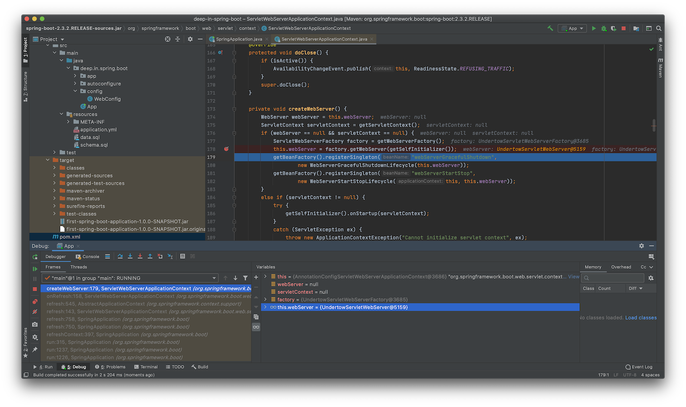
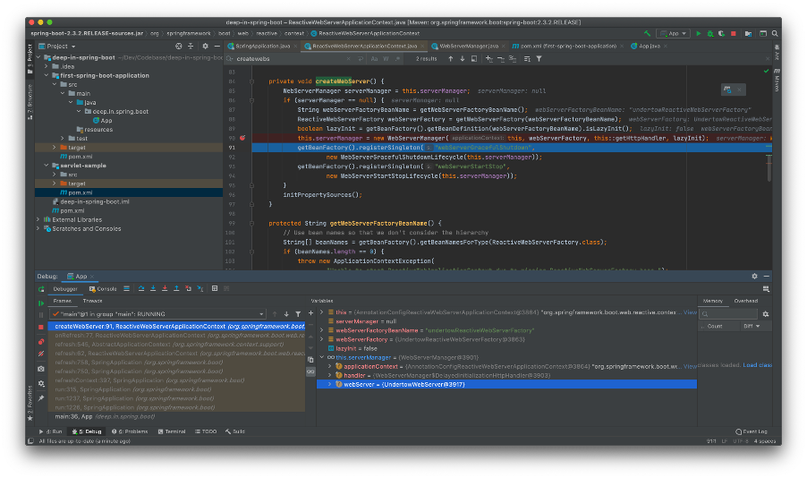

<h3 align="center"><b>03 - 嵌入式Web容器</b></h3>

### 嵌入式Servlet Web容器

从之前项目启动的日志中，总能看到一行：
```text
[           main] o.s.b.w.embedded.tomcat.TomcatWebServer  : Tomcat started on port(s): 8080 (http) with context path ''
```

说明项目使用的Web容器是Tomcat，而在`pom.xml`中没有直接引入相关依赖，而在WAR包的解压目录下，可以看到`WEB-INF/lib/spring-boot-starter-tomcat-2.3.2.RELEASE.jar`的存在，说明该JAR文件应该由`spring-boot-starter-web`间接引入，使用Maven的`dependency`插件可以看到依赖关系：
```cmd
$ mvn dependency:tree -Dincludes=*:spring-boot-starter-tomcat:jar:2.3.2.RELEASE
[INFO] Scanning for projects...
[INFO] 
[INFO] ---------< deep-in-spring-boot:first-spring-boot-application >----------
[INFO] Building first-spring-boot-application 1.0.0-SNAPSHOT
[INFO] --------------------------------[ war ]---------------------------------
[INFO] 
[INFO] --- maven-dependency-plugin:2.8:tree (default-cli) @ first-spring-boot-application ---
[INFO] deep-in-spring-boot:first-spring-boot-application:war:1.0.0-SNAPSHOT
[INFO] \- org.springframework.boot:spring-boot-starter-web:jar:2.3.2.RELEASE:compile
[INFO]    \- org.springframework.boot:spring-boot-starter-tomcat:jar:2.3.2.RELEASE:compile
[INFO] ------------------------------------------------------------------------
[INFO] BUILD SUCCESS
[INFO] ------------------------------------------------------------------------
[INFO] Total time:  1.107 s
[INFO] Finished at: 2020-08-04T14:47:52+08:00
[INFO] ------------------------------------------------------------------------
```

在[Spring Boot官方网站](https://spring.io/projects/spring-boot "Spring Boot官方网站")，介绍Spring Boot的特性时，有如下内容
>Embed Tomcat, Jetty or Undertow directly (no need to deploy WAR files)

示例项目都是`Servlet` Web程序，Spring Boot准备了3种嵌入式Web容器，分别是`Tomcat`，`Jetty`和`Undertow`。

在官方文档中，对3种Servlet容器的相关介绍：
>Spring Boot supports the following embedded servlet containers:
>
>| Name | Servlet Version |
>| :----: | :----: |
>| Tomcat 9.0 | 4.0 |
>| Jetty 9.4 | 3.1 |
>| Undertow 2.0 | 4.0 |
>
>You can also deploy Spring Boot applications to any Servlet 3.1+ compatible container.

#### 1. Tomcat作为嵌入式Servlet Web容器

嵌入式Tomcat作为Web应用的一部分，结合其API实现Servlet容器的引导。同样，Tomcat也提供了Maven插件，不需要编码，也不需要外置Tomcat容器，将当前应用直接打包为可运行的JAR或WAR文件，通过`java -jar`命令启动。

新建项目`servlet-sample`，结构如下：
```cmd
$ tree .
.
├── pom.xml
└── src
    ├── main
    │   ├── java
    │   │   └── deep
    │   │       └── in
    │   │           └── spring
    │   │               └── boot
    │   │                   └── servlet
    │   │                       └── HelloServlet.java
    │   ├── resources
    │   └── webapp
    │       └── WEB-INF
    │           └── web.xml
    └── test
        └── java

13 directories, 3 files
```

传统的Java Web项目，需要在web根路径下有`WEB-INF/web.xml`文件存在，内容如下：
```xml
<?xml version="1.0" encoding="UTF-8"?>
<web-app xmlns:xsi="http://www.w3.org/2001/XMLSchema-instance" xmlns="http://java.sun.com/xml/ns/javaee"
         xsi:schemaLocation="http://java.sun.com/xml/ns/javaee http://java.sun.com/xml/ns/javaee/web-app_3_0.xsd"
         version="3.0">

    <servlet>
        <!-- Servlet 声明 -->
        <servlet-name>HelloServlet</servlet-name>
        <servlet-class>deep.in.spring.boot.servlet.HelloServlet</servlet-class>
        <init-param>
            <param-name>init-param1</param-name>
            <param-value>param1</param-value>
        </init-param>
    </servlet>

    <!-- 声明 Servlet 映射 -->
    <servlet-mapping>
        <!-- 关联 Servlet-->
        <servlet-name>HelloServlet</servlet-name>
        <url-pattern>/hello</url-pattern>
    </servlet-mapping>
</web-app>
```

声明了一个Servlet，并配置一对初始化参数，同时声明该Servlet的映射地址，编写Servlet类：
```java
public class HelloServlet extends HttpServlet {
    @Override
    public void init(ServletConfig servletConfig) {
        Collections.list(servletConfig.getInitParameterNames())
                .forEach(name -> {
                    System.out.println("Init param name : " + name
                            + " , value : " + servletConfig.getInitParameter(name));
                });
    }

    /**
     * 输出 HTTP 请求参数 "messsage" 的内容（支持任意 HTTP 方法）
     *
     * @param request  {@link HttpServletRequest}
     * @param response {@link HttpServletResponse}
     * @throws IOException
     * @throws ServletException
     */
    @Override
    public void service(HttpServletRequest request, HttpServletResponse response)
            throws IOException, ServletException {
        // 获取请求参数 "message" 内容
        String message = request.getParameter("message");
        System.out.println("message : " + message);
        PrintWriter writer = response.getWriter();
        // 输出 "message" 参数内容
        writer.println(message);
        writer.flush();
    }
}
```

项目的`pom.xml`中引入相关依赖和插件配置：
```xml
<?xml version="1.0" encoding="UTF-8"?>
<project xmlns="http://maven.apache.org/POM/4.0.0"
         xmlns:xsi="http://www.w3.org/2001/XMLSchema-instance"
         xsi:schemaLocation="http://maven.apache.org/POM/4.0.0 http://maven.apache.org/xsd/maven-4.0.0.xsd">
    <modelVersion>4.0.0</modelVersion>
    <groupId>deep-in-spring-boot</groupId>
    <artifactId>servlet-sample</artifactId>
    <version>1.0.0-SNAPSHOT</version>
    <packaging>war</packaging>
    <properties>
        <project.build.sourceEncoding>UTF-8</project.build.sourceEncoding>
    </properties>
    <dependencies>
        <!-- 使用 Servlet 3.1 API -->
        <dependency>
            <groupId>javax.servlet</groupId>
            <artifactId>javax.servlet-api</artifactId>
            <version>3.1.0</version>
            <scope>provided</scope>
        </dependency>
    </dependencies>
    <build>
        <plugins>
            <!-- Tomcat 8 Maven 插件用于构建可执行 war -->
            <!-- https://mvnrepository.com/artifact/org.apache.tomcat.maven/tomcat8-maven-plugin -->
            <plugin>
                <groupId>org.apache.tomcat.maven</groupId>
                <artifactId>tomcat8-maven-plugin</artifactId>
                <version>3.0-r1655215</version>
                <executions>
                    <execution>
                        <id>tomcat-run</id>
                        <goals>
                            <!-- 最终打包成可执行的jar包 -->
                            <goal>exec-war-only</goal>
                        </goals>
                        <phase>package</phase>
                        <configuration>
                            <!-- ServletContext 路径 -->
                            <path>/</path>
                        </configuration>
                    </execution>
                </executions>
            </plugin>
            <plugin>
                <groupId>org.apache.maven.plugins</groupId>
                <artifactId>maven-compiler-plugin</artifactId>
                <configuration>
                    <source>8</source>
                    <target>8</target>
                </configuration>
            </plugin>
        </plugins>
    </build>

    <pluginRepositories>
        <pluginRepository>
            <!-- tomcat8-maven-plugin 所在仓库 -->
            <id>Alfresco</id>
            <name>Alfresco Repository</name>
            <url>https://artifacts.alfresco.com/nexus/content/repositories/public/</url>
            <snapshots>
                <enabled>false</enabled>
            </snapshots>
        </pluginRepository>
    </pluginRepositories>
</project>
```

准备好所需内容后直接执行打包：
```cmd
$ mvn clean package
[INFO] Scanning for projects...
[INFO] 
[INFO] -----------------< deep-in-spring-boot:servlet-sample >-----------------
[INFO] Building servlet-sample 1.0.0-SNAPSHOT
[INFO] --------------------------------[ war ]---------------------------------
[INFO] 
[INFO] --- maven-clean-plugin:2.5:clean (default-clean) @ servlet-sample ---
[INFO] Deleting /Users/nanlei/Dev/Codebase/deep-in-spring-boot/servlet-sample/target
[INFO] 
[INFO] --- maven-resources-plugin:2.6:resources (default-resources) @ servlet-sample ---
[INFO] Using 'UTF-8' encoding to copy filtered resources.
[INFO] Copying 0 resource
[INFO] 
[INFO] --- maven-compiler-plugin:3.8.1:compile (default-compile) @ servlet-sample ---
[INFO] Changes detected - recompiling the module!
[INFO] Compiling 1 source file to /Users/nanlei/Dev/Codebase/deep-in-spring-boot/servlet-sample/target/classes
[INFO] 
[INFO] --- maven-resources-plugin:2.6:testResources (default-testResources) @ servlet-sample ---
[INFO] Using 'UTF-8' encoding to copy filtered resources.
[INFO] skip non existing resourceDirectory /Users/nanlei/Dev/Codebase/deep-in-spring-boot/servlet-sample/src/test/resources
[INFO] 
[INFO] --- maven-compiler-plugin:3.8.1:testCompile (default-testCompile) @ servlet-sample ---
[INFO] Changes detected - recompiling the module!
[INFO] 
[INFO] --- maven-surefire-plugin:2.12.4:test (default-test) @ servlet-sample ---
[INFO] 
[INFO] --- maven-war-plugin:2.2:war (default-war) @ servlet-sample ---
[INFO] Packaging webapp
[INFO] Assembling webapp [servlet-sample] in [/Users/nanlei/Dev/Codebase/deep-in-spring-boot/servlet-sample/target/servlet-sample-1.0.0-SNAPSHOT]
[INFO] Processing war project
[INFO] Copying webapp resources [/Users/nanlei/Dev/Codebase/deep-in-spring-boot/servlet-sample/src/main/webapp]
[INFO] Webapp assembled in [26 msecs]
[INFO] Building war: /Users/nanlei/Dev/Codebase/deep-in-spring-boot/servlet-sample/target/servlet-sample-1.0.0-SNAPSHOT.war
[INFO] WEB-INF/web.xml already added, skipping
[INFO] 
[INFO] --- tomcat8-maven-plugin:3.0-r1655215:exec-war-only (tomcat-run) @ servlet-sample ---
[INFO] ------------------------------------------------------------------------
[INFO] BUILD SUCCESS
[INFO] ------------------------------------------------------------------------
[INFO] Total time:  3.817 s
[INFO] Finished at: 2020-08-06T14:47:16+08:00
[INFO] ------------------------------------------------------------------------
```

打包完成，使用`java -jar`命令运行：
```cmd
$ cd target
$ java -jar servlet-sample-1.0.0-SNAPSHOT-war-exec.jar
Aug 06, 2020 2:50:17 PM org.apache.coyote.http11.Http11NioProtocol init
INFO: Initializing ProtocolHandler ["http-nio-8080"]
Aug 06, 2020 2:50:17 PM org.apache.tomcat.util.net.NioSelectorPool getSharedSelector
INFO: Using a shared selector for servlet write/read
Aug 06, 2020 2:50:17 PM org.apache.catalina.core.StandardService startInternal
INFO: Starting service Tomcat
Aug 06, 2020 2:50:17 PM org.apache.catalina.core.StandardEngine startInternal
INFO: Starting Servlet Engine: Apache Tomcat/8.0.14
Aug 06, 2020 2:50:18 PM org.apache.jasper.servlet.TldScanner scanJars
INFO: At least one JAR was scanned for TLDs yet contained no TLDs. Enable debug logging for this logger for a complete list of JARs that were scanned but no TLDs were found in them. Skipping unneeded JARs during scanning can improve startup time and JSP compilation time.
Aug 06, 2020 2:50:18 PM org.apache.coyote.http11.Http11NioProtocol start
INFO: Starting ProtocolHandler ["http-nio-8080"]
```

测试HTTP服务：
```cmd
$ curl http://127.0.0.1:8080/hello?message=helloworld
helloworld
```

同时可以看到命令行输出：
```cmd
Init param name : init-param1 , value : param1
message : helloworld
```

此时在target目录下出现解压的`.extract`目录，观察结构：
```cmd
$ tree .extract/
.extract/
├── conf
│   └── web.xml
├── logs
│   └── access_log.2020-08-06
├── temp
├── webapps
│   ├── ROOT
│   │   ├── META-INF
│   │   │   ├── MANIFEST.MF
│   │   │   └── maven
│   │   │       └── deep-in-spring-boot
│   │   │           └── servlet-sample
│   │   │               ├── pom.properties
│   │   │               └── pom.xml
│   │   └── WEB-INF
│   │       ├── classes
│   │       │   └── deep
│   │       │       └── in
│   │       │           └── spring
│   │       │               └── boot
│   │       │                   └── servlet
│   │       │                       └── HelloServlet.class
│   │       └── web.xml
│   └── ROOT.war
└── work
    └── Tomcat
        └── localhost
            └── ROOT

20 directories, 8 files
```

由此可见，Tomcat Maven插件并非嵌入式Tomcat，仍为传统Tomcat容器部署方式，将应用打包为`ROOT.war`，然后在Tomcat启动过程中将`ROOT.war`部署到`webapps`目录，但该插件支持指定`ServletContext`路径。

Spring Boot使用嵌入式Tomcat构建为`TomcatWebServer` Bean，由Spring上下文将其引导，嵌入式组件的运行，`ClassLoader`的装载均由Spring Boot框架完成。

Tomcat Maven插件打包后的JAR或WAR属于非FAT模式，归档文件会被压缩，而Spring Boot Maven插件`spring-boot-maven-plugin`使用零压缩模式，将应用归档到JAR或WAR包中，在jar命令帮助中有介绍：
```cmd
$ jar
Usage: jar {ctxui}[vfmn0PMe] [jar-file] [manifest-file] [entry-point] [-C dir] files ...
Options:
    -c  create new archive
    -t  list table of contents for archive
    -x  extract named (or all) files from archive
    -u  update existing archive
    -v  generate verbose output on standard output
    -f  specify archive file name
    -m  include manifest information from specified manifest file
    -n  perform Pack200 normalization after creating a new archive
    -e  specify application entry point for stand-alone application 
        bundled into an executable jar file
    -0  store only; use no ZIP compression
    -P  preserve leading '/' (absolute path) and ".." (parent directory) components from file names
    -M  do not create a manifest file for the entries
    -i  generate index information for the specified jar files
    -C  change to the specified directory and include the following file
If any file is a directory then it is processed recursively.
The manifest file name, the archive file name and the entry point name are
specified in the same order as the 'm', 'f' and 'e' flags.

Example 1: to archive two class files into an archive called classes.jar: 
       jar cvf classes.jar Foo.class Bar.class 
Example 2: use an existing manifest file 'mymanifest' and archive all the
           files in the foo/ directory into 'classes.jar': 
       jar cvfm classes.jar mymanifest -C foo/ .
```

传统Servlet容器将压缩的WAR文件解压到对应目录，再加载该目录中的资源。而Spring Boot的可执行WAR文件需要在不解压的前提下读取其中资源，也就是`spring-boot-loader`需要覆盖内建JAR协议的URLStreamHandler的原因所在。

#### 2. Jetty作为嵌入式Servlet Web容器

将默认的嵌入式容器Tomact切换至Jetty的步骤非常简单，官方文档对此有详细说明：
><b>Use Another Web Server</b>  
>Many Spring Boot starters include default embedded containers.
>
>For servlet stack applications, the `spring-boot-starter-web` includes Tomcat by including `spring-boot-starter-tomcat`, but you can use `spring-boot-starter-jetty` or `spring-boot-starter-undertow` instead.
>
>For reactive stack applications, the `spring-boot-starter-webflux` includes Reactor Netty by including `spring-boot-starter-reactor-netty`, but you can use `spring-boot-starter-tomcat`, `spring-boot-starter-jetty`, or `spring-boot-starter-undertow` instead.
>
>When switching to a different HTTP server, you need to exclude the default dependencies in addition to including the one you need. To help with this process, Spring Boot provides a separate starter for each of the supported HTTP servers.
>
>The following Maven example shows how to exclude Tomcat and include Jetty for Spring MVC:
>
>```xml
><properties>
>    <servlet-api.version>3.1.0</servlet-api.version>
></properties>
><dependency>
>    <groupId>org.springframework.boot</groupId>
>    <artifactId>spring-boot-starter-web</artifactId>
>    <exclusions>
>        <!-- Exclude the Tomcat dependency -->
>        <exclusion>
>            <groupId>org.springframework.boot</groupId>
>            <artifactId>spring-boot-starter-tomcat</artifactId>
>        </exclusion>
>    </exclusions>
></dependency>
><!-- Use Jetty instead -->
><dependency>
>    <groupId>org.springframework.boot</groupId>
>    <artifactId>spring-boot-starter-jetty</artifactId>
></dependency>
>```
>
>The version of the Servlet API has been overridden as, unlike Tomcat 9 and Undertow 2.0, Jetty 9.4 does not support Servlet 4.0.

根据官方文档的说明，新建项目`embedded-web-server`。前面分析过`spring-boot-starter-tomcat`为`spring-boot-starter-web`间接引入，所以在依赖中需要排除，再添加新的Jetty依赖`spring-boot-starter-jetty`即可。

运行项目：
```cmd
$ mvn spring-boot:run
[INFO] Scanning for projects...
(省略部分内容...)
[INFO] <<< spring-boot-maven-plugin:2.3.2.RELEASE:run (default-cli) < test-compile @ first-spring-boot-application <<<
[INFO] 
[INFO] 
[INFO] --- spring-boot-maven-plugin:2.3.2.RELEASE:run (default-cli) @ first-spring-boot-application ---
[INFO] Attaching agents: []

  .   ____          _            __ _ _
 /\\ / ___'_ __ _ _(_)_ __  __ _ \ \ \ \
( ( )\___ | '_ | '_| | '_ \/ _` | \ \ \ \
 \\/  ___)| |_)| | | | | || (_| |  ) ) ) )
  '  |____| .__|_| |_|_| |_\__, | / / / /
 =========|_|==============|___/=/_/_/_/
 :: Spring Boot ::        (v2.3.2.RELEASE)

2020-08-06 17:50:22.470  INFO 8185 --- [           main] deep.in.spring.boot.App                  : Starting App on nanleis-MacBook-Pro.local with PID 8185 (/Users/nanlei/Dev/Codebase/deep-in-spring-boot/first-spring-boot-application/target/classes started by nanlei in /Users/nanlei/Dev/Codebase/deep-in-spring-boot/first-spring-boot-application)
2020-08-06 17:50:22.472  INFO 8185 --- [           main] deep.in.spring.boot.App                  : No active profile set, falling back to default profiles: default
2020-08-06 17:50:22.916  INFO 8185 --- [           main] org.eclipse.jetty.util.log               : Logging initialized @947ms to org.eclipse.jetty.util.log.Slf4jLog
2020-08-06 17:50:23.023  INFO 8185 --- [           main] o.s.b.w.e.j.JettyServletWebServerFactory : Server initialized with port: 8080
2020-08-06 17:50:23.024  INFO 8185 --- [           main] org.eclipse.jetty.server.Server          : jetty-9.4.30.v20200611; built: 2020-06-11T12:34:51.929Z; git: 271836e4c1f4612f12b7bb13ef5a92a927634b0d; jvm 1.8.0_251-b08
2020-08-06 17:50:23.043  INFO 8185 --- [           main] o.e.j.s.h.ContextHandler.application     : Initializing Spring embedded WebApplicationContext
2020-08-06 17:50:23.043  INFO 8185 --- [           main] w.s.c.ServletWebServerApplicationContext : Root WebApplicationContext: initialization completed in 531 ms
2020-08-06 17:50:23.111  INFO 8185 --- [           main] org.eclipse.jetty.server.session         : DefaultSessionIdManager workerName=node0
2020-08-06 17:50:23.111  INFO 8185 --- [           main] org.eclipse.jetty.server.session         : No SessionScavenger set, using defaults
2020-08-06 17:50:23.112  INFO 8185 --- [           main] org.eclipse.jetty.server.session         : node0 Scavenging every 660000ms
2020-08-06 17:50:23.118  INFO 8185 --- [           main] o.e.jetty.server.handler.ContextHandler  : Started o.s.b.w.e.j.JettyEmbeddedWebAppContext@6c67e137{application,/,[file:///private/var/folders/dy/g2n42jw12y3g6th2pgtz59_c0000gn/T/jetty-docbase.8002049805771173289.8080/],AVAILABLE}
2020-08-06 17:50:23.118  INFO 8185 --- [           main] org.eclipse.jetty.server.Server          : Started @1150ms
2020-08-06 17:50:23.214  INFO 8185 --- [           main] o.s.s.concurrent.ThreadPoolTaskExecutor  : Initializing ExecutorService 'applicationTaskExecutor'
2020-08-06 17:50:23.303  INFO 8185 --- [           main] o.e.j.s.h.ContextHandler.application     : Initializing Spring DispatcherServlet 'dispatcherServlet'
2020-08-06 17:50:23.303  INFO 8185 --- [           main] o.s.web.servlet.DispatcherServlet        : Initializing Servlet 'dispatcherServlet'
2020-08-06 17:50:23.307  INFO 8185 --- [           main] o.s.web.servlet.DispatcherServlet        : Completed initialization in 4 ms
2020-08-06 17:50:23.334  INFO 8185 --- [           main] o.e.jetty.server.AbstractConnector       : Started ServerConnector@b6b1987{HTTP/1.1, (http/1.1)}{0.0.0.0:8080}
2020-08-06 17:50:23.336  INFO 8185 --- [           main] o.s.b.web.embedded.jetty.JettyWebServer  : Jetty started on port(s) 8080 (http/1.1) with context path '/'
2020-08-06 17:50:23.343  INFO 8185 --- [           main] deep.in.spring.boot.App                  : Started App in 1.098 seconds (JVM running for 1.374)
```

项目正常启动，不同的是，运行容器切换到了Jetty，其中`org.springframework.boot.web.embedded.jetty.JettyWebServer`就是Spring Boot结合Jetty API实现的`org.springframework.boot.web.server.WebServer` Bean。

#### 3. Undertow作为嵌入式Servlet Web容器

若将Servlet容器切换到Undertow，移除`spring-boot-starter-tomcat`依赖后再添加`spring-boot-starter-undertow`依赖即可，再次运行项目：
```cmd
$ mvn spring-boot:run
[INFO] Scanning for projects...
(省略部分内容...)
[INFO] <<< spring-boot-maven-plugin:2.3.2.RELEASE:run (default-cli) < test-compile @ first-spring-boot-application <<<
[INFO] 
[INFO] 
[INFO] --- spring-boot-maven-plugin:2.3.2.RELEASE:run (default-cli) @ first-spring-boot-application ---
[INFO] Attaching agents: []

  .   ____          _            __ _ _
 /\\ / ___'_ __ _ _(_)_ __  __ _ \ \ \ \
( ( )\___ | '_ | '_| | '_ \/ _` | \ \ \ \
 \\/  ___)| |_)| | | | | || (_| |  ) ) ) )
  '  |____| .__|_| |_|_| |_\__, | / / / /
 =========|_|==============|___/=/_/_/_/
 :: Spring Boot ::        (v2.3.2.RELEASE)

2020-08-06 18:06:05.804  INFO 8332 --- [           main] deep.in.spring.boot.App                  : Starting App on nanleis-MacBook-Pro.local with PID 8332 (/Users/nanlei/Dev/Codebase/deep-in-spring-boot/first-spring-boot-application/target/classes started by nanlei in /Users/nanlei/Dev/Codebase/deep-in-spring-boot/first-spring-boot-application)
2020-08-06 18:06:05.806  INFO 8332 --- [           main] deep.in.spring.boot.App                  : No active profile set, falling back to default profiles: default
2020-08-06 18:06:06.317  WARN 8332 --- [           main] io.undertow.websockets.jsr               : UT026010: Buffer pool was not set on WebSocketDeploymentInfo, the default pool will be used
2020-08-06 18:06:06.334  INFO 8332 --- [           main] io.undertow.servlet                      : Initializing Spring embedded WebApplicationContext
2020-08-06 18:06:06.334  INFO 8332 --- [           main] w.s.c.ServletWebServerApplicationContext : Root WebApplicationContext: initialization completed in 488 ms
2020-08-06 18:06:06.449  INFO 8332 --- [           main] o.s.s.concurrent.ThreadPoolTaskExecutor  : Initializing ExecutorService 'applicationTaskExecutor'
2020-08-06 18:06:06.531  INFO 8332 --- [           main] io.undertow                              : starting server: Undertow - 2.1.3.Final
2020-08-06 18:06:06.534  INFO 8332 --- [           main] org.xnio                                 : XNIO version 3.8.0.Final
2020-08-06 18:06:06.542  INFO 8332 --- [           main] org.xnio.nio                             : XNIO NIO Implementation Version 3.8.0.Final
2020-08-06 18:06:06.601  INFO 8332 --- [           main] org.jboss.threads                        : JBoss Threads version 3.1.0.Final
2020-08-06 18:06:06.649  INFO 8332 --- [           main] o.s.b.w.e.undertow.UndertowWebServer     : Undertow started on port(s) 8080 (http)
2020-08-06 18:06:06.656  INFO 8332 --- [           main] deep.in.spring.boot.App                  : Started App in 1.068 seconds (JVM running for 1.323)
```

从日志中可以看到，Undertow Web容器已经成功启动，但这里的输出日志是`UndertowWebServer`，而实际上此处Undertow的实现是`org.springframework.boot.web.embedded.undertow.UndertowServletWebServer`，它继承自`UndertowWebServer`，由于当前版本的子类`UndertowServletWebServer`中没有定义日志输出，而是在父类`UndertowWebServer`进行中输出的，所以在日志上没有明确说明。

这里也可以进行断点跟踪来确定，在`ServletWebServerApplicationContext`中有`createWebServer()`方法，在Spring Boot项目启动过程中会执行到此，进行断点跟踪，就能明确实际创建的`WebServer`的具体实例是什么。



### 嵌入式Reactive Web容器

嵌入式Reactive Web容器通常处于被动激活状态，需要增加`spring-boot-starter-webflux`依赖，而它和`spring-boot-starter-web`同时存在时，`spring-boot-starter-webflux`会被忽略，这是`SpringApplication`中对Web应用类型的推断决定的：
```java
    /**
	 * Create a new {@link SpringApplication} instance. The application context will load
	 * beans from the specified primary sources (see {@link SpringApplication class-level}
	 * documentation for details. The instance can be customized before calling
	 * {@link #run(String...)}.
	 * @param resourceLoader the resource loader to use
	 * @param primarySources the primary bean sources
	 * @see #run(Class, String[])
	 * @see #setSources(Set)
	 */
	@SuppressWarnings({ "unchecked", "rawtypes" })
	public SpringApplication(ResourceLoader resourceLoader, Class<?>... primarySources) {
		this.resourceLoader = resourceLoader;
		Assert.notNull(primarySources, "PrimarySources must not be null");
		this.primarySources = new LinkedHashSet<>(Arrays.asList(primarySources));
		this.webApplicationType = WebApplicationType.deduceFromClasspath();
		setInitializers((Collection) getSpringFactoriesInstances(ApplicationContextInitializer.class));
		setListeners((Collection) getSpringFactoriesInstances(ApplicationListener.class));
		this.mainApplicationClass = deduceMainApplicationClass();
	}
```

创建`SpringApplication`实例时，`this.webApplicationType = WebApplicationType.deduceFromClasspath();`就是对Web应用的类型进行推断，其具体逻辑在枚举类`WebApplicationType`中：
```java
    private static final String WEBMVC_INDICATOR_CLASS = "org.springframework.web.servlet.DispatcherServlet";

	private static final String WEBFLUX_INDICATOR_CLASS = "org.springframework.web.reactive.DispatcherHandler";

	private static final String JERSEY_INDICATOR_CLASS = "org.glassfish.jersey.servlet.ServletContainer";

	private static final String SERVLET_APPLICATION_CONTEXT_CLASS = "org.springframework.web.context.WebApplicationContext";

	static WebApplicationType deduceFromClasspath() {
		if (ClassUtils.isPresent(WEBFLUX_INDICATOR_CLASS, null) && !ClassUtils.isPresent(WEBMVC_INDICATOR_CLASS, null)
				&& !ClassUtils.isPresent(JERSEY_INDICATOR_CLASS, null)) {
			return WebApplicationType.REACTIVE;
		}
		for (String className : SERVLET_INDICATOR_CLASSES) {
			if (!ClassUtils.isPresent(className, null)) {
				return WebApplicationType.NONE;
			}
		}
		return WebApplicationType.SERVLET;
	}
```

可以很容易看出，只有当`spring-boot-starter-webflux`单独存在是，`WebApplicationType`才是REACTIVE类型。

#### 4. Undertow作为嵌入式Reactive Web容器

修改pom.xml，添加相关依赖：
```xml
    <dependencies>
        <dependency>
            <groupId>org.springframework.boot</groupId>
            <artifactId>spring-boot-starter-webflux</artifactId>
            <version>2.3.2.RELEASE</version>
        </dependency>
        <dependency>
            <groupId>org.springframework.boot</groupId>
            <artifactId>spring-boot-starter-undertow</artifactId>
        </dependency>
    </dependencies>
```

编写一些WebFlux代码，并将`maven-compiler-plugin`的编译级别调整到1.8：
```java
@RestController
@SpringBootApplication
public class App {

    @RequestMapping("/")
    public String index() {
        return "Welcome to SpringBoot";
    }

    @Bean
    public RouterFunction<ServerResponse> helloworld() {
        return route(GET("/helloworld"),
                request -> ok().body(Mono.just("Hello World"), String.class)
        );
    }

    public static void main(String[] args) {
        SpringApplication.run(App.class, args);
    }
}
```

启动项目：
```cmd
$ mvn spring-boot:run
[INFO] Scanning for projects...
(省略部分内容...)
[INFO] --- spring-boot-maven-plugin:2.3.2.RELEASE:run (default-cli) @ first-spring-boot-application ---
[INFO] Attaching agents: []

  .   ____          _            __ _ _
 /\\ / ___'_ __ _ _(_)_ __  __ _ \ \ \ \
( ( )\___ | '_ | '_| | '_ \/ _` | \ \ \ \
 \\/  ___)| |_)| | | | | || (_| |  ) ) ) )
  '  |____| .__|_| |_|_| |_\__, | / / / /
 =========|_|==============|___/=/_/_/_/
 :: Spring Boot ::        (v2.3.2.RELEASE)

2020-08-07 14:03:53.126  INFO 3738 --- [           main] deep.in.spring.boot.App                  : Starting App on nanleis-MacBook-Pro.local with PID 3738 (/Users/nanlei/Dev/Codebase/deep-in-spring-boot/first-spring-boot-application/target/classes started by nanlei in /Users/nanlei/Dev/Codebase/deep-in-spring-boot/first-spring-boot-application)
2020-08-07 14:03:53.130  INFO 3738 --- [           main] deep.in.spring.boot.App                  : No active profile set, falling back to default profiles: default
2020-08-07 14:03:53.717  INFO 3738 --- [           main] io.undertow                              : starting server: Undertow - 2.1.3.Final
2020-08-07 14:03:53.721  INFO 3738 --- [           main] org.xnio                                 : XNIO version 3.8.0.Final
2020-08-07 14:03:53.727  INFO 3738 --- [           main] org.xnio.nio                             : XNIO NIO Implementation Version 3.8.0.Final
2020-08-07 14:03:53.793  INFO 3738 --- [           main] org.jboss.threads                        : JBoss Threads version 3.1.0.Final
2020-08-07 14:03:53.853  INFO 3738 --- [           main] o.s.b.w.e.undertow.UndertowWebServer     : Undertow started on port(s) 8080 (http)
2020-08-07 14:03:53.862  INFO 3738 --- [           main] deep.in.spring.boot.App                  : Started App in 0.947 seconds (JVM running for 1.206)
```

此时仍然启动的是`UndertowWebServer`实例，但实际情况还是通过断点跟踪来一探究竟：

 

 要注意的是，运行在REACTIVE类型下，Spring的上下文就是`ReactiveWebServerApplicationContext`了，其中的`createWebServer()`方法和`ServletWebServerApplicationContext`的略有不同：
```java
    private void createWebServer() {
	    WebServerManager serverManager = this.serverManager;
	    if (serverManager == null) {
            String webServerFactoryBeanName = getWebServerFactoryBeanName();
            ReactiveWebServerFactory webServerFactory = getWebServerFactory(webServerFactoryBeanName);
            boolean lazyInit = getBeanFactory().getBeanDefinition(webServerFactoryBeanName).isLazyInit();
            this.serverManager = new WebServerManager(this, webServerFactory, this::getHttpHandler, lazyInit);
            getBeanFactory().registerSingleton("webServerGracefulShutdown",
                new WebServerGracefulShutdownLifecycle(this.serverManager));
            getBeanFactory().registerSingleton("webServerStartStop",
                new WebServerStartStopLifecycle(this.serverManager));
        }
        initPropertySources();
    }
```

二者都是`WebServerApplicationContext`接口的子类，其中的`getWebServer()`方法就可以获取到运行的`WebServer`实例，在`App.java`中添加相关代码：
```java
    @Bean
    public ApplicationRunner runner(WebServerApplicationContext context) {
        return args -> {
            System.out.println("WebServer type: " + context.getWebServer().getClass().getName());
        };
    }
```

利用了`ApplicationRunner`接口的特性，在`SpringApplication`启动后回调。再次启动项目可以看到控制台输出：
```cmd
2020-08-07 14:19:58.687  INFO 3867 --- [           main] o.s.b.w.e.undertow.UndertowWebServer     : Undertow started on port(s) 8080 (http)
2020-08-07 14:19:58.722  INFO 3867 --- [           main] deep.in.spring.boot.App                  : Started App in 2.19 seconds (JVM running for 2.659)
WebServer type: org.springframework.boot.web.embedded.undertow.UndertowWebServer
```

继续测试HTTP服务：
```cmd
$ curl http://localhost:8080
Welcome to Spring
$ curl http://localhost:8080/helloworld
Hello World
```

但在上面使用`ApplicationRunner`注入`WebServerApplicationContext`时，代码存在一个潜在的问题：没有考虑非Web应用的情况。可以利用Spring的事件机制来进行完善。

Spring Boot官方文档对相关事件的介绍：
>the following events are also published after `ApplicationPreparedEvent` and before `ApplicationStartedEvent`:  
>A `WebServerInitializedEvent` is sent after the `WebServer` is ready. `ServletWebServerInitializedEvent` and `ReactiveWebServerInitializedEvent` are the servlet and reactive variants respectively.

Servlet和Reactive有各自的初始化事件，使用它们的父类`WebServerInitializedEvent`则覆盖的范围更广，修改`App.java`代码：
```java
//    @Bean
//    public ApplicationRunner runner(WebServerApplicationContext context) {
//        return args -> {
//            System.out.println("WebServer type: " + context.getWebServer().getClass().getName());
//        };
//    }

    @EventListener(WebServerInitializedEvent.class)
    public void onWebServerReady(WebServerInitializedEvent event) {
        System.out.println("WebServer Type: " + event.getWebServer().getClass().getName());
    }
```

启动项目，依然可以得到结果，但程序健壮性更佳，即便不在Web应用中运行，也不会注入`WebServerApplicationContext`失败：
```cmd
2020-08-07 15:24:05.760  INFO 4413 --- [           main] o.s.b.w.e.undertow.UndertowWebServer     : Undertow started on port(s) 8080 (http)
WebServer Type: org.springframework.boot.web.embedded.undertow.UndertowWebServer
2020-08-07 15:24:05.772  INFO 4413 --- [           main] deep.in.spring.boot.App                  : Started App in 1.87 seconds (JVM running for 2.319)
```

注意输出的顺序，理解事件机制的时序。

#### 5. Jetty作为嵌入式Reactive Web容器

和上面类似，若要使用Jetty作为Web容器，只需修改`pom.xml`中的依赖即可：
```xml
        <dependency>
            <groupId>org.springframework.boot</groupId>
            <artifactId>spring-boot-starter-jetty</artifactId>
        </dependency>
```

启动项目得到类似的输出：
```cmd
2020-08-07 15:32:04.568  INFO 4478 --- [           main] o.s.b.web.embedded.jetty.JettyWebServer  : Jetty started on port(s) 8080 (http/1.1) with context path '/'
WebServer Type: org.springframework.boot.web.embedded.jetty.JettyWebServer
2020-08-07 15:32:04.579  INFO 4478 --- [           main] deep.in.spring.boot.App                  : Started App in 1.448 seconds (JVM running for 1.877)
```

#### 6. Tomcat作为嵌入式Reactive Web容器

要注意的是，Tomcat是Servlet Web的默认容器，但不是Reactive Web的默认容器。

同样要使用Tomcat，修改`pom.xml`:
```xml
        <dependency>
            <groupId>org.springframework.boot</groupId>
            <artifactId>spring-boot-starter-tomcat</artifactId>
        </dependency>
```

 运行结果为：
```cmd
2020-08-07 15:35:03.966  INFO 4497 --- [           main] o.s.b.w.embedded.tomcat.TomcatWebServer  : Tomcat started on port(s): 8080 (http) with context path ''
WebServer Type: org.springframework.boot.web.embedded.tomcat.TomcatWebServer
2020-08-07 15:35:03.977  INFO 4497 --- [           main] deep.in.spring.boot.App                  : Started App in 1.677 seconds (JVM running for 2.116)
```

#### 7. 默认的嵌入式Reactive Web容器

Netty作为默认的Reactive Web容器，若要使用，去掉容器依赖即可：
```cmd
2020-08-07 15:36:58.625  INFO 4510 --- [           main] o.s.b.web.embedded.netty.NettyWebServer  : Netty started on port(s): 8080
WebServer Type: org.springframework.boot.web.embedded.netty.NettyWebServer
2020-08-07 15:36:58.638  INFO 4510 --- [           main] deep.in.spring.boot.App                  : Started App in 1.393 seconds (JVM running for 1.811)
```

