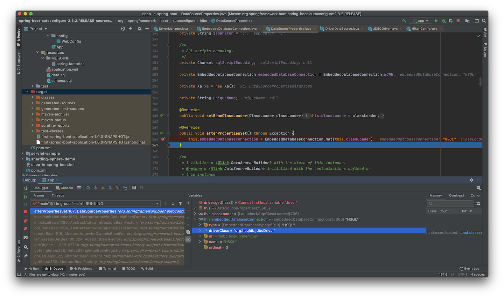
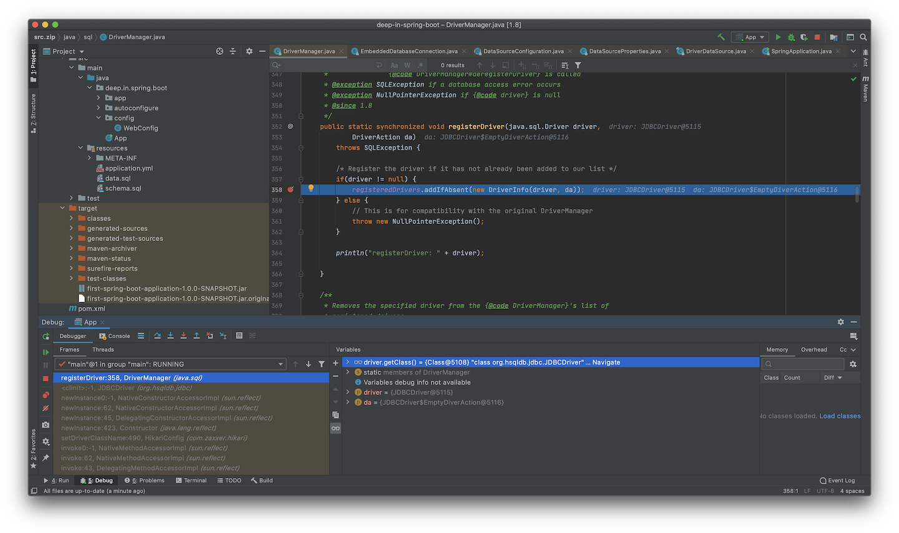
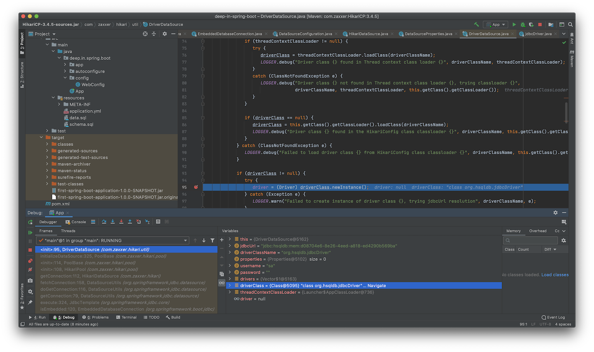

<h3 align="center"><b>04 - 理解自动装配</b></h3>

Spring Boot官方文档对自动装配(Auto-configuration)做了简单介绍：
>Spring Boot auto-configuration attempts to automatically configure your Spring application based on the jar dependencies that you have added. For example, if `HSQLDB` is on your classpath, and you have not manually configured any database connection beans, then Spring Boot auto-configures an in-memory database.
>
>You need to opt-in to auto-configuration by adding the `@EnableAutoConfiguration` or `@SpringBootApplication` annotations to one of your `@Configuration` classes.

自动装配是存在前提的，基于添加的JAR文件依赖，但自动装配的实体并非一定装载。  
文档举例说明当`HSQLDB`在Class Path中，不需要手动配置数据库连接的Beans，而是Spring Boot自动装配一个内存型的数据库。添加如下依赖到`pom.xml`中(`spring-boot-dependencies`中已经包含了`HSQLDB`的版本，因此不需要再次指定)：
```xml
        <dependency>
            <groupId>org.hsqldb</groupId>
            <artifactId>hsqldb</artifactId>
        </dependency>
        <dependency>
            <groupId>org.springframework.boot</groupId>
            <artifactId>spring-boot-starter-jdbc</artifactId>
            <version>2.3.2.RELEASE</version>
        </dependency>
```

添加数据库表和数据，将`schema.sql`和`data.sql`文件直接放到`resources`目录下即可：
```sql
CREATE TABLE person (id INT NOT NULL, name varchar(50) DEFAULT NULL)
```

```sql
INSERT INTO person (id, name) VALUES (1,'Tom');
INSERT INTO person (id, name) VALUES (2,'Jerry');
```

无需任何其他配置，直接启动项目：
```cmd
  .   ____          _            __ _ _
 /\\ / ___'_ __ _ _(_)_ __  __ _ \ \ \ \
( ( )\___ | '_ | '_| | '_ \/ _` | \ \ \ \
 \\/  ___)| |_)| | | | | || (_| |  ) ) ) )
  '  |____| .__|_| |_|_| |_\__, | / / / /
 =========|_|==============|___/=/_/_/_/
 :: Spring Boot ::        (v2.3.2.RELEASE)

2020-08-13 09:18:07.994  INFO 2034 --- [           main] deep.in.spring.boot.App                  : Starting App on nanleis-MacBook-Pro.local with PID 2034 (/Users/nanlei/Dev/Codebase/deep-in-spring-boot/first-spring-boot-application/target/classes started by nanlei in /Users/nanlei/Dev/Codebase/deep-in-spring-boot)
2020-08-13 09:18:07.996  INFO 2034 --- [           main] deep.in.spring.boot.App                  : No active profile set, falling back to default profiles: default
2020-08-13 09:18:08.837  INFO 2034 --- [           main] o.s.b.w.embedded.tomcat.TomcatWebServer  : Tomcat initialized with port(s): 8080 (http)
2020-08-13 09:18:08.848  INFO 2034 --- [           main] o.apache.catalina.core.StandardService   : Starting service [Tomcat]
2020-08-13 09:18:08.848  INFO 2034 --- [           main] org.apache.catalina.core.StandardEngine  : Starting Servlet engine: [Apache Tomcat/9.0.37]
2020-08-13 09:18:08.912  INFO 2034 --- [           main] o.a.c.c.C.[Tomcat].[localhost].[/]       : Initializing Spring embedded WebApplicationContext
2020-08-13 09:18:08.912  INFO 2034 --- [           main] w.s.c.ServletWebServerApplicationContext : Root WebApplicationContext: initialization completed in 872 ms
2020-08-13 09:18:09.032  INFO 2034 --- [           main] com.zaxxer.hikari.HikariDataSource       : HikariPool-1 - Starting...
2020-08-13 09:18:09.037  WARN 2034 --- [           main] com.zaxxer.hikari.util.DriverDataSource  : Registered driver with driverClassName=org.hsqldb.jdbcDriver was not found, trying direct instantiation.
2020-08-13 09:18:09.675  INFO 2034 --- [           main] com.zaxxer.hikari.pool.PoolBase          : HikariPool-1 - Driver does not support get/set network timeout for connections. (feature not supported)
2020-08-13 09:18:09.678  INFO 2034 --- [           main] com.zaxxer.hikari.HikariDataSource       : HikariPool-1 - Start completed.
2020-08-13 09:18:09.907  INFO 2034 --- [           main] o.s.s.concurrent.ThreadPoolTaskExecutor  : Initializing ExecutorService 'applicationTaskExecutor'
2020-08-13 09:18:10.257  INFO 2034 --- [           main] o.s.b.w.embedded.tomcat.TomcatWebServer  : Tomcat started on port(s): 8080 (http) with context path ''
2020-08-13 09:18:10.269  INFO 2034 --- [           main] deep.in.spring.boot.App                  : Started App in 2.572 seconds (JVM running for 3.027)
```

从日志中可以看到，Spring Boot自动初始化了`HikariDataSource`作为数据库连接池，继续编写应用代码：
```java
    @Autowired
    private JdbcTemplate jdbcTemplate;

    @RequestMapping("/listuser")
    public List listuser(){
        return jdbcTemplate.queryForList("select * from person");
    }
```

直接测试接口即可：
```cmd
$ curl http://localhost:8080/listuser | json_pp
  % Total    % Received % Xferd  Average Speed   Time    Time     Time  Current
                                 Dload  Upload   Total   Spent    Left  Speed
100    47    0    47    0     0  15666      0 --:--:-- --:--:-- --:--:-- 15666
[
   {
      "ID" : 1,
      "NAME" : "Tom"
   },
   {
      "ID" : 2,
      "NAME" : "Jerry"
   }
]
```

没有配置数据源，没有配置`JdbcTemplate` Bean，但可以直接注入使用，这些组件都是自动装配的。

官方文档继续介绍，注解`@EnableAutoConfiguration` 或 `@SpringBootApplication`标注到任一`@Configuration`类上，即可开启自动装配。但却没有介绍`@Configuration`如何装配。在Spring Framework中，可以使用`@Import`和`@ComponentScan`注解来装配，由`AnnotationConfigApplicationContext`来注册。

## 1. 理解`@SpringBootApplication`
官方文档也说了使用`@SpringBootApplication`可以开启自动装配，下面从此处入手，首先看官方文档的解释：
><b>Using the @SpringBootApplication Annotation</b>  
Many Spring Boot developers like their apps to use auto-configuration, component scan and be able to define extra configuration on their "application class". A single `@SpringBootApplication` annotation can be used to enable those three features, that is:
>
>+ `@EnableAutoConfiguration`: enable Spring Boot’s auto-configuration mechanism
>
>+ `@ComponentScan`: enable `@Component` scan on the package where the application is located (see the best practices)
>
>+ `@Configuration`: allow to register extra beans in the context or import additional configuration classes

可以看出，`@SpringBootApplication`激活了三个注解特性，其中`@EnableAutoConfiguration`激活Spring Boot的自动装配机制；`@ComponentScan`激活`@Component`扫描；`@Configuration`允许注册更多的bean到上下文中或导入更多的配置类。并且给出代码示例：
>```java
>package com.example.myapplication;
>
>import org.springframework.boot.SpringApplication;
>import org.springframework.boot.autoconfigure.SpringBootApplication;
>
>@SpringBootApplication // same as @Configuration @EnableAutoConfiguration @ComponentScan
>public class Application {
>
>    public static void main(String[] args) {
>        SpringApplication.run(Application.class, args);
>    }
>
>}
>```

使用3个注解替换`@SpringBootApplication`，重构项目代码：
```java
@RestController
@EnableAutoConfiguration
@ComponentScan
@Configuration
public class App {
    ...
}
```

重新启动项目，发现一切正常，测试HTTP服务也并无异常，说明替换和文档所述无误，但实际情况却要复杂一些，看一下`@SpringBootApplication`注解声明：
```java
@Target(ElementType.TYPE)
@Retention(RetentionPolicy.RUNTIME)
@Documented
@Inherited
@SpringBootConfiguration
@EnableAutoConfiguration
@ComponentScan(excludeFilters = { @Filter(type = FilterType.CUSTOM, classes = TypeExcludeFilter.class),
		@Filter(type = FilterType.CUSTOM, classes = AutoConfigurationExcludeFilter.class) })
public @interface SpringBootApplication {
    ...
}
```

<b>文档的描述和代码实际是有区别的，实际引用还应以源码为准，文档作为参考。</b>

实际上，`@SpringBootApplication`等价于`@SpringBootConfiguration`、`@EnableAutoConfiguration`和`@ComponentScan`，但`@ComponentScan`并非默认值，而是加入了排除：`TypeExcludeFilter`和`AutoConfigurationExcludeFilter`。

`TypeExcludeFilter`用于查找`BeanFactory`中已经注册的`TypeExcludeFilter` Bean，作为代理执行对象。
```java
public class TypeExcludeFilter implements TypeFilter, BeanFactoryAware {

	private BeanFactory beanFactory;

	private Collection<TypeExcludeFilter> delegates;

	@Override
	public void setBeanFactory(BeanFactory beanFactory) throws BeansException {
		this.beanFactory = beanFactory;
	}

	@Override
	public boolean match(MetadataReader metadataReader, MetadataReaderFactory metadataReaderFactory)
			throws IOException {
		if (this.beanFactory instanceof ListableBeanFactory && getClass() == TypeExcludeFilter.class) {
			for (TypeExcludeFilter delegate : getDelegates()) {
				if (delegate.match(metadataReader, metadataReaderFactory)) {
					return true;
				}
			}
		}
		return false;
	}

	private Collection<TypeExcludeFilter> getDelegates() {
		Collection<TypeExcludeFilter> delegates = this.delegates;
		if (delegates == null) {
			delegates = ((ListableBeanFactory) this.beanFactory).getBeansOfType(TypeExcludeFilter.class).values();
			this.delegates = delegates;
		}
		return delegates;
	}

    ...
}
```

`AutoConfigurationExcludeFilter`用于排除其他同时标注`@EnableAutoConfiguration`和`@Configuration`的类：
```java
public class AutoConfigurationExcludeFilter implements TypeFilter, BeanClassLoaderAware {

	private ClassLoader beanClassLoader;

	private volatile List<String> autoConfigurations;

	@Override
	public void setBeanClassLoader(ClassLoader beanClassLoader) {
		this.beanClassLoader = beanClassLoader;
	}

	@Override
	public boolean match(MetadataReader metadataReader, MetadataReaderFactory metadataReaderFactory)
			throws IOException {
		return isConfiguration(metadataReader) && isAutoConfiguration(metadataReader);
	}

	private boolean isConfiguration(MetadataReader metadataReader) {
		return metadataReader.getAnnotationMetadata().isAnnotated(Configuration.class.getName());
	}

	private boolean isAutoConfiguration(MetadataReader metadataReader) {
		return getAutoConfigurations().contains(metadataReader.getClassMetadata().getClassName());
	}

	protected List<String> getAutoConfigurations() {
		if (this.autoConfigurations == null) {
			this.autoConfigurations = SpringFactoriesLoader.loadFactoryNames(EnableAutoConfiguration.class,
					this.beanClassLoader);
		}
		return this.autoConfigurations;
	}

}
```

而`@SpringBootConfiguration`的声明为：
```java
@Target(ElementType.TYPE)
@Retention(RetentionPolicy.RUNTIME)
@Documented
@Configuration
public @interface SpringBootConfiguration {
    ...
}
```

`@Configuration`的声明为：
```java
@Target(ElementType.TYPE)
@Retention(RetentionPolicy.RUNTIME)
@Documented
@Component
public @interface Configuration {
    ...
}
```

可以发现层级关系为：

+ `@Component`
    + `@Configuration`
        + `@SpringBootConfiguration`

`@ComponentScan`仅关注`@Component`，而`@SpringBootConfiguration`属于`@Component`的派生注解，所以能够被`@ComponentScan`识别。

`@Repository`、`@Service`、`@Controller`属于`@Component`的直接派生注解，也被称为Spring模式注解(Stereotype Annotation)

官方文档继续简单介绍了`@SpringBootApplication`的属性别名
>`@SpringBootApplication` also provides aliases to customize the attributes of `@EnableAutoConfiguration` and `@ComponentScan`

`@SpringBootApplication`的属性方法声明为：
```java
public @interface SpringBootApplication {


	@AliasFor(annotation = EnableAutoConfiguration.class)
	Class<?>[] exclude() default {};

	/**
	 * ...
	 * @since 1.3.0
	 */
	@AliasFor(annotation = EnableAutoConfiguration.class)
	String[] excludeName() default {};

	/**
	 * ...
	 * @since 1.3.0
	 */
	@AliasFor(annotation = ComponentScan.class, attribute = "basePackages")
	String[] scanBasePackages() default {};

	/**
	 * ...
	 * @since 1.3.0
	 */
	@AliasFor(annotation = ComponentScan.class, attribute = "basePackageClasses")
	Class<?>[] scanBasePackageClasses() default {};

	/**
	 * ...
	 * @since 2.3.0
	 */
	@AliasFor(annotation = ComponentScan.class, attribute = "nameGenerator")
	Class<? extends BeanNameGenerator> nameGenerator() default BeanNameGenerator.class;

	/**
	 * ...
	 * @since 2.2
	 */
	@AliasFor(annotation = Configuration.class)
	boolean proxyBeanMethods() default true;

}
```

通过`@AliasFor`，可以将注解属性别名到某个注解中，重构一下代码，将引导类调整到`deep.in.spring.boot.app`包中并重新命名：
```java
package deep.in.spring.boot.app;

import org.springframework.boot.SpringApplication;
import org.springframework.boot.autoconfigure.EnableAutoConfiguration;
import org.springframework.boot.autoconfigure.SpringBootApplication;
import org.springframework.context.annotation.ComponentScan;
import org.springframework.context.annotation.Configuration;

//@EnableAutoConfiguration
//@ComponentScan
//@Configuration
@SpringBootApplication(scanBasePackages = "deep.in.spring.boot.config")
public class FirstSpringBootApp {
    public static void main(String[] args) {
        SpringApplication.run(FirstSpringBootApp.class, args);
    }
}
```

将`@EventListener`方法抽取至`deep.in.spring.boot.config.WebConfig`配置类中：
```java
package deep.in.spring.boot.config;

import org.springframework.boot.web.context.WebServerInitializedEvent;
import org.springframework.context.annotation.Configuration;
import org.springframework.context.event.EventListener;

@Configuration
public class WebConfig {

    @EventListener(WebServerInitializedEvent.class)
    public void onWebServerReady(WebServerInitializedEvent event) {
        System.out.println("WebServer Type: " + event.getWebServer().getClass().getName());
        System.out.println("ApplicationContext: " + event.getApplicationContext().getClass().getName());
    }
}
```

注意在`FirstSpringBootApp`中再次使用`@SpringBootApplication`，并设置属性`scanBasePackages = "deep.in.spring.boot.config"`。

再次启动项目，看到输出：
```cmd
  .   ____          _            __ _ _
 /\\ / ___'_ __ _ _(_)_ __  __ _ \ \ \ \
( ( )\___ | '_ | '_| | '_ \/ _` | \ \ \ \
 \\/  ___)| |_)| | | | | || (_| |  ) ) ) )
  '  |____| .__|_| |_|_| |_\__, | / / / /
 =========|_|==============|___/=/_/_/_/
 :: Spring Boot ::        (v2.3.2.RELEASE)

2020-08-19 14:11:28.722  INFO 6047 --- [           main] d.in.spring.boot.app.FirstSpringBootApp  : Starting FirstSpringBootApp on nanleis-MacBook-Pro.local with PID 6047 (/Users/nanlei/Dev/Codebase/deep-in-spring-boot/first-spring-boot-application/target/classes started by nanlei in /Users/nanlei/Dev/Codebase/deep-in-spring-boot)
(省略部分内容...)
2020-08-19 14:11:30.921  INFO 6047 --- [           main] o.s.b.w.embedded.tomcat.TomcatWebServer  : Tomcat started on port(s): 8080 (http) with context path ''
WebServer Type: org.springframework.boot.web.embedded.tomcat.TomcatWebServer
ApplicationContext: org.springframework.boot.web.servlet.context.AnnotationConfigServletWebServerApplicationContext
2020-08-19 14:11:30.929  INFO 6047 --- [           main] d.in.spring.boot.app.FirstSpringBootApp  : Started FirstSpringBootApp in 2.497 seconds (JVM running for 2.935)
```

说明配置类运行正常，若不配置`scanBasePackages`属性，那么配置类`WebConfig`将不会被扫描到。

综上所述，`@SpringBootApplication`是一个聚合注解，包含`@SpringBootConfiguration`、`@EnableAutoConfiguration`和`@ComponentScan`的特性，类似注解还有`@RestController`，聚合了`@Controller`和`@ResponseBody`。

`@SpringBootApplication`通常标注于引导类上，但并不限制。若将其标注于非引导类上，调整代码如下：
```java
package deep.in.spring.boot.config;

import org.springframework.boot.autoconfigure.SpringBootApplication;
import org.springframework.boot.web.context.WebServerInitializedEvent;
import org.springframework.context.annotation.Configuration;
import org.springframework.context.event.EventListener;

//@Configuration
@SpringBootApplication
public class WebConfig {

    @EventListener(WebServerInitializedEvent.class)
    public void onWebServerReady(WebServerInitializedEvent event) {
        System.out.println("WebServer Type: " + event.getWebServer().getClass().getName());
        System.out.println("ApplicationContext: " + event.getApplicationContext().getClass().getName());
    }
}
```

因为`@SpringBootApplication`已经包含`@Configuration`特性，此处不再需要。

引导类`FirstSpringBootApp`仅保留`main()`方法，`SpringApplication.run()`的入参调整为`WebConfig.class`：
```java
package deep.in.spring.boot.app;

import deep.in.spring.boot.config.WebConfig;
import org.springframework.boot.SpringApplication;

public class FirstSpringBootApp {
    public static void main(String[] args) {
        //SpringApplication.run(FirstSpringBootApp.class, args);
        SpringApplication.run(WebConfig.class, args);
    }
}
```

重新启动程序，运行效果依旧。

## 2. 理解`@EnableAutoConfiguration`

官方文档提到了`@EnableAutoConfiguration`和`@SpringBootApplication`都能激活自动装配特性，但为了说明`@EnableAutoConfiguration`和`@SpringBootApplication`的差别，将项目调整为`webflux`项目：
```xml
        <dependency>
            <groupId>org.springframework.boot</groupId>
            <artifactId>spring-boot-starter-webflux</artifactId>
            <version>2.3.2.RELEASE</version>
        </dependency>
```

在`WebConfg`类中，添加`RouterFunction`的Bean，并使用`@EnableAutoConfiguration`来注解：
```java
package deep.in.spring.boot.config;

import org.springframework.boot.autoconfigure.EnableAutoConfiguration;
import org.springframework.boot.autoconfigure.SpringBootApplication;
import org.springframework.boot.web.context.WebServerInitializedEvent;
import org.springframework.context.annotation.Bean;
import org.springframework.context.annotation.Configuration;
import org.springframework.context.event.EventListener;
import org.springframework.web.reactive.function.server.RouterFunction;
import org.springframework.web.reactive.function.server.ServerResponse;
import reactor.core.publisher.Mono;

import static org.springframework.web.reactive.function.server.ServerResponse.ok;
import static org.springframework.web.reactive.function.server.RequestPredicates.GET;
import static org.springframework.web.reactive.function.server.RouterFunctions.route;

//@Configuration
//@SpringBootApplication
@EnableAutoConfiguration
public class WebConfig {

    @Bean
    public RouterFunction<ServerResponse> helloworld() {
        return route(GET("/helloworld"),
                request -> ok().body(Mono.just("Hello World"), String.class)
        );
    }

    @EventListener(WebServerInitializedEvent.class)
    public void onWebServerReady(WebServerInitializedEvent event) {
        System.out.println("WebServer Type: " + event.getWebServer().getClass().getName());
        System.out.println("ApplicationContext: " + event.getApplicationContext().getClass().getName());
        System.out.println("WebConfig Bean:" + event.getApplicationContext().getBean(WebConfig.class).getClass().getName());
        System.out.println("helloworld Bean: " + event.getApplicationContext().getBean("helloworld").getClass().getName());
    }
}
```

启动程序，得到输出：
```cmd
(省略部分内容...)
WebServer Type: org.springframework.boot.web.embedded.netty.NettyWebServer
ApplicationContext: org.springframework.boot.web.reactive.context.AnnotationConfigReactiveWebServerApplicationContext
WebConfig Bean:deep.in.spring.boot.config.WebConfig
helloworld Bean: org.springframework.web.reactive.function.server.RouterFunctions$DefaultRouterFunction
2020-08-19 15:32:38.305  INFO 6752 --- [           main] d.in.spring.boot.app.FirstSpringBootApp  : Started FirstSpringBootApp in 1.93 seconds (JVM running for 2.33)
```

测试`/helloworld`也没有问题：
```cmd
$ curl http://127.0.0.1:8080/helloworld
Hello World
```

由此说明，`@EnableAutoConfiguration`注解的`WebConfig`类在运行上与`@SpringBootApplication`并无差别，也就是`SpringApplication.run()`方法引导启动时，并不强依赖`@Configuration`注解。

官方文档对此也有简要说明：
><b>Configuration Classes</b>  
Spring Boot favors Java-based configuration. Although it is possible to use SpringApplication with XML sources, we generally recommend that your primary source be a single `@Configuration` class. Usually the class that defines the `main` method is a good candidate as the primary `@Configuration`.

为了说明和`@SpringBootApplication`的差异，也就是`@SpringBootApplication`多出的`@Configuration`特性(`@ComponentScan`特性已有解释)，将`WebConfig`类的注解改回，重新运行程序：
```cmd
(省略部分内容...)
WebServer Type: org.springframework.boot.web.embedded.netty.NettyWebServer
ApplicationContext: org.springframework.boot.web.reactive.context.AnnotationConfigReactiveWebServerApplicationContext
WebConfig Bean:deep.in.spring.boot.config.WebConfig$$EnhancerBySpringCGLIB$$757dd7cc
helloworld Bean: org.springframework.web.reactive.function.server.RouterFunctions$DefaultRouterFunction
2020-08-19 16:26:50.591  INFO 7301 --- [           main] d.in.spring.boot.app.FirstSpringBootApp  : Started FirstSpringBootApp in 2.298 seconds (JVM running for 2.733)
```

很明显，`WebConfig` Bean的实现类从`deep.in.spring.boot.config.WebConfig`变为`deep.in.spring.boot.config.WebConfig$$EnhancerBySpringCGLIB$$757dd7cc`，也就是后者使用了CGLIB进行提升，这也是`@SpringBootApplication`作为`@Configuration`派生注解最明显的特性，在SpringFrameork官方文档( https://docs.spring.io/spring/docs/current/spring-framework-reference/core.html#spring-core )中也有介绍：
>The `@Bean` methods in a regular Spring component are processed differently than their counterparts inside a Spring `@Configuration` class. The difference is that `@Component` classes are not enhanced with CGLIB to intercept the invocation of methods and fields. CGLIB proxying is the means by which invoking methods or fields within `@Bean` methods in `@Configuration` classes creates bean metadata references to collaborating objects. Such methods are not invoked with normal Java semantics but rather go through the container in order to provide the usual lifecycle management and proxying of Spring beans, even when referring to other beans through programmatic calls to `@Bean` methods. In contrast, invoking a method or field in a `@Bean` method within a plain `@Component` class has standard Java semantics, with no special CGLIB processing or other constraints applying.

也就是`@Component`注解的类，Bean的行为和正常Java对象语义相同，不存在CGLIB处理，而`@Configuration`注解的类，进行CGLIB提升。

官方文档进一步介绍：
><b>Full @Configuration vs “lite” @Bean mode?</b>   
When `@Bean` methods are declared within classes that are not annotated with `@Configuration`, they are referred to as being processed in a “lite” mode. Bean methods declared in a `@Component` or even in a plain old class are considered to be “lite”, with a different primary purpose of the containing class and a `@Bean` method being a sort of bonus there. For example, service components may expose management views to the container through an additional `@Bean` method on each applicable component class. In such scenarios, `@Bean` methods are a general-purpose factory method mechanism.
>
>Unlike full `@Configuration`, lite `@Bean` methods cannot declare inter-bean dependencies. Instead, they operate on their containing component’s internal state and, optionally, on arguments that they may declare. Such a `@Bean` method should therefore not invoke other `@Bean` methods. Each such method is literally only a factory method for a particular bean reference, without any special runtime semantics. The positive side-effect here is that no CGLIB subclassing has to be applied at runtime, so there are no limitations in terms of class design (that is, the containing class may be `final` and so forth).
>
>In common scenarios, `@Bean` methods are to be declared within `@Configuration` classes, ensuring that “full” mode is always used and that cross-method references therefore get redirected to the container’s lifecycle management. This prevents the same `@Bean` method from accidentally being invoked through a regular Java call, which helps to reduce subtle bugs that can be hard to track down when operating in “lite” mode.

简而言之，`@Bean`在普通Java类被声明后，其行为和在`@Component`类下的声明一致，官方称这种方式为“轻量模式”，而在`@Configuration`类中的声明为“完全模式”，后者会执行CGLIB提升。这也就是前面代码运行结果的对比。

## 3. <span id='uac'>理解自动配置</span>

前面所述的`WebConfig`属于编码方式装配，而不是自动装配。而其他自动装配的Bean是通过自动配置机制完成的。

在Spring Boot之前，Spring Framework提供Bean的生命周期管理和编程模型，框架层面已经支持派生注解，但却不能自动装配`@Configuration`类。Spring Boot在此基础之上添加了约定配置化导入`@Configuration`类的方式。

官方文档介绍了如何构建自定义自动装配类：
><b>Creating Your Own Auto-configuration</b>
>
>If you work in a company that develops shared libraries, or if you work on an open-source or commercial library, you might want to develop your own auto-configuration. Auto-configuration classes can be bundled in external jars and still be picked-up by Spring Boot.
>
>Auto-configuration can be associated to a “starter” that provides the auto-configuration code as well as the typical libraries that you would use with it. We first cover what you need to know to build your own auto-configuration and then we move on to the [typical steps required to create a custom starter](https://docs.spring.io/spring-boot/docs/current/reference/htmlsingle/#boot-features-custom-starter "typical steps required to create a custom starter").

自动装配类可以打包到外部JAR文件中，并且被Spring Boot装载。自动装配类也能被关联到“starter”中，这些“starter”提供自动装配的代码及关联的依赖。

官方文档继续介绍了Spring Boot自动装配底层实现与@Configuration和@Conditional的关系：
>Understanding Auto-configured Beans
>
>Under the hood, auto-configuration is implemented with standard `@Configuration` classes. Additional `@Conditional` annotations are used to constrain when the auto-configuration should apply. Usually, auto-configuration classes use `@ConditionalOnClass` and `@ConditionalOnMissingBean` annotations. This ensures that auto-configuration applies only when relevant classes are found and when you have not declared your own `@Configuration`.
>
>You can browse the source code of [spring-boot-autoconfigure](https://github.com/spring-projects/spring-boot/tree/master/spring-boot-project/spring-boot-autoconfigure/src/main/java/org/springframework/boot/autoconfigure "source code of spring-boot-autoconfigure") to see the `@Configuration` classes that Spring provides (see the [META-INF/spring.factories](https://github.com/spring-projects/spring-boot/blob/master/spring-boot-project/spring-boot-autoconfigure/src/main/resources/META-INF/spring.factories "spring.factories file") file).

文档中提及`@ConditionalOnClass`和`@ConditionalOnMissingBean`是常用的注解。根据名称很容易理解，当`@ConditionalOnClass`注解在`@Configuration`类上时，当目标类存在于Class Path时予以装配。这就是开头提到的`HSQLDB`存在于应用的Class Path时，Spring Boot提供了自动装配`HSQLDB`的逻辑，在`DataSourceAutoConfiguration`自动装配类中：
```java
package org.springframework.boot.autoconfigure.jdbc;
...
@Configuration(proxyBeanMethods = false)
@ConditionalOnClass({ DataSource.class, EmbeddedDatabaseType.class })
@ConditionalOnMissingBean(type = "io.r2dbc.spi.ConnectionFactory")
@EnableConfigurationProperties(DataSourceProperties.class)
@Import({ DataSourcePoolMetadataProvidersConfiguration.class, DataSourceInitializationConfiguration.class })
public class DataSourceAutoConfiguration {

	@Configuration(proxyBeanMethods = false)
	@Conditional(EmbeddedDatabaseCondition.class)
	@ConditionalOnMissingBean({ DataSource.class, XADataSource.class })
	@Import(EmbeddedDataSourceConfiguration.class)
	protected static class EmbeddedDatabaseConfiguration {

	}

	@Configuration(proxyBeanMethods = false)
	@Conditional(PooledDataSourceCondition.class)
	@ConditionalOnMissingBean({ DataSource.class, XADataSource.class })
	@Import({ DataSourceConfiguration.Hikari.class, DataSourceConfiguration.Tomcat.class,
			DataSourceConfiguration.Dbcp2.class, DataSourceConfiguration.Generic.class,
			DataSourceJmxConfiguration.class })
	protected static class PooledDataSourceConfiguration {

	}
	...
}
```

代码中并没有手动配置`DataSource` Bean，那么`EmbeddedDatabaseConfiguration`和`PooledDataSourceCondition`，`PooledDataSourceAvailableCondition`就会依次进行判断。加入的`HSQLDB`支持连接池，因此会在`HikariCP`启动的时候进行装配。

`HikariCP`的自动装配类是`org.springframework.boot.autoconfigure.jdbc.DataSourceConfiguration`中的`Hikari`静态内部类：
```java
	/**
	 * Hikari DataSource configuration.
	 */
	@Configuration(proxyBeanMethods = false)
	@ConditionalOnClass(HikariDataSource.class)
	@ConditionalOnMissingBean(DataSource.class)
	@ConditionalOnProperty(name = "spring.datasource.type", havingValue = "com.zaxxer.hikari.HikariDataSource",
			matchIfMissing = true)
	static class Hikari {

		@Bean
		@ConfigurationProperties(prefix = "spring.datasource.hikari")
		HikariDataSource dataSource(DataSourceProperties properties) {
			HikariDataSource dataSource = createDataSource(properties, HikariDataSource.class);
			if (StringUtils.hasText(properties.getName())) {
				dataSource.setPoolName(properties.getName());
			}
			return dataSource;
		}

	}
```

`Hikari`数据源能自动装配是`PooledDataSourceConfiguration`被激活后`@Import`进来的，而`HikariCP`已经是Spring Boot默认使用的连接池了。此处`Hikari`要根据`DataSourceProperties`进行数据源创建，那么在`DataSourceProperties`中：
```java
package org.springframework.boot.autoconfigure.jdbc;
...
@ConfigurationProperties(prefix = "spring.datasource")
public class DataSourceProperties implements BeanClassLoaderAware, InitializingBean {
	...
	@Override
	public void afterPropertiesSet() throws Exception {
		this.embeddedDatabaseConnection = EmbeddedDatabaseConnection.get(this.classLoader);
	}
	...
}
```

`afterPropertiesSet`是`InitializingBean`接口中的唯一方法：
```java
package org.springframework.beans.factory;

/**
 * Interface to be implemented by beans that need to react once all their properties
 * have been set by a {@link BeanFactory}: e.g. to perform custom initialization,
 * or merely to check that all mandatory properties have been set.
 *
 * <p>An alternative to implementing {@code InitializingBean} is specifying a custom
 * init method, for example in an XML bean definition. For a list of all bean
 * lifecycle methods, see the {@link BeanFactory BeanFactory javadocs}.
 *
 * @author Rod Johnson
 * @author Juergen Hoeller
 * @see DisposableBean
 * @see org.springframework.beans.factory.config.BeanDefinition#getPropertyValues()
 * @see org.springframework.beans.factory.support.AbstractBeanDefinition#getInitMethodName()
 */
public interface InitializingBean {

	/**
	 * Invoked by the containing {@code BeanFactory} after it has set all bean properties
	 * and satisfied {@link BeanFactoryAware}, {@code ApplicationContextAware} etc.
	 * <p>This method allows the bean instance to perform validation of its overall
	 * configuration and final initialization when all bean properties have been set.
	 * @throws Exception in the event of misconfiguration (such as failure to set an
	 * essential property) or if initialization fails for any other reason
	 */
	void afterPropertiesSet() throws Exception;

}
```

也就是在Bean初始化时，设置完属性后要回调的方法，`DataSourceProperties`就在此时调用`EmbeddedDatabaseConnection.get(this.classLoader)`来获取到内嵌数据库的信息，具体实现为：
```java
package org.springframework.boot.jdbc;
...
public enum EmbeddedDatabaseConnection {
	...
	/**
	 * HSQL Database Connection.
	 */
	HSQL(EmbeddedDatabaseType.HSQL, "org.hsqldb.jdbcDriver", "jdbc:hsqldb:mem:%s");
	...
		/**
	 * Returns the most suitable {@link EmbeddedDatabaseConnection} for the given class
	 * loader.
	 * @param classLoader the class loader used to check for classes
	 * @return an {@link EmbeddedDatabaseConnection} or {@link #NONE}.
	 */
	public static EmbeddedDatabaseConnection get(ClassLoader classLoader) {
		for (EmbeddedDatabaseConnection candidate : EmbeddedDatabaseConnection.values()) {
			if (candidate != NONE && ClassUtils.isPresent(candidate.getDriverClassName(), classLoader)) {
				return candidate;
			}
		}
		return NONE;
	}
	...
}
```

至此，内嵌数据库`HSQLDB`通过默认数据源`HikariCP`的自动装配实现了。

综上所述，`DataSourceAutoConfiguration`和内部`@Configuration`类同样都结合了`@Configuration`和`@Conditional`特性，内部的`@Configuration`类随着`DataSourceAutoConfiguration`的装配而装配。

那么`DataSourceAutoConfiguration`又是如何被装配的，回到官方文档中的最后一段介绍，这些自动装配类都在`META-INF/spring.factories`下，即在`spring-boot-autoconfigure`依赖中。

`spring-boot-autoconfigure`是Spring Boot的核心依赖，提供了大量的自动装配`@Configuration`类，并统一存放在`org.springframework.boot.autoconfigure`包和子包下，完整的自动装配类可参照`META-INF/spring.factories`文件。

## 4. 创建自动配置类

创建自动装配类`WebAutoConfiguration`：
```java
package deep.in.spring.boot.autoconfigure;

import deep.in.spring.boot.config.WebConfig;
import org.springframework.context.annotation.Configuration;
import org.springframework.context.annotation.Import;

@Configuration
@Import(WebConfig.class)
public class WebAutoConfiguration {

}
```

这里使用`@Import`导入配置类`WebConfig`，同时在`src/main/resource`下创建`META-INF/spring.factories`文件，将`WebAutoConfiguration`配置进去：
```txt
#Auto-Configuration
org.springframework.boot.autoconfigure.EnableAutoConfiguration=\
deep.in.spring.boot.autoconfigure.WebAutoConfiguration
```

同时修改`WebConfig`，使其仅作为`@Configuration`类：
```java
package deep.in.spring.boot.config;
...
@Configuration
//@SpringBootApplication
//@EnableAutoConfiguration
public class WebConfig {
	...
}
```

最后修改引导类`App.java`，仅标注`@EnableAutoConfiguration`，同时调整SpringApplication.run()方法参数：
```java
package deep.in.spring.boot;
...
@RestController
@EnableAutoConfiguration
//@ComponentScan
//@Configuration
//@SpringBootApplication
public class App {
	...
	public static void main(String[] args) {
        SpringApplication.run(App.class, args);
    }
}
```

运行项目，发现并无异常：
```cmd
  .   ____          _            __ _ _
 /\\ / ___'_ __ _ _(_)_ __  __ _ \ \ \ \
( ( )\___ | '_ | '_| | '_ \/ _` | \ \ \ \
 \\/  ___)| |_)| | | | | || (_| |  ) ) ) )
  '  |____| .__|_| |_|_| |_\__, | / / / /
 =========|_|==============|___/=/_/_/_/
 :: Spring Boot ::        (v2.3.2.RELEASE)

2020-08-27 10:54:53.368  INFO 2682 --- [           main] deep.in.spring.boot.App                  : Starting App on nanleis-MacBook-Pro.local with PID 2682 (/Users/nanlei/Dev/Codebase/deep-in-spring-boot/first-spring-boot-application/target/classes started by nanlei in /Users/nanlei/Dev/Codebase/deep-in-spring-boot)
2020-08-27 10:54:53.370  INFO 2682 --- [           main] deep.in.spring.boot.App                  : No active profile set, falling back to default profiles: default
2020-08-27 10:54:54.216  INFO 2682 --- [           main] com.zaxxer.hikari.HikariDataSource       : HikariPool-1 - Starting...
2020-08-27 10:54:54.227  WARN 2682 --- [           main] com.zaxxer.hikari.util.DriverDataSource  : Registered driver with driverClassName=org.hsqldb.jdbcDriver was not found, trying direct instantiation.
2020-08-27 10:54:54.856  INFO 2682 --- [           main] com.zaxxer.hikari.pool.PoolBase          : HikariPool-1 - Driver does not support get/set network timeout for connections. (feature not supported)
2020-08-27 10:54:54.859  INFO 2682 --- [           main] com.zaxxer.hikari.HikariDataSource       : HikariPool-1 - Start completed.
2020-08-27 10:54:55.427  INFO 2682 --- [           main] o.s.b.web.embedded.netty.NettyWebServer  : Netty started on port(s): 8080
WebServer Type: org.springframework.boot.web.embedded.netty.NettyWebServer
ApplicationContext: org.springframework.boot.web.reactive.context.AnnotationConfigReactiveWebServerApplicationContext
WebConfig Bean:deep.in.spring.boot.config.WebConfig$$EnhancerBySpringCGLIB$$e99faf97
helloworld Bean: org.springframework.web.reactive.function.server.RouterFunctions$DefaultRouterFunction
2020-08-27 10:54:55.438  INFO 2682 --- [           main] deep.in.spring.boot.App                  : Started App in 2.441 seconds (JVM running for 2.906)
```

说明`WebAutoConfiguration`已被自动装配。

## *. 示例代码启动日志`WARN`排查

示例中的启动过程有如下`WARN`输出：
```cmd
2020-08-27 10:54:54.227  WARN 2682 --- [           main] com.zaxxer.hikari.util.DriverDataSource  : Registered driver with driverClassName=org.hsqldb.jdbcDriver was not found, trying direct instantiation.
```

这是`com.zaxxer.hikari.util.DriverDataSource`的日志输出，可以查看到源码片段：
```java
      if (driverClassName != null) {
         Enumeration<Driver> drivers = DriverManager.getDrivers();
         while (drivers.hasMoreElements()) {
            Driver d = drivers.nextElement();
            if (d.getClass().getName().equals(driverClassName)) {
               driver = d;
               break;
            }
         }

         if (driver == null) {
            LOGGER.warn("Registered driver with driverClassName={} was not found, trying direct instantiation.", driverClassName);
			...
		 }
		 ...
	  }
```

如果`driver == null`，那么就会输出该日志，说明上面获取`driver`的时候没有获取到，而获取`driver`的判断是`driverClassName`的判断。

结合[上面的分析过程](#uac)，在`DataSourceProperties`中，`afterPropertiesSet()`方法获取到的`embeddedDatabaseConnection`如下：



其中`driverClass`的值是`org.hsqldb.jdbcDriver`，是在`EmbeddedDatabaseConnection`中由枚举定义的。之后`DataSourceConfiguration.Hikari`开始自动装配`HikariDataSource`，会执行到`HikariConfig`中如下代码：
```java
      try {
         driverClass.getConstructor().newInstance();
         this.driverClassName = driverClassName;
      }
      catch (Exception e) {
         throw new RuntimeException("Failed to instantiate class " + driverClassName, e);
      }
```

创建`driver`实例时，会执行到`java.sql.DriverManager`中：



可以看到这里注册的`driver`是`org.hsqldb.jdbc.JDBCDriver`，因为和`EmbeddedDatabaseConnection`设置的不同，所以在`DriverDataSource`中比较时就造成了不匹配，会输出`WARN`日志。

但程序本身并没有因此而出错，是因为：
```java
package org.hsqldb;

public class jdbcDriver extends org.hsqldb.jdbc.JDBCDriver {}
```

因此，`DriverDataSource`后续依然可以使用`org.hsqldb.jdbcDriver`来通过反射创建`driver`对象：



因为是Spring Boot代码中的问题，向Spring Boot官方提出该问题，并最终确认是Bug，可以参考：https://github.com/spring-projects/spring-boot/issues/23036
