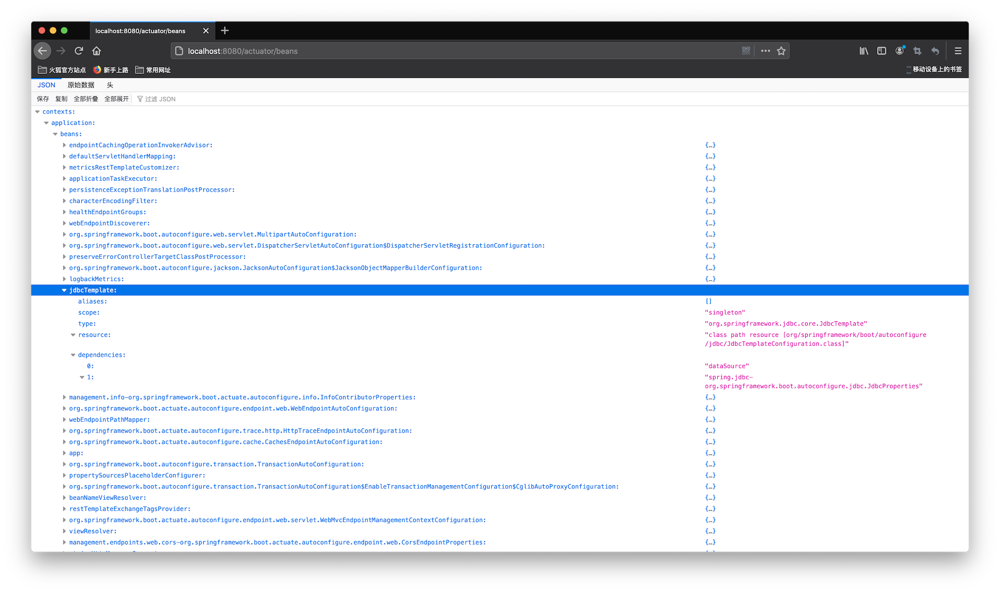
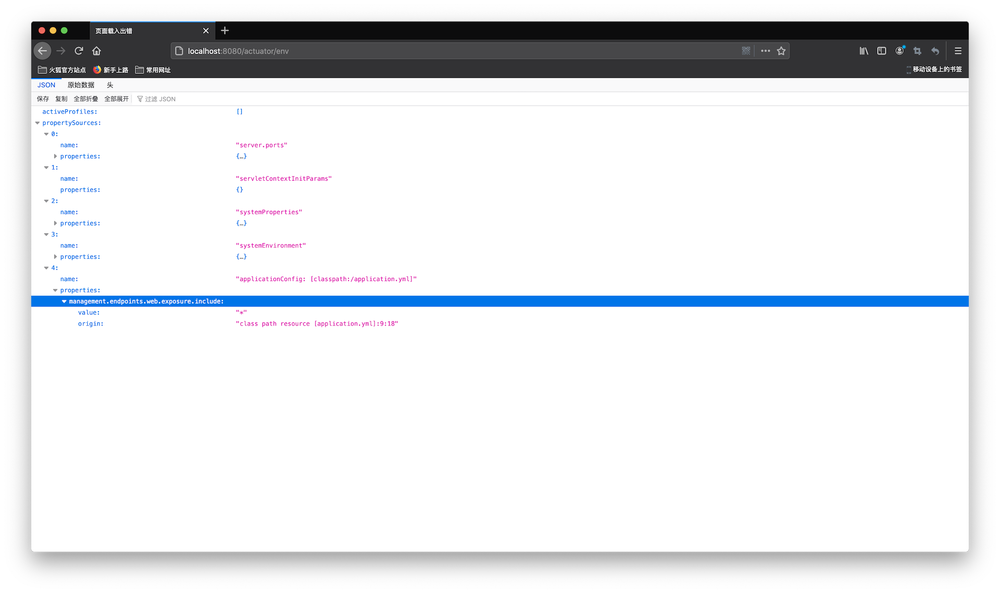

<h3 align="center"><b>05 - 理解Production-Ready特性</b></h3>

[Spring Boot官方首页](https://spring.io/projects/spring-boot)对Production-Ready的描述为：

>Provide production-ready features such as metrics, health checks, and externalized configuration

按照官方说明，metrics(指标)，health checks(健康检查)，externalized configuration(外部化配置)都是为生产准备的特性。

#### 1. Spring Boot Actuator

在官方文档中，Production-Ready特性出自：

> <b>Spring Boot Actuator: Production-ready Features</b>
> 
>Spring Boot includes a number of additional features to help you monitor and manage your application when you push it to production. You can choose to manage and monitor your application by using HTTP endpoints or with JMX. Auditing, health, and metrics gathering can also be automatically applied to your application.

也就是，使用HTTP或者JMX来监控和管理投入生产的应用。审计、健康和指标收集可以自动用于应用程序中。

官方文档进一步说明：

><b>Definition of Actuator</b>
>
>An actuator is a manufacturing term that refers to a mechanical device for moving or controlling something. Actuators can generate a large amount of motion from a small change.

综上，Spring Boot Actuator用于监控和管理Spring应用，可以通过HTTP edpoints或者JMX Bean来交互。

要开启这个特性，官方文档进一步说明：

><b>Enabling Production-ready Features</b>
>
>The `spring-boot-actuator` module provides all of Spring Boot’s production-ready features. The recommended way to enable the features is to add a dependency on the `spring-boot-starter-actuator` ‘Starter’.
>
>To add the actuator to a Maven based project, add the following ‘Starter’ dependency:
>
>```xml
><dependencies>
>    <dependency>
>        <groupId>org.springframework.boot</groupId>
>        <artifactId>spring-boot-starter-actuator</artifactId>
>    </dependency>
></dependencies>
>```

也就是将上述依赖加入到pom.xml文件中，就可以开启Actuator。

官方文档列出了所有的内建endpoints，可以参考：https://docs.spring.io/spring-boot/docs/current/reference/htmlsingle/#production-ready-endpoints

启动项目，在启动日志中，可以看到如下输出：
```cmd
(省略部分输出...)
2020-08-28 16:26:47.857  INFO 4230 --- [           main] o.s.b.a.e.web.EndpointLinksResolver      : Exposing 2 endpoint(s) beneath base path '/actuator'
2020-08-28 16:26:47.915  INFO 4230 --- [           main] o.s.b.w.embedded.tomcat.TomcatWebServer  : Tomcat started on port(s): 8080 (http) with context path ''
2020-08-28 16:26:47.928  INFO 4230 --- [           main] deep.in.spring.boot.App                  : Started App in 3.524 seconds (JVM running for 4.005)
```

这是因为默认情况下，Actuator暴露2个端点：`health`和`info`，测试这些端点，可以看到：
```cmd
$ curl http://localhost:8080/actuator/health | json_pp
  % Total    % Received % Xferd  Average Speed   Time    Time     Time  Current
                                 Dload  Upload   Total   Spent    Left  Speed
100    15    0    15    0     0     92      0 --:--:-- --:--:-- --:--:--    92
{
   "status" : "UP"
}
$ curl http://localhost:8080/actuator/info | json_pp
  % Total    % Received % Xferd  Average Speed   Time    Time     Time  Current
                                 Dload  Upload   Total   Spent    Left  Speed
100     2    0     2    0     0    181      0 --:--:-- --:--:-- --:--:--   181
{}
$ curl http://localhost:8080/actuator/beans | json_pp
  % Total    % Received % Xferd  Average Speed   Time    Time     Time  Current
                                 Dload  Upload   Total   Spent    Left  Speed
100   116    0   116    0     0   6105      0 --:--:-- --:--:-- --:--:--  6105
{
   "status" : 404,
   "path" : "/actuator/beans",
   "error" : "Not Found",
   "timestamp" : "2020-08-28T08:30:33.798+00:00",
   "message" : ""
}
```

如果需要暴露其他非默认开放的端点，需要在配置文件中添加如下配置：
```yaml
management:
  endpoints:
    web:
      exposure:
        include: "*"
```

查看`beans`端点的输出：



可以看到装配的Bean的详细信息，将配置文件中的*替换为其他确定的端点名称即可开启指定端点。

`env`端点包含了系统环境配置的信息：



其中也能看到应用程序的配置`management.endpoints.web.exposure.include`的内容和所在位置。

`metrics`端点可以查看系统的一些指标数据：
```cmd
$ curl http://localhost:8080/actuator/metrics | json_pp
  % Total    % Received % Xferd  Average Speed   Time    Time     Time  Current
                                 Dload  Upload   Total   Spent    Left  Speed
100  1134    0  1134    0     0   369k      0 --:--:-- --:--:-- --:--:--  369k
{
   "names" : [
      "hikaricp.connections",
      "hikaricp.connections.acquire",
      "hikaricp.connections.active",
      "hikaricp.connections.creation",
      "hikaricp.connections.idle",
      "hikaricp.connections.max",
      "hikaricp.connections.min",
      "hikaricp.connections.pending",
      "hikaricp.connections.timeout",
      "hikaricp.connections.usage",
      "http.server.requests",
      "jdbc.connections.active",
      "jdbc.connections.idle",
      "jdbc.connections.max",
      "jdbc.connections.min",
      "jvm.buffer.count",
      "jvm.buffer.memory.used",
      "jvm.buffer.total.capacity",
      "jvm.classes.loaded",
      "jvm.classes.unloaded",
      "jvm.gc.live.data.size",
      "jvm.gc.max.data.size",
      "jvm.gc.memory.allocated",
      "jvm.gc.memory.promoted",
      "jvm.gc.pause",
      "jvm.memory.committed",
      "jvm.memory.max",
      "jvm.memory.used",
      "jvm.threads.daemon",
      "jvm.threads.live",
      "jvm.threads.peak",
      "jvm.threads.states",
      "logback.events",
      "process.cpu.usage",
      "process.files.max",
      "process.files.open",
      "process.start.time",
      "process.uptime",
      "system.cpu.count",
      "system.cpu.usage",
      "system.load.average.1m",
      "tomcat.sessions.active.current",
      "tomcat.sessions.active.max",
      "tomcat.sessions.alive.max",
      "tomcat.sessions.created",
      "tomcat.sessions.expired",
      "tomcat.sessions.rejected"
   ]
}
```

使用指标的名称即可查看该指标的参数，例如查看`system.cpu.count`：
```cmd
$ curl http://localhost:8080/actuator/metrics/system.cpu.count | json_pp
  % Total    % Received % Xferd  Average Speed   Time    Time     Time  Current
                                 Dload  Upload   Total   Spent    Left  Speed
100   193    0   193    0     0  64333      0 --:--:-- --:--:-- --:--:-- 64333
{
   "description" : "The number of processors available to the Java virtual machine",
   "availableTags" : [],
   "baseUnit" : null,
   "name" : "system.cpu.count",
   "measurements" : [
      {
         "value" : 16,
         "statistic" : "VALUE"
      }
   ]
}
```

#### 2. 理解外部化配置

官方文档对外部化配置的解释是：
><b>Externalized Configuration</b>
>
>Spring Boot lets you externalize your configuration so that you can work with the same application code in different environments. You can use properties files, YAML files, environment variables, and command-line arguments to externalize configuration. Property values can be injected directly into your beans by using the `@Value` annotation, accessed through Spring’s `Environment` abstraction, or be [bound to structured objects](https://docs.spring.io/spring-boot/docs/current/reference/htmlsingle/#boot-features-external-config-typesafe-configuration-properties) through `@ConfigurationProperties`.

文档中说，相同的代码，根据所处的不同环境，可以使用不同的外部化配置，比如`properties`文件，`YAML`文件，命令行参数或者环境变量。

外部化配置的属性值可以通过`@Value`注解、Spring的`Environment`，或者`@ConfigurationProperties`绑定到结构化对象的方式直接注入到Bean中。

官方文档继续说明：
>Spring Boot uses a very particular `PropertySource` order that is designed to allow sensible overriding of values. Properties are considered in the following order:
>
>1. [Devtools global settings properties](https://docs.spring.io/spring-boot/docs/current/reference/htmlsingle/#using-boot-devtools-globalsettings) in the `$HOME/.config/spring-boot` directory when devtools is active.
>2. [`@TestPropertySource`](https://docs.spring.io/spring/docs/current/javadoc-api/org/springframework/test/context/TestPropertySource.html) annotations on your tests.
>3. `properties` attribute on your tests. Available on [`@SpringBootTest`](https://docs.spring.io/spring-boot/docs/current/api/org/springframework/boot/test/context/SpringBootTest.html) and the [test annotations for testing a particular slice of your application](https://docs.spring.io/spring-boot/docs/current/reference/htmlsingle/#boot-features-testing-spring-boot-applications-testing-autoconfigured-tests).
>4. Command line arguments.
>5. Properties from `SPRING_APPLICATION_JSON` (inline JSON embedded in an environment variable or system property).
>6. `ServletConfig` init parameters.
>7. `ServletContext` init parameters.
>8. JNDI attributes from `java:comp/env`.
>9. Java System properties (`System.getProperties()`).
>10. OS environment variables.
>11. A `RandomValuePropertySource` that has properties only in `random.*`.
>12. [Profile-specific application properties](https://docs.spring.io/spring-boot/docs/current/reference/htmlsingle/#boot-features-external-config-profile-specific-properties) outside of your packaged jar (`application-{profile}.properties` and YAML variants).
>13. [Profile-specific application properties](https://docs.spring.io/spring-boot/docs/current/reference/htmlsingle/#boot-features-external-config-profile-specific-properties) packaged inside your jar (`application-{profile}.properties` and YAML variants).
>14. [Application properties](https://docs.spring.io/spring-boot/docs/current/reference/htmlsingle/#boot-features-external-config-application-property-files) outside of your packaged jar (`application.properties` and YAML variants).
>15. [Application properties](https://docs.spring.io/spring-boot/docs/current/reference/htmlsingle/#boot-features-external-config-application-property-files) packaged inside your jar (`application.properties` and YAML variants).
>16. [`@PropertySource`](https://docs.spring.io/spring/docs/current/javadoc-api/org/springframework/context/annotation/PropertySource.html) annotations on your `@Configuration` classes. Please note that such property sources are not added to the `Environment` until the application context is being refreshed. This is too late to configure certain properties such as `logging.*` and `spring.main.*` which are read before refresh begins.
>17. Default properties (specified by setting `SpringApplication.setDefaultProperties`).

文档中所说的`PropertySource`(属性源)，就是外部化配置的属性来源，Spring Boot规定了17中内建的属性源顺序。

紧接着，文档给出示例：
>To provide a concrete example, suppose you develop a `@Component` that uses a `name` property, as shown in the following example:
>
>```java
>import org.springframework.stereotype.*;
>import org.springframework.beans.factory.annotation.*;
>
>@Component
>public class MyBean {
>
>    @Value("${name}")
>    private String name;
>
>    // ...
>
>}
>```
>
>On your application classpath (for example, inside your jar) you can have an `application.properties` file that provides a sensible default property value for `name`. When running in a new environment, an `application.properties` file can be provided outside of your jar that overrides the `name`. For one-off testing, you can launch with a specific command line switch (for example, `java -jar app.jar --name="Spring"`).

`name`属性在`application.properties`文件中为默认值，当应用运行在新环境时，可以通过命令行的方式来覆盖该默认值，也就是被`@Value("${name}")`注入的`name`的值也随之变化。

因为Spring Boot内建属性源的顺序确定了`4. Command line arguments`的优先级是高于`15. Application properties packaged inside your jar (application.properties and YAML variants)`的，因此`application.properties`中的默认值被忽略，达到了覆盖的目的。

对于可扩展的应用，其中使用的功能性组件是可配置化的，若要设置Spring应用的`profile`为`dev`，可以调用`ConfigurableEnvironment`的`setActiveProfiles("dev")`方法来实现，例如：
```java
package deep.in.spring.boot.config;

import org.springframework.context.annotation.Bean;
import org.springframework.context.annotation.Configuration;
import org.springframework.context.annotation.Profile;

@Configuration
public class AppConfig {

    @Bean
    public void defaultBean() {
        System.out.println("default Bean");
    }

    @Profile("dev")
    @Bean
    public void devBean() {
        System.out.println("dev Bean");
    }

    @Profile("test")
    @Bean
    public void testBean() {
        System.out.println("test Bean");
    }
}
```

编写指定`profile`的`main()`方法：
```java
    public static void main(String[] args) {
        AnnotationConfigApplicationContext context = new AnnotationConfigApplicationContext();
        context.getEnvironment().setActiveProfiles("dev");
        context.register(AppConfig.class);
        context.refresh();
        context.close();
    }
```

得到输出：
```cmd
17:40:58.686 [main] DEBUG org.springframework.core.env.StandardEnvironment - Activating profiles [dev]
17:40:58.725 [main] DEBUG org.springframework.context.annotation.AnnotationConfigApplicationContext - Refreshing org.springframework.context.annotation.AnnotationConfigApplicationContext@6bc168e5
17:40:58.738 [main] DEBUG org.springframework.beans.factory.support.DefaultListableBeanFactory - Creating shared instance of singleton bean 'org.springframework.context.annotation.internalConfigurationAnnotationProcessor'
17:40:58.862 [main] DEBUG org.springframework.beans.factory.support.DefaultListableBeanFactory - Creating shared instance of singleton bean 'org.springframework.context.event.internalEventListenerProcessor'
17:40:58.864 [main] DEBUG org.springframework.beans.factory.support.DefaultListableBeanFactory - Creating shared instance of singleton bean 'org.springframework.context.event.internalEventListenerFactory'
17:40:58.865 [main] DEBUG org.springframework.beans.factory.support.DefaultListableBeanFactory - Creating shared instance of singleton bean 'org.springframework.context.annotation.internalAutowiredAnnotationProcessor'
17:40:58.867 [main] DEBUG org.springframework.beans.factory.support.DefaultListableBeanFactory - Creating shared instance of singleton bean 'org.springframework.context.annotation.internalCommonAnnotationProcessor'
17:40:58.873 [main] DEBUG org.springframework.beans.factory.support.DefaultListableBeanFactory - Creating shared instance of singleton bean 'appConfig'
17:40:58.878 [main] DEBUG org.springframework.beans.factory.support.DefaultListableBeanFactory - Creating shared instance of singleton bean 'defaultBean'
default Bean
17:40:58.888 [main] DEBUG org.springframework.beans.factory.support.DefaultListableBeanFactory - Creating shared instance of singleton bean 'devBean'
dev Bean
17:40:58.910 [main] DEBUG org.springframework.context.annotation.AnnotationConfigApplicationContext - Closing org.springframework.context.annotation.AnnotationConfigApplicationContext@6bc168e5, started on Sat Aug 29 17:40:58 CST 2020

Process finished with exit code 0
```

因为`defaultBean`没有设置`profile`，则每次都会加载该Bean，而`devBean`和`testBean`指定了`profile`，只当该类型的`profile`设置时才会被加载。

上述代码是一种显式的代码配置，配置数据源来源于内部代码实现，也称为“内部化配置”，虽然可以达到目的，但应用程序缺少弹性。

实现相同的需求，Spring Boot提供了实现，比如在`application.yml`文件中配置：
```yaml
spring:
  profiles:
    active: dev
```

或者使用命令行参数的方式`--spring.profiles.active=dev`。

以上两种方式都是“外部化配置”，在官方文档中有明确说明，也就是外部配置属性源是“外部化配置”的读取媒介，可以是配置文件方式，环境变量方式或命令行参数方式等。

#### 3. 约定优于配置

Spring Boot的最后一个特性：
>Absolutely no code generation and no requirement for XML configuration

就是约定优于配置的体现。该特性是Spring Framework已经支持的，并非是Spring Boot引入的。