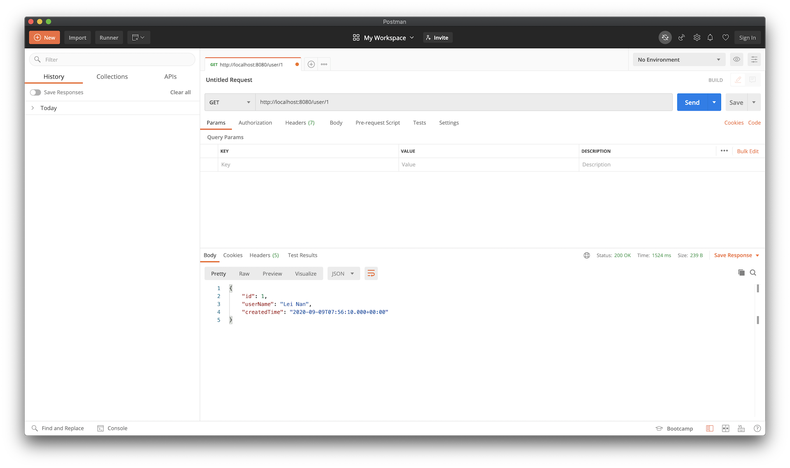
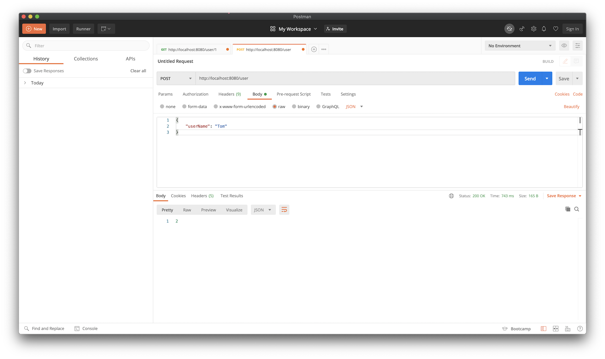

<h3 align="center"><b>App 示例 - 使用ShardingSphere连接MySQL主从库</b></h3>

#### 1. 构建MySQL主从库

具体方法请点击[参考文档](../DataBase/MySQL/master-slave.md)

#### 2. ShardingSphere

Apache ShardingSphere 是一套开源的分布式数据库中间件解决方案，可以参考[官方文档](https://shardingsphere.apache.org/document/current/cn/overview/)，更多内容也可查询[官方网站](https://shardingsphere.apache.org/)

本示例使用的数据库方案是MySQL一主二从读写分离(即主库负责写，从库负责读，从库使用Binlog进行实时同步)。

使用ShardingSphere中间件的目的在于其帮助我们实现在主从库之间的转换，而程序中无需指定读写操作的数据库。

#### 3. 代码示例

##### 3.1 引入依赖

Spring Boot的版本为2.3.2.RELEASE，ShardingSphere的版本为4.1.1

同时加入MySQL的数据库驱动和MyBatis的starter

参考如下配置：
```xml
    <dependencies>
        <dependency>
            <groupId>org.springframework.boot</groupId>
            <artifactId>spring-boot-starter-web</artifactId>
            <version>2.3.2.RELEASE</version>
        </dependency>
        <dependency>
            <groupId>org.springframework.boot</groupId>
            <artifactId>spring-boot-starter-jdbc</artifactId>
            <version>2.3.2.RELEASE</version>
        </dependency>
        <dependency>
            <groupId>org.apache.shardingsphere</groupId>
            <artifactId>sharding-jdbc-spring-boot-starter</artifactId>
            <version>4.1.1</version>
        </dependency>
        <dependency>
            <groupId>com.alibaba</groupId>
            <artifactId>druid</artifactId>
            <version>1.1.23</version>
        </dependency>
        <dependency>
            <groupId>mysql</groupId>
            <artifactId>mysql-connector-java</artifactId>
            <version>8.0.21</version>
        </dependency>
        <dependency>
            <groupId>org.mybatis.spring.boot</groupId>
            <artifactId>mybatis-spring-boot-starter</artifactId>
            <version>2.1.3</version>
        </dependency>
    </dependencies>
```

##### 3.2 Spring Boot配置

`spring.shardingsphere`就是ShardingSphere配置的起始头，数据库使用的是一主二从，即配置`datasource`时直接指明`names: master, slave1, slave2`

继续给每个数据源配置相关信息即可(这里的从库用户mysql只有select权限)

配置好数据源信息，继续设置ShardingSphere的主从配置`spring.shardingsphere.masterslave`信息，指定主库的name和从库的name，还有负载平衡算法，这里设置的`round_robin`表示轮询

配置完ShardingSphere，继续配置MyBatis，指定出mapper和config的加载路径即可

参考如下配置：
```yaml
server:
  port: 8080

spring:
  shardingsphere:
    datasource:
      names: master,slave1,slave2
      master:
        type: com.alibaba.druid.pool.DruidDataSource
        driver-class-name: com.mysql.cj.jdbc.Driver
        url: jdbc:mysql://39.105.58.106:33306/demo
        username: root
        password: root
#        druid:
#          initial-size: 5
#          max-active: 10
#          min-idle: 5
#          max-wait: 60000
#          time-between-eviction-runs-millis: 120000
#          min-evictable-idle-time-millis: 300000
#          validation-query: SELECT 1
#          test-while-idle: true
      slave1:
        type: com.alibaba.druid.pool.DruidDataSource
        driver-class-name: com.mysql.cj.jdbc.Driver
        url: jdbc:mysql://39.105.58.106:33307/demo
        username: mysql
        password: mysql
#        druid:
#          initial-size: 5
#          max-active: 10
#          min-idle: 5
#          max-wait: 60000
#          time-between-eviction-runs-millis: 120000
#          min-evictable-idle-time-millis: 300000
#          validation-query: SELECT 1
#          test-while-idle: true
      slave2:
        type: com.alibaba.druid.pool.DruidDataSource
        driver-class-name: com.mysql.cj.jdbc.Driver
        url: jdbc:mysql://39.105.58.106:33308/demo
        username: mysql
        password: mysql
#        druid:
#          initial-size: 5
#          max-active: 10
#          min-idle: 5
#          max-wait: 60000
#          time-between-eviction-runs-millis: 120000
#          min-evictable-idle-time-millis: 300000
#          validation-query: SELECT 1
#          test-while-idle: true
    masterslave:
      name: ms
      master-data-source-name: master
      slave-data-source-names: slave1, slave2
      load-balance-algorithm-type: round_robin
    props:
      sql:
        show: true
mybatis:
  mapperLocations: classpath:mybatis/**/*Mapper.xml
  configLocation: classpath:mybatis/mybatis-config.xml
```

##### 3.3 数据模型和MyBatis配置

演示使用的简单数据模型为
```sql
CREATE TABLE `USERS` (
  `ID` bigint NOT NULL AUTO_INCREMENT,
  `USER_NAME` varchar(100) NOT NULL,
  `CREATED_TIME` datetime NOT NULL,
  PRIMARY KEY (`ID`)
)
```

MyBatis的配置如下：
```xml
<?xml version="1.0" encoding="UTF-8" ?>
<!DOCTYPE configuration
        PUBLIC "-//mybatis.org//DTD Config 3.0//EN"
        "http://mybatis.org/dtd/mybatis-3-config.dtd">
<configuration>
    <settings>
        <setting name="cacheEnabled" value="true"/>  <!-- 全局映射器启用缓存 -->
        <setting name="useGeneratedKeys" value="true"/>  <!-- 允许 JDBC 支持自动生成主键 -->
    </settings>

    <typeAliases>
        <typeAlias type="sharding.sphere.demo.entity.User" alias="User"/>
    </typeAliases>
</configuration>
```

其中`User.java`定义为：
```java
package sharding.sphere.demo.entity;

import java.util.Date;

public class User {
    private Long id;
    private String userName;
    private Date createdTime;

    public Long getId() {
        return id;
    }

    public void setId(Long id) {
        this.id = id;
    }

    public String getUserName() {
        return userName;
    }

    public void setUserName(String userName) {
        this.userName = userName;
    }

    public Date getCreatedTime() {
        return createdTime;
    }

    public void setCreatedTime(Date createdTime) {
        this.createdTime = createdTime;
    }
}
```

MyBatis的mapper定义为：
```xml
<?xml version="1.0" encoding="UTF-8" ?>
<!DOCTYPE mapper
        PUBLIC "-//mybatis.org//DTD Mapper 3.0//EN"
        "http://mybatis.org/dtd/mybatis-3-mapper.dtd">
<mapper namespace="sharding.sphere.demo.mapper.UserMapper">
    <resultMap id="userResult" type="User">
        <id property="id" column="ID"/>
        <result property="userName" column="USER_NAME"/>
        <result property="createdTime" column="CREATED_TIME"/>
    </resultMap>

    <select id="listUsers" resultMap="userResult">
        SELECT * FROM USERS
        LIMIT #{start}, #{limit}
    </select>

    <select id="getUserById" resultMap="userResult">
        SELECT *
        FROM USERS
        WHERE ID = #{id}
    </select>

    <insert id="insertUser" parameterType="User">
        INSERT INTO
        USERS(USER_NAME,CREATED_TIME)
        VALUES (#{user.userName}, now())
    </insert>

    <delete id="deleteUser" parameterType="User">
        DELETE FROM USERS
        WHERE ID = #{user.id}
    </delete>
</mapper>
```

对应的Mapper类：
```java
package sharding.sphere.demo.mapper;

import org.apache.ibatis.annotations.Mapper;
import org.apache.ibatis.annotations.Param;
import sharding.sphere.demo.entity.User;

import java.util.List;

@Mapper
public interface UserMapper {
    List<User> listUsers(@Param("start") int start, @Param("limit") int limit);

    User getUserById(@Param("id") long id);

    int insertUser(@Param("user") User user);

    int deleteUser(@Param("user") User user);
}
```

##### 3.4 编写业务代码

示例代码仅包含按ID获取User信息、增加User两个功能：
```java
package sharding.sphere.demo.service.impl;

import org.apache.shardingsphere.api.hint.HintManager;
import org.springframework.beans.factory.annotation.Autowired;
import org.springframework.stereotype.Service;
import sharding.sphere.demo.entity.User;
import sharding.sphere.demo.mapper.UserMapper;
import sharding.sphere.demo.service.UserService;

@Service
public class UserServiceImpl implements UserService {

    @Autowired
    private UserMapper userMapper;

    @Override
    public User getUserById(Long id) {
        return userMapper.getUserById(id);
    }

    @Override
    public int insertUser(User user) {
        return userMapper.insertUser(user);
    }
}
```

编写API接口：
```java
package sharding.sphere.demo.controller;

import org.springframework.beans.factory.annotation.Autowired;
import org.springframework.web.bind.annotation.*;
import sharding.sphere.demo.entity.User;
import sharding.sphere.demo.service.UserService;

@RestController
public class UserController {

    @Autowired
    private UserService userService;

    @GetMapping(value = "/user/{id}")
    public User getUserById(@PathVariable("id") Long id) {
        return userService.getUserById(id);
    }

    @PostMapping(value = "/user", consumes = "application/json", produces = "application/json")
    public Long insertUser(@RequestBody User user) {
        userService.insertUser(user);
        return user.getId();
    }
}
```

引导类：
```java
package sharding.sphere.demo;

import org.springframework.boot.SpringApplication;
import org.springframework.boot.autoconfigure.SpringBootApplication;

@SpringBootApplication
public class ShardingSphereDemoApp {
    public static void main(String[] args) {
        SpringApplication.run(ShardingSphereDemoApp.class, args);
    }
}
```

#### 4. 运行示例

直接运行引导类，启动项目：
```cmd
  .   ____          _            __ _ _
 /\\ / ___'_ __ _ _(_)_ __  __ _ \ \ \ \
( ( )\___ | '_ | '_| | '_ \/ _` | \ \ \ \
 \\/  ___)| |_)| | | | | || (_| |  ) ) ) )
  '  |____| .__|_| |_|_| |_\__, | / / / /
 =========|_|==============|___/=/_/_/_/
 :: Spring Boot ::        (v2.3.2.RELEASE)

2020-09-09 22:06:42.925  INFO 7602 --- [           main] s.sphere.demo.ShardingSphereDemoApp      : Starting ShardingSphereDemoApp on nanleis-MacBook-Pro.local with PID 7602 (/Users/nanlei/Dev/Codebase/deep-in-spring-boot/sharding-sphere-demo/target/classes started by nanlei in /Users/nanlei/Dev/Codebase/deep-in-spring-boot)
2020-09-09 22:06:42.927  INFO 7602 --- [           main] s.sphere.demo.ShardingSphereDemoApp      : No active profile set, falling back to default profiles: default
2020-09-09 22:06:43.677  INFO 7602 --- [           main] trationDelegate$BeanPostProcessorChecker : Bean 'stringToNoneShardingStrategyConfigurationConverter' of type [org.apache.shardingsphere.spring.boot.converter.StringToNoneShardingStrategyConfigurationConverter] is not eligible for getting processed by all BeanPostProcessors (for example: not eligible for auto-proxying)
2020-09-09 22:06:43.686  INFO 7602 --- [           main] trationDelegate$BeanPostProcessorChecker : Bean 'spring.shardingsphere.sharding-org.apache.shardingsphere.shardingjdbc.spring.boot.sharding.SpringBootShardingRuleConfigurationProperties' of type [org.apache.shardingsphere.shardingjdbc.spring.boot.sharding.SpringBootShardingRuleConfigurationProperties] is not eligible for getting processed by all BeanPostProcessors (for example: not eligible for auto-proxying)
2020-09-09 22:06:43.694  INFO 7602 --- [           main] trationDelegate$BeanPostProcessorChecker : Bean 'spring.shardingsphere.masterslave-org.apache.shardingsphere.shardingjdbc.spring.boot.masterslave.SpringBootMasterSlaveRuleConfigurationProperties' of type [org.apache.shardingsphere.shardingjdbc.spring.boot.masterslave.SpringBootMasterSlaveRuleConfigurationProperties] is not eligible for getting processed by all BeanPostProcessors (for example: not eligible for auto-proxying)
2020-09-09 22:06:43.696  INFO 7602 --- [           main] trationDelegate$BeanPostProcessorChecker : Bean 'spring.shardingsphere.encrypt-org.apache.shardingsphere.shardingjdbc.spring.boot.encrypt.SpringBootEncryptRuleConfigurationProperties' of type [org.apache.shardingsphere.shardingjdbc.spring.boot.encrypt.SpringBootEncryptRuleConfigurationProperties] is not eligible for getting processed by all BeanPostProcessors (for example: not eligible for auto-proxying)
2020-09-09 22:06:43.700  INFO 7602 --- [           main] trationDelegate$BeanPostProcessorChecker : Bean 'spring.shardingsphere.shadow-org.apache.shardingsphere.shardingjdbc.spring.boot.shadow.SpringBootShadowRuleConfigurationProperties' of type [org.apache.shardingsphere.shardingjdbc.spring.boot.shadow.SpringBootShadowRuleConfigurationProperties] is not eligible for getting processed by all BeanPostProcessors (for example: not eligible for auto-proxying)
2020-09-09 22:06:43.702  INFO 7602 --- [           main] trationDelegate$BeanPostProcessorChecker : Bean 'spring.shardingsphere-org.apache.shardingsphere.shardingjdbc.spring.boot.common.SpringBootPropertiesConfigurationProperties' of type [org.apache.shardingsphere.shardingjdbc.spring.boot.common.SpringBootPropertiesConfigurationProperties] is not eligible for getting processed by all BeanPostProcessors (for example: not eligible for auto-proxying)
2020-09-09 22:06:43.918  INFO 7602 --- [           main] trationDelegate$BeanPostProcessorChecker : Bean 'org.apache.shardingsphere.shardingjdbc.spring.boot.SpringBootConfiguration' of type [org.apache.shardingsphere.shardingjdbc.spring.boot.SpringBootConfiguration$$EnhancerBySpringCGLIB$$e7dff249] is not eligible for getting processed by all BeanPostProcessors (for example: not eligible for auto-proxying)
2020-09-09 22:06:44.242  INFO 7602 --- [           main] o.s.b.w.embedded.tomcat.TomcatWebServer  : Tomcat initialized with port(s): 8080 (http)
2020-09-09 22:06:44.255  INFO 7602 --- [           main] o.apache.catalina.core.StandardService   : Starting service [Tomcat]
2020-09-09 22:06:44.255  INFO 7602 --- [           main] org.apache.catalina.core.StandardEngine  : Starting Servlet engine: [Apache Tomcat/9.0.37]
2020-09-09 22:06:44.341  INFO 7602 --- [           main] o.a.c.c.C.[Tomcat].[localhost].[/]       : Initializing Spring embedded WebApplicationContext
2020-09-09 22:06:44.341  INFO 7602 --- [           main] w.s.c.ServletWebServerApplicationContext : Root WebApplicationContext: initialization completed in 1263 ms
2020-09-09 22:06:44.660  INFO 7602 --- [           main] com.alibaba.druid.pool.DruidDataSource   : {dataSource-1} inited
2020-09-09 22:06:45.364  INFO 7602 --- [           main] com.alibaba.druid.pool.DruidDataSource   : {dataSource-2} inited
2020-09-09 22:06:45.811  INFO 7602 --- [           main] com.alibaba.druid.pool.DruidDataSource   : {dataSource-3} inited
2020-09-09 22:06:46.292  INFO 7602 --- [           main] o.a.s.core.log.ConfigurationLogger       : MasterSlaveRuleConfiguration:
loadBalanceAlgorithmType: round_robin
masterDataSourceName: master
name: ms
slaveDataSourceNames:
- slave1
- slave2

2020-09-09 22:06:46.293  INFO 7602 --- [           main] o.a.s.core.log.ConfigurationLogger       : Properties:
sql.show: 'true'

2020-09-09 22:06:46.429  INFO 7602 --- [           main] ShardingSphere-metadata                  : Loading 1 tables' meta data.
2020-09-09 22:06:46.583  INFO 7602 --- [           main] ShardingSphere-metadata                  : Meta data load finished, cost 290 milliseconds.
2020-09-09 22:06:46.935  INFO 7602 --- [           main] o.s.s.concurrent.ThreadPoolTaskExecutor  : Initializing ExecutorService 'applicationTaskExecutor'
2020-09-09 22:06:47.170  INFO 7602 --- [           main] o.s.b.w.embedded.tomcat.TomcatWebServer  : Tomcat started on port(s): 8080 (http) with context path ''
2020-09-09 22:06:47.186  INFO 7602 --- [           main] s.sphere.demo.ShardingSphereDemoApp      : Started ShardingSphereDemoApp in 4.612 seconds (JVM running for 5.065)
```

可以看到`DruidDataSource`初始化了3个对象，对应`master`，`slave1`和`slave2`。

首先在数据库master中添加一个User:
```sql
insert into USERS(USER_NAME,CREATED_TIME) values('Lei Nan', now());
```

访问接口`/user/{id}`：


日志输出为：
```cmd
2020-09-09 22:06:52.656  INFO 7602 --- [nio-8080-exec-1] ShardingSphere-SQL                       : Logic SQL: SELECT *
        FROM USERS
        WHERE ID = ?
2020-09-09 22:06:52.657  INFO 7602 --- [nio-8080-exec-1] ShardingSphere-SQL                       : SQLStatement: SelectStatementContext(super=CommonSQLStatementContext(sqlStatement=org.apache.shardingsphere.sql.parser.sql.statement.dml.SelectStatement@3528a95f, tablesContext=org.apache.shardingsphere.sql.parser.binder.segment.table.TablesContext@4b2481ee), tablesContext=org.apache.shardingsphere.sql.parser.binder.segment.table.TablesContext@4b2481ee, projectionsContext=ProjectionsContext(startIndex=7, stopIndex=7, distinctRow=false, projections=[ShorthandProjection(owner=Optional.empty, actualColumns=[ColumnProjection(owner=null, name=id, alias=Optional.empty), ColumnProjection(owner=null, name=user_name, alias=Optional.empty), ColumnProjection(owner=null, name=created_time, alias=Optional.empty)])]), groupByContext=org.apache.shardingsphere.sql.parser.binder.segment.select.groupby.GroupByContext@1a02bfb, orderByContext=org.apache.shardingsphere.sql.parser.binder.segment.select.orderby.OrderByContext@4567ed4b, paginationContext=org.apache.shardingsphere.sql.parser.binder.segment.select.pagination.PaginationContext@35f5c6e9, containsSubquery=false)
2020-09-09 22:06:52.657  INFO 7602 --- [nio-8080-exec-1] ShardingSphere-SQL                       : Actual SQL: slave1 ::: SELECT *
        FROM USERS
        WHERE ID = ?
```

再次执行时：
```cmd
2020-09-09 22:09:30.725  INFO 7602 --- [nio-8080-exec-5] ShardingSphere-SQL                       : Actual SQL: slave2 ::: SELECT *
        FROM USERS
        WHERE ID = ?
```

可以看到`slave1`和`slave2`是轮询查找的

通过API增加User:



日志输出为：
```cmd
2020-09-09 23:26:35.559  INFO 8499 --- [nio-8080-exec-2] ShardingSphere-SQL                       : Logic SQL: INSERT INTO
        USERS(USER_NAME,CREATED_TIME)
        VALUES (?, now())
2020-09-09 23:26:35.560  INFO 8499 --- [nio-8080-exec-2] ShardingSphere-SQL                       : SQLStatement: CommonSQLStatementContext(sqlStatement=org.apache.shardingsphere.sql.parser.sql.statement.dml.InsertStatement@5534efa9, tablesContext=org.apache.shardingsphere.sql.parser.binder.segment.table.TablesContext@6933988a)
2020-09-09 23:26:35.560  INFO 8499 --- [nio-8080-exec-2] ShardingSphere-SQL                       : Actual SQL: master ::: INSERT INTO
        USERS(USER_NAME,CREATED_TIME)
        VALUES (?, now())
```

新增操作自动使用`master`主库

如果查询操作强行使用`master`主库，可以如下进行：
```java
    @Override
    public User getUserById(Long id) {
        if (id == 2) {
            HintManager.getInstance().setMasterRouteOnly();
        }
        return userMapper.getUserById(id);
    }
```

执行`GET /user/2`时，日志输出为：
```cmd
2020-09-09 23:31:53.901  INFO 8499 --- [nio-8080-exec-5] ShardingSphere-SQL                       : Actual SQL: master ::: SELECT *
        FROM USERS
        WHERE ID = ?
```