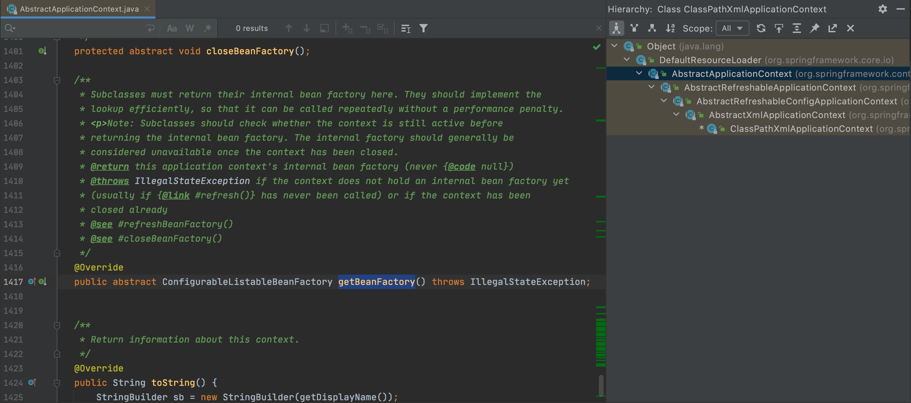
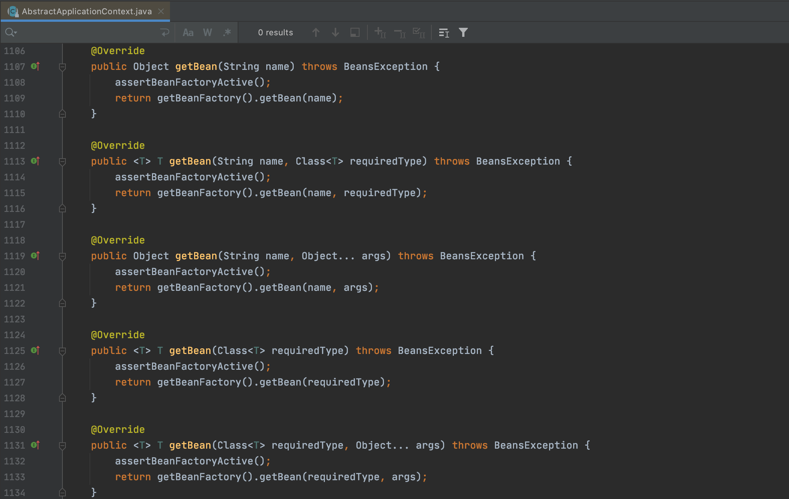

<h3 align="center"><b>Spring IoC 基础</b></h3>

## 1. 什么是IoC

**IoC**(Inversion of Control，控制反转)并不是Spring Framework特有的概念，站在从软件开发角度来理解，[可以参考](https://en.wikipedia.org/wiki/Inversion_of_control)。

而广义上的IoC，可以从一句话理解：`Don’t call me, we will call you`(好莱坞原则)

## 2. IoC的基本概念

广义上的IoC实现，[可以参考](https://en.wikipedia.org/wiki/Inversion_of_control#Implementation_techniques)。

在Spring Framework中，在其作者Rod Johnson和Juergen Hoeller做著的`《Expert One-on-One™J2EE™Development without EJB》`一书中提到：

(**Chapter 6: Lightweight Containers andInversion of Control**)
>***IoC Implementation Strategies***
>
>IoC is a broad concept that can be implemented in different ways. There are two main types:
>
>+ **Dependency Lookup**:The container provides callbacks to components, and a lookup context. This is the EJB and Apache Avalon approach. It leaves the onus on each component to use container APIs to look up resources and collaborators. The Inversion of Control is limited to the container invoking callback methods that application code can use to obtain resources.
>+ **Dependency Injection**:Components do no look up; they provide plain Java methods enabling the container to resolve dependencies. The container is wholly responsible for wiring up components, passing resolved objects in to JavaBean properties or constructors. Use of JavaBean properties is called Setter Injection; use of constructor arguments is called Constructor Injection.

也就是IoC实现策略有依赖查找和依赖注入两种类型，在Spring Framework中都有它们的存在。

**IoC的目标**

[可以参考](https://en.wikipedia.org/wiki/Inversion_of_control#Overview)

>Inversion of control serves the following design purposes:
>
> + To decouple the execution of a task from implementation.
> + To focus a module on the task it is designed for.
> + To free modules from assumptions about how other systems do what they do and instead rely on contracts.
> + To prevent side effects when replacing a module.

**IoC的职责**

+ 依赖处理：依赖查找，依赖注入
+ 生命周期管理： 容器，托管的资源(Java Bean或其他资源)
+ 配置：容器，外部化配置，托管的资源(Java Bean或其他资源)

## 3. IoC的实现

+ Java SE
  + Java Beans
  + Java ServiceLoader SPI
  + JNDI(Java Naming and Directory Interface)
+ Java EE
  + EJB(Enterprise Java Bean)
  + Servlet
+ Open Source
  + Apache Avalon(https://avalon.apache.org/closed.html)
  + PicoContainer(http://picocontainer.com)
  + Google Guice(https://github.com/google/guice)
  + Spring Framework(https://spring.io/projects/spring-framework)

**Java Beans 作为IoC容器**

+ 特性：依赖查找，生命周期管理，配置元信息，事件，自定义，资源管理，持久化
+ 规范：
  + Java Beans(https://www.oracle.com/java/technologies/javase/javabeans-spec.html)
  + BeanContext(https://docs.oracle.com/javase/8/docs/technotes/guides/beans/spec/beancontext.html)

首先构建一个简单的Java Bean：
```java
package bean;

/**
 * POJO class of Person
 * <p>
 * Getter/Setter方法(可读/可写方法)
 */
public class Person {
    //String to String
    private String name;
    //String to Integer
    private Integer age;

    public String getName() {
        return name;
    }

    public void setName(String name) {
        this.name = name;
    }

    public Integer getAge() {
        return age;
    }

    public void setAge(Integer age) {
        this.age = age;
    }

    @Override
    public String toString() {
        return "Person {" +
                "name='" + name + '\'' +
                ", age=" + age +
                '}';
    }
}
```

简单的Java对象(POJO)包含属性和可读/可写方法(Getter/Setter方法)，上例中设置属性`name`和`age`，类型为`String`和`Integer`来描述`Person`。

通过`BeanInfo`来获取Java Bean的信息：
```java
import bean.Person;


import java.beans.BeanInfo;
import java.beans.Introspector;
import java.util.stream.Stream;

/**
 * {@link java.beans.BeanInfo} 示例
 */
public class BeanInfoDemo {
    public static void main(String[] args) throws Exception {
        //通过自省方式来获取BeanInfo
        BeanInfo beanInfo = Introspector.getBeanInfo(Person.class);
        //获取PropertyDescriptor并分析
        Stream.of(beanInfo.getPropertyDescriptors()).forEach(propertyDescriptor -> {
            System.out.println(propertyDescriptor);
        });
    }
}
```

 运行程序，得到结果：
```txt
java.beans.PropertyDescriptor[name=age; propertyType=class java.lang.Integer; readMethod=public java.lang.Integer bean.Person.getAge(); writeMethod=public void bean.Person.setAge(java.lang.Integer)]
java.beans.PropertyDescriptor[name=class; propertyType=class java.lang.Class; readMethod=public final native java.lang.Class java.lang.Object.getClass()]
java.beans.PropertyDescriptor[name=name; propertyType=class java.lang.String; readMethod=public java.lang.String bean.Person.getName(); writeMethod=public void bean.Person.setName(java.lang.String)]
```

除了我们定义的`name`和`age`属性，还有一个`class`属性，这是因为在`java.lang.Object`中，有`public final native Class<?> getClass();`方法定义。而对象访问是通过方法进行的，而不是直接通过字段访问，那么`getClass()`方法就被认为是`class`属性的读方法。如果在`Person`类中不添加Getter和Setter方法，那么BeanInfo是获取不到`name`和`age`属性的。

为了排除`Object`类的影响，修改代码：
```java
BeanInfo beanInfo = Introspector.getBeanInfo(Person.class, Object.class);
```

`getBeanInfo`的重载方法`public static BeanInfo getBeanInfo(Class<?> beanClass, Class<?> stopClass) throws IntrospectionException`可以设置一个`stopClass`，表示不分析的父类起始点。再次运行程序，就没有`java.lang.Class`类型的`PropertyDescriptor`了。

在实际应用中，若要创建一个`Person`对象，其信息接受用户在UI上输入，那么传输的信息以字符串形式表示，但对于`age`属性，Java操作的是`Integer`类型对象，这就有类型转换的问题，要把`String`转为`Integer`类型，这里可以给`PropertyDescriptor`添加`PropertyEditor`来实现：
```java
import bean.Person;


import java.beans.BeanInfo;
import java.beans.Introspector;
import java.beans.PropertyEditorSupport;
import java.util.stream.Stream;

/**
 * {@link java.beans.BeanInfo} 示例
 */
public class BeanInfoDemo {
    public static void main(String[] args) throws Exception {
        //通过自省方式来获取BeanInfo
        BeanInfo beanInfo = Introspector.getBeanInfo(Person.class, Object.class);
        //获取PropertyDescriptor并分析
        Stream.of(beanInfo.getPropertyDescriptors()).forEach(propertyDescriptor -> {
            System.out.println(propertyDescriptor);
            //获取属性名称
            String propertyName = propertyDescriptor.getName();
            //PropertyDescriptor添加PropertyEditor(PropertyEditor的基础实现是PropertyEditorSupport)
            propertyDescriptor.setPropertyEditorClass(PropertyEditorSupport.class);
            //需要特殊处理的情况再使用自定义PropertyEditor覆盖
            if ("age".equals(propertyName)) {
                propertyDescriptor.setPropertyEditorClass(StringToIntegerPropertyEditor.class);
            }
        });

        //createObject();
    }

        /**
     * String to Integer PropertyEditor
     */
    static class StringToIntegerPropertyEditor extends PropertyEditorSupport {
        public void setAsText(String text) throws java.lang.IllegalArgumentException {
            //String to Integer
            Integer value = Integer.valueOf(text);
            setValue(value);
        }
    }
```

这里覆盖了`PropertyEditorSupport`类的`public void setAsText(String text) throws java.lang.IllegalArgumentException`方法，其原始定义为：
```java
    /**
     * Sets the property value by parsing a given String.  May raise
     * java.lang.IllegalArgumentException if either the String is
     * badly formatted or if this kind of property can't be expressed
     * as text.
     *
     * @param text  The string to be parsed.
     */
    public void setAsText(String text) throws java.lang.IllegalArgumentException {
        if (value instanceof String) {
            setValue(text);
            return;
        }
        throw new java.lang.IllegalArgumentException(text);
    }
```

经过覆盖重写，可以支持类型转换。下面实现`createObject()`方法：
```java
import bean.Person;


import java.beans.*;
import java.io.InputStream;
import java.lang.reflect.Method;
import java.util.Properties;
import java.util.stream.Stream;

/**
 * {@link java.beans.BeanInfo} 示例
 */
public class BeanInfoDemo {
    public static void main(String[] args) throws Exception {
        //通过自省方式来获取BeanInfo
        BeanInfo beanInfo = Introspector.getBeanInfo(Person.class, Object.class);
        //获取PropertyDescriptor并分析
        Stream.of(beanInfo.getPropertyDescriptors()).forEach(propertyDescriptor -> {
            System.out.println(propertyDescriptor);
            //获取属性名称
            String propertyName = propertyDescriptor.getName();
            //PropertyDescriptor添加PropertyEditor(PropertyEditor的基础实现是PropertyEditorSupport)
            propertyDescriptor.setPropertyEditorClass(PropertyEditorSupport.class);
            //需要特殊处理的情况再使用自定义PropertyEditor覆盖
            if ("age".equals(propertyName)) {
                propertyDescriptor.setPropertyEditorClass(StringToIntegerPropertyEditor.class);
            }
        });

        Person person = (Person) createObject(Person.class, beanInfo, "person.properties");
        System.out.println(person);
    }

    private static Object createObject(Class<?> clazz, BeanInfo beanInfo, String source) throws Exception {
        //从source加载资源(以Properties文件为例)
        Properties p = new Properties();
        InputStream is = BeanInfoDemo.class.getClassLoader().getResourceAsStream(source);
        p.load(is);

        Object object = clazz.newInstance();
        for (PropertyDescriptor propertyDescriptor : beanInfo.getPropertyDescriptors()) {
            //获取属性的写方法
            String key = propertyDescriptor.getName();
            String value = p.getProperty(key);
            Method method = propertyDescriptor.getWriteMethod();
            //获取属性的PropertyEditor
            PropertyEditor pe = (PropertyEditor) propertyDescriptor.getPropertyEditorClass().newInstance();
            if (pe.getClass() == StringToIntegerPropertyEditor.class) {
                pe.setAsText(value);
            } else {
                pe.setValue(value);
            }
            method.invoke(object, pe.getValue());
        }
        return object;
    }

    /**
     * String to Integer PropertyEditor
     */
    static class StringToIntegerPropertyEditor extends PropertyEditorSupport {
        public void setAsText(String text) throws java.lang.IllegalArgumentException {
            //String to Integer
            Integer value = Integer.valueOf(text);
            setValue(value);
        }
    }
}
```

`person.properties`文件内容为：
```properties
name=Tom
age=18
```

最终运行结果为：
```txt
java.beans.PropertyDescriptor[name=age; propertyType=class java.lang.Integer; writeMethod=public void bean.Person.setAge(java.lang.Integer)]
java.beans.PropertyDescriptor[name=name; propertyType=class java.lang.String; writeMethod=public void bean.Person.setName(java.lang.String)]
Person {name='Tom', age=18}
```

这里结合Java反射来创建对象，通过`BeanInfo`获取对应的`PropertyDescriptor`信息，再根据`PropertyEditor`来设置属性值。实现了外部数据到内部对象的数据绑定。

可以看出，Java Beans也可以作为IoC容器。

**轻量级IoC容器**

**特征**

`《Expert One-on-One™J2EE™Development without EJB》`一书中提到轻量级IoC容器所具有的特征：

(**Chapter 6: Lightweight Containers andInversion of Control**)
>A container that can manage application code
>
>A container that is quick to start up
>
>A container that doesn’t require any special deployment steps to deploy objects within it.
>
>A container that has such a light footprint and minimal API dependencies that it can be run in a variety of environments
>
>A container that sets the bar for adding a managed object so low in terms of deployment effort and performance overhead that it’s possible to deploy and manage fine-grained objects, as well as coarse-grained components.

**优势**

`《Expert One-on-One™J2EE™Development without EJB》`一书中提到轻量级IoC容器所具有的优势：

(**Chapter 6: Lightweight Containers andInversion of Control**)
>**Escaping the monolithic container**
>
>**Maximizing code reusability**
>
>**Greater object orientation**
>
>**Greater productivity**

## 4. 依赖查找和依赖注入

依赖查找是主动通过容器API进行的获取依赖。

依赖注入并不依赖容器API，是被动提供依赖，代码侵入性低。

Spring对依赖注入支持构造器注入和Setter注入，二者的比较[可以参考](https://docs.spring.io/spring-framework/docs/current/spring-framework-reference/core.html#beans-setter-injection)。Spring官方现在更推荐的是构造器注入。

而在`《Expert One-on-One™J2EE™Development without EJB》`一书中，作者更佳详细的比较了两种注入方式，但更倾向于Setter注入。

(Chapter 6: Lightweight Containers andInversion of Control)
>***Choosing between Setter and Constructor Injection***
>
>Advantages of Setter Injection include:
>
>+ JavaBean properties are well supported in IDEs.
>+ JavaBean properties are self-documenting.
>+ JavaBean properties are inherited by subclasses without the need for any code.
>+ It’s possible to use the standard JavaBeans property-editor machinery for type conversions if necessary.
>+ Many existing JavaBeans can be used within a JavaBean-oriented IoC container without modification.
>+ If there is a corresponding getter for each setter (making the property readable, as well as writable), it is possible to ask the component for its current configuration state. This is particularly useful if we want to persist that state: for example, in an XML form or in a database. With Constructor Injection, there’s no way to find the current state.
>+ Setter Injection works well for objects that have default values, meaning that not all properties need to be supplied at runtime.
>
>Disadvantages include:
>
>+ The order in which setters are called is not expressed in any contract. Thus, we sometimes need to invoke a method after the last setter has been called to initialize the component. Spring provides the `org.springframework.beans.factory.InitializingBean` interface for this; it also provides the ability to invoke an arbitrary init method. However, this contract must be documented to ensure correct use outside a container.
>+ Not all the necessary setters may have been called before use. The object can thus be left partially configured.
>
>Advantages of Constructor Injection include:
>
>+ Each managed object is guaranteed to be in a consistent state—fully configured—before it can be invoked in any business methods. This is the primary motivation of Constructor Injection. (However, it is possible to achieve the same result with JavaBeans via dependency checking, as Spring can optionally perform.) There’s no need for initialization methods.
>+ There may be slightly less code than results from the use of multiple JavaBean methods, although will be no difference in complexity.
>
>Disadvantages include:
>
>+ Although also a Java-language feature, multi-argument constructors are probably less common in existing code than use of JavaBean properties.
>+ Java constructor arguments don’t have names visible by introspection. (现在可以通过注解来处理)
>+ Constructor argument lists are less well supported by IDEs than JavaBean setter methods.
>+ Long constructor argument lists and large constructor bodies can become unwieldy.
>+ Concrete inheritance can become problematic
>+ Poor support for optional properties, compared to JavaBeans, which can have default values.
>+ Unit testing can be slightly more difficult
>+ When collaborators are passed in on object construction, it becomes impossible to change the reference held in the object. 

两种方式并无好坏之分，在各自合适的场景下使用即可。

## 5. Spring IoC容器

### 5.1 Spring IoC 依赖查找

Spring IoC容器中依赖查找可以分为：

+ 根据Bean名称查找(实时，延迟)
+ 根据Bean类型查找(单对象，集合对象)
+ 根据Bean名称+类型复合查找
+ 根据Java注解查找(单对象，集合对象)

参考示例：

首先引入Spring Ioc核心依赖：
```xml
        <!-- Spring IoC 核心依赖 -->
        <dependency>
            <groupId>org.springframework</groupId>
            <artifactId>spring-context</artifactId>
            <version>5.2.8.RELEASE</version>
        </dependency>
```

创建Spring XML配置文件`dependency-lookup.xml`，放在`resources`目录下：
```xml
<?xml version="1.0" encoding="UTF-8"?>
<beans xmlns="http://www.springframework.org/schema/beans"
       xmlns:xsi="http://www.w3.org/2001/XMLSchema-instance"
       xsi:schemaLocation="http://www.springframework.org/schema/beans
        https://www.springframework.org/schema/beans/spring-beans.xsd">
        ......
</beans>
```

创建Java实体对象，用于示例操作：
```java
package deep.in.spring.ioc.overview.domain;

public class Person {
    private String name;
    private Integer age;

    public String getName() {
        return name;
    }

    public void setName(String name) {
        this.name = name;
    }

    public Integer getAge() {
        return age;
    }

    public void setAge(Integer age) {
        this.age = age;
    }

    @Override
    public String toString() {
        return "Person{" +
                "name='" + name + '\'' +
                ", age=" + age +
                '}';
    }
}
```

在Spring XML配置文件中创建一个`bean`：
```xml
    <bean id="person" class="deep.in.spring.ioc.overview.domain.Person">
        <property name="name" value="Tom"/>
        <property name="age" value="18"/>
    </bean>
```

创建引导类：
```java
package deep.in.spring.ioc.overview.dependency.lookup;

import deep.in.spring.ioc.overview.domain.Person;
import org.springframework.beans.factory.BeanFactory;
import org.springframework.context.support.ClassPathXmlApplicationContext;

/**
 * 依赖查找示例
 */
public class DependencyLookupDemo {
    public static void main(String[] args) {
        //配置XML配置文件
        //启动Spring应用上下文
        BeanFactory beanFactory = new ClassPathXmlApplicationContext("classpath:/dependency-lookup.xml");
        //按名称实时查找
        lookupInRealTime(beanFactory, "person");
    }

    private static void lookupInRealTime(BeanFactory beanFactory, String beanName) {
        Object object = beanFactory.getBean(beanName);
        System.out.println("Lookup in Realtime: " + object);
    }
}
```

运行程序，结果如下：
```txt
Lookup in Realtime: Person{name='Tom', age=18}
```

添加延迟查找`bean`，使用`ObjectFactoryCreatingFactoryBean`类型：
```xml
    <bean id="objectFactory" class="org.springframework.beans.factory.config.ObjectFactoryCreatingFactoryBean">
        <property name="targetBeanName" value="person"/>
    </bean>
```

`ObjectFactoryCreatingFactoryBean`类型有个String类型的属性`targetBeanName`，就是目标`bean`的名称，这里设置为`person`。

创建对应的Java方法：
```java
    //lookupInLazy(beanFactory, "objectFactory"); 调用方法
    ...
    private static void lookupInLazy(BeanFactory beanFactory, String beanName) {
        ObjectFactory objectFactory = (ObjectFactory) beanFactory.getBean(beanName);
        Object object = objectFactory.getObject();
        System.out.println("Lookup in Lazy: " + object);
    }
```

再次运行引导程序，结果为：
```txt
Lookup in Realtime: Person{name='Tom', age=18}
Lookup in Lazy: Person{name='Tom', age=18}
```

按照Bean类型查找时，修改获取`bean`的方法即可：
```java
    //lookupByType(beanFactory, Person.class); 调用方法
    ...
    private static void lookupByType(BeanFactory beanFactory, Class<?> clazz) {
        Object object = beanFactory.getBean(clazz);
        System.out.println("Lookup By Type: " + object);
    }
```

按照Bean类型查找集合对象，需要用到`BeanFactory`的子类`ListableBeanFactory`中的相关方法：
```java
    //lookupByCollectionType(beanFactory, Person.class); 调用方法
    ...
    private static void lookupByCollectionType(BeanFactory beanFactory, Class<?> clazz) {
        if (beanFactory instanceof ListableBeanFactory) {
            ListableBeanFactory listableBeanFactory = (ListableBeanFactory) beanFactory;
            Map<String, ?> collection = listableBeanFactory.getBeansOfType(clazz);
            System.out.println("Lookup By collection: " + collection);
        }
    }
```

同时在XML配置文件中多创建一个`Person`类型的`bean`：
```xml
    <bean id="person" class="deep.in.spring.ioc.overview.domain.Person">
        <property name="name" value="Tom"/>
        <property name="age" value="18"/>
    </bean>

    <bean id="person2" class="deep.in.spring.ioc.overview.domain.Person">
        <property name="name" value="Jerry"/>
        <property name="age" value="18"/>
    </bean>
```

直接运行程序，可以得到：
```txt
Lookup By collection: {person=Person{name='Tom', age=18}, person2=Person{name='Jerry', age=18}}
```

按类型和名称同时查找时，使用`BeanFactory`的`<T> T getBean(String name, Class<T> requiredType) throws BeansException;`方法即可。

按注解查找，需要先创建注解：
```java
package deep.in.spring.ioc.overview.annotation;

import java.lang.annotation.ElementType;
import java.lang.annotation.Retention;
import java.lang.annotation.RetentionPolicy;
import java.lang.annotation.Target;

@Target(ElementType.TYPE)
@Retention(RetentionPolicy.RUNTIME)
public @interface Admin {
}
```

该注解仅有标记性作用，同时创建实体类`Administrator`：
```java
package deep.in.spring.ioc.overview.domain;

import deep.in.spring.ioc.overview.annotation.Admin;

/**
 * Administrator
 */
@Admin
public class Administrator extends Person {
    private String userName;
    private String password;

    public String getUserName() {
        return userName;
    }

    public void setUserName(String userName) {
        this.userName = userName;
    }

    public String getPassword() {
        return password;
    }

    public void setPassword(String password) {
        this.password = password;
    }

    @Override
    public String toString() {
        return "Administrator{" +
                "userName='" + userName + '\'' +
                ", password='" + password + '\'' +
                "} " + super.toString();
    }
}
```

`Administrator`继承自`Person`，并新增2个属性，在XML配置文件中新增相关的`bean`：
```xml
    <bean id="admin" class="deep.in.spring.ioc.overview.domain.Administrator" parent="person">
        <property name="userName" value="tom@abc.com"/>
        <property name="password" value="123456"/>
    </bean>
```

编写相关查找方法：
```java
    //lookupByAnnotation(beanFactory, Admin.class); 调用方法
    ...
    private static void lookupByAnnotation(BeanFactory beanFactory, Class<? extends Annotation> annotationClass) {
        if (beanFactory instanceof ListableBeanFactory) {
            ListableBeanFactory listableBeanFactory = (ListableBeanFactory) beanFactory;
            Map<String, Object> beans = (Map) listableBeanFactory.getBeansWithAnnotation(annotationClass);
            System.out.println("Lookup collection " + annotationClass.getSimpleName() + ": " + beans);
        }
    }
```

运行程序，得到结果：
```txt
Lookup collection Admin: {admin=Administrator{userName='tom@abc.com', password='123456'} Person{name='Tom', age=18}}
```

### 5.2 Spring IoC依赖注入

Spring IoC依赖注入可以分为：

+ 根据Bean名称注入
+ 根据Bean类型查找(单对象，集合对象)
+ 容器内建Bean对象注入
+ 非Bean对象注入
+ 注入方式可分为：实时注入，延迟注入

参考示例：

首先创建XML配置文件`dependency-injection`：
```xml
<?xml version="1.0" encoding="UTF-8"?>
<beans xmlns="http://www.springframework.org/schema/beans"
       xmlns:xsi="http://www.w3.org/2001/XMLSchema-instance"
       xmlns:util="http://www.springframework.org/schema/util"
       xsi:schemaLocation="
        http://www.springframework.org/schema/beans https://www.springframework.org/schema/beans/spring-beans.xsd
        http://www.springframework.org/schema/util https://www.springframework.org/schema/util/spring-util.xsd">

    <!-- 复用dependency-lookup.xml -->
    <import resource="dependency-lookup.xml"/>

    <bean id="personRepository" class="deep.in.spring.ioc.overview.repository.PersonRepository">
        <!-- 手动配置 -->
        <property name="persons">
            <util:list>
                <ref bean="person2"/>
                <ref bean="admin"/>
                <ref bean="person"/>
            </util:list>
        </property>
    </bean>
</beans>
```

将`dependency-lookup.xml`作为资源引入，同时声明一个`Repository`类型的bean：
```java
package deep.in.spring.ioc.overview.repository;

import deep.in.spring.ioc.overview.domain.Person;

import java.util.Collection;

/**
 * 成员信息仓库
 */
public class PersonRepository {
    private Collection<Person> persons;

    public Collection<Person> getPersons() {
        return persons;
    }

    public void setPersons(Collection<Person> persons) {
        this.persons = persons;
    }
}
```

在XML配置文件中，给`persons`对象进行依赖注入，就是在`dependency-lookup.xml`中定义的3个`bean`，`person2`，`admin`和`person`。

编写引导类：
```java
package deep.in.spring.ioc.overview.dependency.injection;

import deep.in.spring.ioc.overview.repository.PersonRepository;
import org.springframework.beans.factory.BeanFactory;
import org.springframework.context.support.ClassPathXmlApplicationContext;

/**
 * 依赖注入示例
 */
public class DependencyInjectionDemo {
    public static void main(String[] args) {
        //配置XML配置文件
        //启动Spring应用上下文
        BeanFactory beanFactory = new ClassPathXmlApplicationContext("classpath:/dependency-injection.xml");
        //获取personRepository
        PersonRepository personRepository = (PersonRepository) beanFactory.getBean("personRepository");
        System.out.println(personRepository.getPersons());
    }
}
```

运行程序，得到结果：
```txt
[Person{name='Jerry', age=18}, Administrator{userName='tom@abc.com', password='123456'} Person{name='Tom', age=18}, Person{name='Tom', age=18}]
```

可以看到，通过依赖注入，3个`bean`都正确返回了，但却是在XML配置文件里硬编码指定的(手动配置)，当`bean`过多时，显然不可取。可以使用自动绑定的方式来代替：
```xml
    <bean id="personRepository" class="deep.in.spring.ioc.overview.repository.PersonRepository"
          autowire="byType"> <!-- Auto-Wiring -->
    </bean>
```

通过类型来自动绑定，再次运行程序，得到结果：
```txt
[Person{name='Tom', age=18}, Person{name='Jerry', age=18}, Administrator{userName='tom@abc.com', password='123456'} Person{name='Tom', age=18}]
```

`bean`的输出顺序和配置的顺序一致，而手动配置的顺序也和打印的一致。

非Bean对象的注入，可以修改`PersonRepository`：
```java
package deep.in.spring.ioc.overview.repository;

import deep.in.spring.ioc.overview.domain.Person;
import org.springframework.beans.factory.BeanFactory;

import java.util.Collection;

/**
 * 成员信息仓库
 */
public class PersonRepository {
    private Collection<Person> persons; //自定义Bean

    private BeanFactory beanFactory;//内建非Bean对象

    public Collection<Person> getPersons() {
        return persons;
    }

    public void setPersons(Collection<Person> persons) {
        this.persons = persons;
    }

    public BeanFactory getBeanFactory() {
        return beanFactory;
    }

    public void setBeanFactory(BeanFactory beanFactory) {
        this.beanFactory = beanFactory;
    }
}
```

修改引导程序：
```java
package deep.in.spring.ioc.overview.dependency.injection;

import deep.in.spring.ioc.overview.repository.PersonRepository;
import org.springframework.beans.factory.BeanFactory;
import org.springframework.context.support.ClassPathXmlApplicationContext;

/**
 * 依赖注入示例
 */
public class DependencyInjectionDemo {
    public static void main(String[] args) {
        //配置XML配置文件
        //启动Spring应用上下文
        BeanFactory beanFactory = new ClassPathXmlApplicationContext("classpath:/dependency-injection.xml");
        //获取personRepository
        PersonRepository personRepository = (PersonRepository) beanFactory.getBean("personRepository");
        //依赖注入(内建依赖)
        System.out.println(beanFactory == personRepository.getBeanFactory());
    }
}
```

运行程序，结果为`false`，说明`beanFactory`和`PersonRepository`中的非Bean对象`beanFactory`是不同的，可以将它们打印出来看：
```java
        System.out.println(personRepository.getBeanFactory());
        System.out.println(beanFactory);
```

结果为：
```txt
org.springframework.beans.factory.support.DefaultListableBeanFactory@73f792cf: defining beans [person,person2,admin,objectFactory,personRepository]; root of factory hierarchy
org.springframework.context.support.ClassPathXmlApplicationContext@246b179d, started on Thu Oct 29 23:01:17 CST 2020
```

说明其是内建对象，而不是Bean，如果是Bean，可以通过依赖查找获取到：
```java
        //依赖查找(错误)
        System.out.println(beanFactory.getBean(BeanFactory.class));
```

但这里是错误的：
```txt
Exception in thread "main" org.springframework.beans.factory.NoSuchBeanDefinitionException: No qualifying bean of type 'org.springframework.beans.factory.BeanFactory' available
```

示例本身也说明了依赖查找和依赖注入是不同的。

延迟注入，和延迟查找类似，可以借助`ObjectFactory`，修改`PersonRepository`：
```java
package deep.in.spring.ioc.overview.repository;

import deep.in.spring.ioc.overview.domain.Person;
import org.springframework.beans.factory.BeanFactory;
import org.springframework.beans.factory.ObjectFactory;

import java.util.Collection;

/**
 * 成员信息仓库
 */
public class PersonRepository {
    private Collection<Person> persons; //自定义Bean

    private BeanFactory beanFactory;//内建非Bean对象

    private ObjectFactory<Person> personObjectFactory;

    public Collection<Person> getPersons() {
        return persons;
    }

    public void setPersons(Collection<Person> persons) {
        this.persons = persons;
    }

    public BeanFactory getBeanFactory() {
        return beanFactory;
    }

    public void setBeanFactory(BeanFactory beanFactory) {
        this.beanFactory = beanFactory;
    }

    public ObjectFactory<Person> getPersonObjectFactory() {
        return personObjectFactory;
    }

    public void setPersonObjectFactory(ObjectFactory<Person> personObjectFactory) {
        this.personObjectFactory = personObjectFactory;
    }
}
```

对应修改引导程序：
```java
package deep.in.spring.ioc.overview.dependency.injection;

import deep.in.spring.ioc.overview.repository.PersonRepository;
import org.springframework.beans.factory.BeanFactory;
import org.springframework.beans.factory.ObjectFactory;
import org.springframework.context.support.ClassPathXmlApplicationContext;

/**
 * 依赖注入示例
 */
public class DependencyInjectionDemo {
    public static void main(String[] args) {
        //配置XML配置文件
        //启动Spring应用上下文
        BeanFactory beanFactory = new ClassPathXmlApplicationContext("classpath:/dependency-injection.xml");
        //获取personRepository
        PersonRepository personRepository = (PersonRepository) beanFactory.getBean("personRepository");
        //延迟注入
        ObjectFactory personObjectFactory = personRepository.getPersonObjectFactory();
        System.out.println(personObjectFactory.getObject());
    }
}
```

直接运行：
```txt
Exception in thread "main" org.springframework.beans.factory.NoUniqueBeanDefinitionException: No qualifying bean of type 'deep.in.spring.ioc.overview.domain.Person' available: expected single matching bean but found 3: person,person2,admin
```

这里的问题是定义了3个`Person`类型的`bean`，但程序期望只得到一个，可以修改配置文件，添加属性：
```xml
    <bean id="admin" class="deep.in.spring.ioc.overview.domain.Administrator" parent="person" primary="true">
        <property name="userName" value="tom@abc.com"/>
        <property name="password" value="123456"/>
    </bean>
```

在其中的一个`bean`上添加`primary="true"`即可，再次运行即可得到结果。

修改`ObjectFactory`获取的内容为`ApplicationContext`：
```java
    private ObjectFactory<ApplicationContext> objectFactory;
    ...
    public ObjectFactory<ApplicationContext> getObjectFactory() {
        return objectFactory;
    }

    public void setObjectFactory(ObjectFactory<ApplicationContext> objectFactory) {
        this.objectFactory = objectFactory;
    }
```

修改引导程序：
```java
        ObjectFactory objectFactory = personRepository.getObjectFactory();
        System.out.println(objectFactory.getObject());
        System.out.println(beanFactory);
```

此时得到的结果就是`beanFactory`，它们是一个东西。

容器内建Bean对象：
```java
        //容器内建Bean
        Environment environment = beanFactory.getBean(Environment.class);
        System.out.println(environment);
```

运行输出：
```txt
StandardEnvironment {activeProfiles=[], defaultProfiles=[default], propertySources=[PropertiesPropertySource {name='systemProperties'}, SystemEnvironmentPropertySource {name='systemEnvironment'}]}
```

由此总结Spring IoC依赖来源：

+ 自定义Bean
+ 容器内建依赖
+ 容器内建Bean对象

### 5.3 Spring IoC配置元信息

+ Bean的定义配置：XML文件/Properties文件/Java注解/Java API
+ IoC容器配置：XML文件/Java注解/Java API
+ 外部化属性配置：Java注解

### 5.4 `BeanFactory`和`ApplictionContext`

Spring官方文档对此有解释，[可以参考](https://docs.spring.io/spring-framework/docs/current/reference/html/core.html#beans-introduction)：
>The `org.springframework.beans` and `org.springframework.context` packages are the basis for Spring Framework’s IoC container. The [`BeanFactory`](https://docs.spring.io/spring-framework/docs/current/javadoc-api/org/springframework/beans/factory/BeanFactory.html) interface provides an advanced configuration mechanism capable of managing any type of **object**. [`ApplicationContext`](https://docs.spring.io/spring-framework/docs/current/javadoc-api/org/springframework/context/ApplicationContext.html) is a sub-interface of `BeanFactory`. It adds:
>
>+ Easier integration with Spring’s AOP features
>+ Message resource handling (for use in internationalization)
>+ Event publication
>+ Application-layer specific contexts such as the `WebApplicationContext` for use in web applications.
>
>In short, the `BeanFactory` provides the configuration framework and basic functionality, and the `ApplicationContext` adds more enterprise-specific functionality. The `ApplicationContext` is a complete superset of the `BeanFactory` and is used exclusively in this chapter in descriptions of Spring’s IoC container. For more information on using the `BeanFactory` instead of the `ApplicationContext`, [see The BeanFactory](https://docs.spring.io/spring-framework/docs/current/reference/html/core.html#beans-beanfactory).

上面的示例中，引导程序的第一行：
```
BeanFactory beanFactory = new ClassPathXmlApplicationContext("classpath:/dependency-injection.xml");
```

就印证了官方文档的内容，`ApplicationContext`是`BeanFactory`的超集，也可以改为：
```java
package deep.in.spring.ioc.overview.dependency.injection;

import deep.in.spring.ioc.overview.repository.PersonRepository;
import org.springframework.context.ApplicationContext;
import org.springframework.context.support.ClassPathXmlApplicationContext;

/**
 * 依赖注入示例
 */
public class DependencyInjectionDemo {
    public static void main(String[] args) {
        //配置XML配置文件
        //启动Spring应用上下文
        ApplicationContext applicationContext = new ClassPathXmlApplicationContext("classpath:/dependency-injection.xml");
        //获取personRepository
        PersonRepository personRepository = (PersonRepository) applicationContext.getBean("personRepository");

        System.out.println(applicationContext == personRepository.getBeanFactory());
    }
}
```

下面来看`applicationContext == personRepository.getBeanFactory()`为`false`的问题。

因为在配置`bean`的时候，设置了`autowire="byType"`，所以`BeanFactory`依赖被注入到`personRepository`中，可以通过`personRepository.getBeanFactory()`获取到，但这里注入的`BeanFactory`和引导类中的`ApplicationContext`(`BeanFactory`)并不是一回事，因为在`ApplicationContext`的继承链上，既有继承，还有组合。

在`ClassPathXmlApplicationContext`的继承链上，有抽象类`AbstractApplicationContext`，其中有抽象方法`getBeanFactory()`：

(如图所示继承关系不包含所实现的接口)

而这个方法依然是覆盖了`ConfigurableApplicationContext`接口中的`getBeanFactory()`方法。其接口继承关系为：`ConfigurableApplicationContext --> ApplicationContext --> ListableBeanFactory --> BeanFactory`。

既然有`BeanFactory`继承关系，子接口还定义方法去获取，说明这里不单单是继承。在`AbstractRefreshableApplicationContext`中有`getBeanFactory()`的实现代码：
```java
	/** Bean factory for this context. */
	@Nullable
	private volatile DefaultListableBeanFactory beanFactory;
    ...
	@Override
	public final ConfigurableListableBeanFactory getBeanFactory() {
		DefaultListableBeanFactory beanFactory = this.beanFactory;
		if (beanFactory == null) {
			throw new IllegalStateException("BeanFactory not initialized or already closed - " +
					"call 'refresh' before accessing beans via the ApplicationContext");
		}
		return beanFactory;
	}
```

所以上面程序打印`personRepository.getBeanFactory()`的结果时，返回的就是`DefaultListableBeanFactory`，就是从这里来的，是组合来的。再看其中的`getBean()`系列方法：


可以看到`getBean()`系列方法也是从组合对象中进行获取的。而引导类中的`beanFactory`才是`ClassPathXmlApplicationContext`，是继承来的。

综上所述，`ApplicationContext`就是`BeanFactory`，它们具有继承关系，但`ApplicationContext`又组合了一个`BeanFactory`的实现。

而`ApplicationContext`和`BeanFactory`本身的区别，参考官方文档的解释即可。

`BeanFactory`是Spring底层IoC容器，`ApplicationContext`除了作为IoC容器，还提供：

+ 面向切面(AOP)
+ 配置元信息(Configuration Metadata)
+ 资源管理(Resources)
+ 事件(Events)
+ 国际化(i18n)
+ 注解(Annotation)
+ Environment抽象(配置，外部化配置)

### 5.5 `BeanFactory`和`ApplicationContext`比较

上节示例中，Spring为Bean默认注入的`BeanFactory`类型是`DefaultListableBeanFactory`，它实现了`ListableBeanFactory`接口，`ListableBeanFactory`接口继承自`BeanFactory`接口。

由此，也可以直接使用`DefaultListableBeanFactory`作为IoC容器，比如：
```java
DefaultListableBeanFactory beanFactory = new DefaultListableBeanFactory();
```

但上节示例中，使用的是基于类路径下XML的`ApplicationContext`实现，将配置文件地址作为构造方法参数传入，而直接使用`BeanFactory`类型时，需要将Bean信息(配置文件)手动加载。

基于XML方式的Bean的加载API是`XmlBeanDefinitionReader`，其需要一个`BeanDefinitionRegistry`类型的参数来进行构造，而`DefaultListableBeanFactory`恰好实现了`BeanDefinitionRegistry`接口，可以直接使用：
```java
XmlBeanDefinitionReader reader = new XmlBeanDefinitionReader(beanFactory);
```

有了`XmlBeanDefinitionReader`之后，加载配置文件即可，其`loadBeanDefinitions(String location)`方法即可读取配置文件，方法返回值为`int`类型，是找到`bean`定义的数量：
```java
String configLocation = "classpath:/dependency-lookup.xml";
int beanDefinitionsCount = reader.loadBeanDefinitions(configLocation);
```

调用该方法后，`BeanFactory`类型的IoC容器就已经初始化好，可以继续使用了，完整示例如下：
```java
package deep.in.spring.ioc.overview.container;

import deep.in.spring.ioc.overview.domain.Person;
import org.springframework.beans.factory.BeanFactory;
import org.springframework.beans.factory.ListableBeanFactory;
import org.springframework.beans.factory.support.DefaultListableBeanFactory;
import org.springframework.beans.factory.xml.XmlBeanDefinitionReader;

import java.util.Map;

/**
 * {@link BeanFactory} IoC容器示例
 */
public class BeanFactoryIoCContainerDemo {
    public static void main(String[] args) {
        //创建 BeanFactory 容器
        DefaultListableBeanFactory beanFactory = new DefaultListableBeanFactory();
        XmlBeanDefinitionReader reader = new XmlBeanDefinitionReader(beanFactory);
        //XML配置文件路径
        String configLocation = "classpath:/dependency-lookup.xml";
        //加载配置
        int beanDefinitionsCount = reader.loadBeanDefinitions(configLocation);
        System.out.println("Bean count: " + beanDefinitionsCount);
        //依赖查找集合对象
        lookupByCollectionType(beanFactory, Person.class);
    }

    private static void lookupByCollectionType(BeanFactory beanFactory, Class<?> clazz) {
        if (beanFactory instanceof ListableBeanFactory) {
            ListableBeanFactory listableBeanFactory = (ListableBeanFactory) beanFactory;
            Map<String, ?> collection = listableBeanFactory.getBeansOfType(clazz);
            System.out.println("Lookup By collection: " + collection);
        }
    }
}
```

沿用之前的配置文件`dependency-lookup.xml`，运行程序，得到输出：
```txt
Bean count: 4
Lookup By collection: {person=Person{name='Tom', age=18}, person2=Person{name='Jerry', age=18}, admin=Administrator{userName='tom@abc.com', password='123456'} Person{name='Tom', age=18}}
```

使用`BeanFactory`就是典型的IoC容器，没有事件，资源等特性。

上面示例一直使用的是基于XML的配置信息，下面使用基于注解配置的实现，使用`AnnotationConfigApplicationContext`：
```java
AnnotationConfigApplicationContext applicationContext = new AnnotationConfigApplicationContext();
```

创建好`ApplicationContext`对象后，需要注册配置类，使用`register(Class<?>... componentClasses)`方法即可将配置类进行注册。配置好后，再调用`refresh()`方法即可初始化IoC容器，完整示例如下：
```java
package deep.in.spring.ioc.overview.container;

import deep.in.spring.ioc.overview.domain.Person;
import org.springframework.beans.factory.BeanFactory;
import org.springframework.beans.factory.ListableBeanFactory;
import org.springframework.context.ApplicationContext;
import org.springframework.context.annotation.AnnotationConfigApplicationContext;
import org.springframework.context.annotation.Bean;

import java.util.Map;

/**
 * 注解能力 {@link ApplicationContext} IoC容器
 */
public class AnnotationApplicationContextIoCContainerDemo {
    public static void main(String[] args) {
        //创建 ApplicationContext
        AnnotationConfigApplicationContext applicationContext = new AnnotationConfigApplicationContext();
        //将当前类作为配置类
        applicationContext.register(AnnotationApplicationContextIoCContainerDemo.class);
        //启动应用上下文
        applicationContext.refresh();
        //依赖查找集合对象
        lookupByCollectionType(applicationContext, Person.class);
    }

    /**
     * 通过Java注解的方式定义Bean
     */
    @Bean
    public Person person() {
        Person person = new Person();
        person.setName("Leo");
        person.setAge(20);
        return person;
    }

    private static void lookupByCollectionType(BeanFactory beanFactory, Class<?> clazz) {
        if (beanFactory instanceof ListableBeanFactory) {
            ListableBeanFactory listableBeanFactory = (ListableBeanFactory) beanFactory;
            Map<String, ?> collection = listableBeanFactory.getBeansOfType(clazz);
            System.out.println("Lookup By collection: " + collection);
        }
    }
}
```

这里通过注解的方式定义Bean，执行程序，即可得到：
```txt
Lookup By collection: {person=Person{name='Leo', age=20}}
```

### 5.6 Spring IoC容器的生命周期

Spring IoC容器的生命周期简单分为以下过程：

+ 启动
+ 运行
+ 停止

上节的示例中，使用了`applicationContext.refresh()`方法来启动应用上下文，对应了启动过程，该方法在`AbstractApplicationContext`中实现：
(以下代码基于Spring Framework **5.2.8.RELEASE**)
```java
@Override
	public void refresh() throws BeansException, IllegalStateException {
		synchronized (this.startupShutdownMonitor) {
			// Prepare this context for refreshing.
			prepareRefresh();

			// Tell the subclass to refresh the internal bean factory.
			ConfigurableListableBeanFactory beanFactory = obtainFreshBeanFactory();

			// Prepare the bean factory for use in this context.
			prepareBeanFactory(beanFactory);

			try {
				// Allows post-processing of the bean factory in context subclasses.
				postProcessBeanFactory(beanFactory);

				// Invoke factory processors registered as beans in the context.
				invokeBeanFactoryPostProcessors(beanFactory);

				// Register bean processors that intercept bean creation.
				registerBeanPostProcessors(beanFactory);

				// Initialize message source for this context.
				initMessageSource();

				// Initialize event multicaster for this context.
				initApplicationEventMulticaster();

				// Initialize other special beans in specific context subclasses.
				onRefresh();

				// Check for listener beans and register them.
				registerListeners();

				// Instantiate all remaining (non-lazy-init) singletons.
				finishBeanFactoryInitialization(beanFactory);

				// Last step: publish corresponding event.
				finishRefresh();
			}

			catch (BeansException ex) {
				if (logger.isWarnEnabled()) {
					logger.warn("Exception encountered during context initialization - " +
							"cancelling refresh attempt: " + ex);
				}

				// Destroy already created singletons to avoid dangling resources.
				destroyBeans();

				// Reset 'active' flag.
				cancelRefresh(ex);

				// Propagate exception to caller.
				throw ex;
			}

			finally {
				// Reset common introspection caches in Spring's core, since we
				// might not ever need metadata for singleton beans anymore...
				resetCommonCaches();
			}
		}
	}
```

整个逻辑放在`synchronized`同步块中进行。

+ `prepareRefresh()`方法做一些启动前的准备工作：记录启动时间、设置状态、初始化`Environment`属性并校验，准备启动前监听器等。

+ `obtainFreshBeanFactory()`方法为获取`BeanFactory`，主要方法由子类实现。其中`AbstractRefreshableApplicationContext`的实现为：
```java
	/**
	 * This implementation performs an actual refresh of this context's underlying
	 * bean factory, shutting down the previous bean factory (if any) and
	 * initializing a fresh bean factory for the next phase of the context's lifecycle.
	 */
	@Override
	protected final void refreshBeanFactory() throws BeansException {
		if (hasBeanFactory()) {
			destroyBeans();
			closeBeanFactory();
		}
		try {
			DefaultListableBeanFactory beanFactory = createBeanFactory();
			beanFactory.setSerializationId(getId());
			customizeBeanFactory(beanFactory);
			loadBeanDefinitions(beanFactory);
			this.beanFactory = beanFactory;
		}
		catch (IOException ex) {
			throw new ApplicationContextException("I/O error parsing bean definition source for " + getDisplayName(), ex);
		}
	}
    ...
    protected DefaultListableBeanFactory createBeanFactory() {
		return new DefaultListableBeanFactory(getInternalParentBeanFactory());
	}
    ...
    @Override
	public final ConfigurableListableBeanFactory getBeanFactory() {
		DefaultListableBeanFactory beanFactory = this.beanFactory;
		if (beanFactory == null) {
			throw new IllegalStateException("BeanFactory not initialized or already closed - " +
					"call 'refresh' before accessing beans via the ApplicationContext");
		}
		return beanFactory;
	}
```
该类中的`beanFactory`使用`volatile`关键字修饰，老版本中也是使用`synchronized`加锁。

+ `prepareBeanFactory(beanFactory)`方法，注册了一些基本的内建依赖，比如`BeanFactory`和`Environment`等其他操作。
  
+ `postProcessBeanFactory(beanFactory)`方法由子类具体实现，`invokeBeanFactoryPostProcessors(beanFactory)`就是进行调用：
```java
	/**
	 * Modify the application context's internal bean factory after its standard
	 * initialization. All bean definitions will have been loaded, but no beans
	 * will have been instantiated yet. This allows for registering special
	 * BeanPostProcessors etc in certain ApplicationContext implementations.
	 * @param beanFactory the bean factory used by the application context
	 */
	protected void postProcessBeanFactory(ConfigurableListableBeanFactory beanFactory) {
	}
    ...
    protected void invokeBeanFactoryPostProcessors(ConfigurableListableBeanFactory beanFactory) {
		PostProcessorRegistrationDelegate.invokeBeanFactoryPostProcessors(beanFactory, getBeanFactoryPostProcessors());

		// Detect a LoadTimeWeaver and prepare for weaving, if found in the meantime
		// (e.g. through an @Bean method registered by ConfigurationClassPostProcessor)
		if (beanFactory.getTempClassLoader() == null && beanFactory.containsBean(LOAD_TIME_WEAVER_BEAN_NAME)) {
			beanFactory.addBeanPostProcessor(new LoadTimeWeaverAwareProcessor(beanFactory));
			beanFactory.setTempClassLoader(new ContextTypeMatchClassLoader(beanFactory.getBeanClassLoader()));
		}
	}
```

+ `registerBeanPostProcessors(beanFactory)`就是注册Bean的后置处理器。

+ `initMessageSource()`是对国际化的支持，初始化`Message`资源，体现了`ApplicationContext`和`BeanFactory`的不同。
  
+ `initApplicationEventMulticaster()`初始化应用事件广播，具备事件特性。

+ `onRefresh()`是初始化特定上下文中的特定`bean`。

+ `registerListeners()`是注册监听器。

+ `finishBeanFactoryInitialization(beanFactory)`实例化一些单例对象并完成`BeanFactory`的初始化。

+ `finishRefresh()`完成初始化并发布对应事件。

`ApplicationContext`的初始化工作较为复杂，这里只是简单介绍了其中各个步骤，其具体内容需要深入了解。

停止操作可以调用如下方法完成：
```java
        //关闭应用上下文
        applicationContext.close();
```

`close()`方法也在`AbstractApplicationContext`中定义：
```java
	/**
	 * Close this application context, destroying all beans in its bean factory.
	 * <p>Delegates to {@code doClose()} for the actual closing procedure.
	 * Also removes a JVM shutdown hook, if registered, as it's not needed anymore.
	 * @see #doClose()
	 * @see #registerShutdownHook()
	 */
	@Override
	public void close() {
		synchronized (this.startupShutdownMonitor) {
			doClose();
			// If we registered a JVM shutdown hook, we don't need it anymore now:
			// We've already explicitly closed the context.
			if (this.shutdownHook != null) {
				try {
					Runtime.getRuntime().removeShutdownHook(this.shutdownHook);
				}
				catch (IllegalStateException ex) {
					// ignore - VM is already shutting down
				}
			}
		}
	}
```

其中Spring Framework的关闭操作在`doClose()`方法中完成，其中主要是以下3个方法：
```java
            ...
			// Destroy all cached singletons in the context's BeanFactory.
			destroyBeans();

			// Close the state of this context itself.
			closeBeanFactory();

			// Let subclasses do some final clean-up if they wish...
			onClose();
            ...
```

也就是销毁所有的Bean，关闭`BeanFactory`，并且给子类留有特定关闭逻辑的`onClose()`方法。

其余内容可以具体参考源代码。

(不同版本之间的代码实现会有差别)