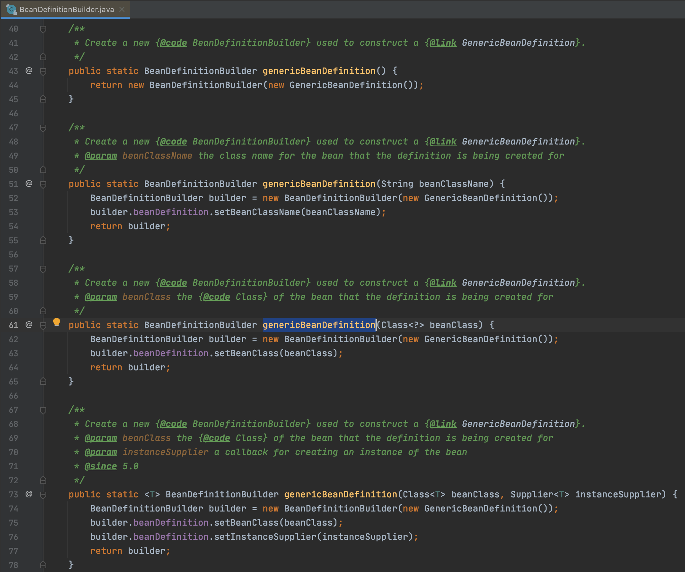
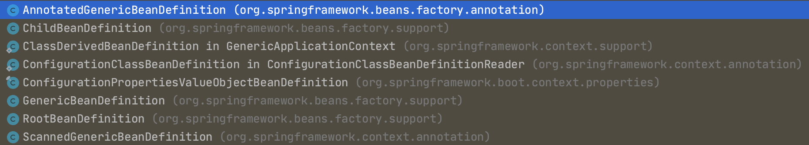
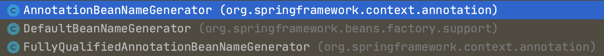
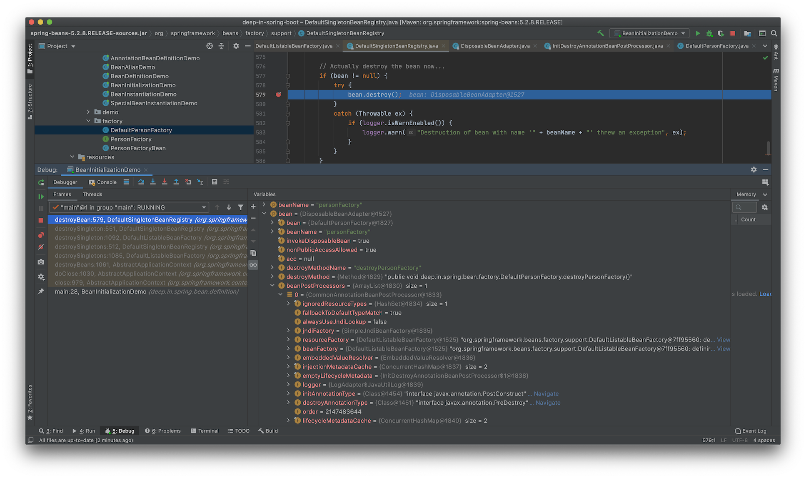

<h3 align="center"><b>Spring Beans 基础</b></h3>

## 1. Spring `BeanDefinition`

`BeanDefinition`是Spring Framework中定义Bean的配置元信息接口(`org.springframework.beans.factory.config.BeanDefinition`)，包含：

+ Bean的类名(类全名/完全限定名)
+ Bean行为元素(作用域，自动绑定模式，生命周期回调等)
+ 其他Bean引用(依赖dependencies)
+ 配置设置(Bean属性properties)

`BeanDefinition`的构建主要通过以下方式进行：

+ `BeanDefinitionBuilder`
+ `AbstractBeanDefinition`(本身实现了`BeanDefinition`接口)以及子类

`BeanDefinition`的元信息包括：

+ Bean的类全名(必须是具体类，不能是接口或抽象类)：`class`
+ Bean的名称：`id`/`name`
+ Bean的作用域(`singleton`，`prototype`)：`scope`
+ Bean的构造器参数(用于依赖注入)：`constructor-arg`
+ Bean的属性设置(用于依赖注入)：`property`
+ Bean的自动绑定模式(`byName`，`byType`等)：`autowire`
+ Bean的延迟初始化模式(`true`/`false`)：`lazy-init`
+ 初始化回调方法：`init-method`
+ 销毁回调方法：`destroy-method`

### 1.1 通过`BeanDefinitionBuilder`构建

`BeanDefinitionBuilder`(`org.springframework.beans.factory.support.BeanDefinitionBuilder`)是一个构建器模式的类，提供了一系列的静态方法来辅助构建`BeanDefinition`。


首先创建`BeanDefinitionBuilder`对象，按照Bean的类型来构建：
```java
//通过BeanDefinitionBuilder构建
BeanDefinitionBuilder beanDefinitionBuilder = BeanDefinitionBuilder.genericBeanDefinition(Person.class);
```

获取到`BeanDefinitionBuilder`对象后，进行属性设置：
```java
//属性设置
beanDefinitionBuilder.addPropertyValue("name", "Tom").addPropertyValue("age", 22);
```

构建完成，获取`BeanDefinition`对象：
```java
//获取BeanDefinition实例
BeanDefinition beanDefinition = beanDefinitionBuilder.getBeanDefinition();
```

此时的`beanDefinition`还可以自定义修改，并非Bean的最终状态，因为这里只是获取`BeanDefinition`，没有注册到IoC容器中。

### 1.2 通过`AbstractBeanDefinition`以及子类构建

抽象类`AbstractBeanDefinition`实现了`BeanDefinition`接口，可以使用其子类进行`BeanDefinition`构建。

当前Spring版本(**5.2.8.RELEASE**)，`AbstractBeanDefinition`的实现类有以下几个：


这里作为示例，使用`GenericBeanDefinition`进行构建：
```java
//通过AbstractBeanDefinition以及子类构建
GenericBeanDefinition genericBeanDefinition = new GenericBeanDefinition();
```

创建好对象，设置Bean的类型：
```java
//设置Bean类型
genericBeanDefinition.setBeanClass(Person.class);
```

继续设置参数：
```java
//通过MutablePropertyValues批量操作
MutablePropertyValues mutablePropertyValues = new MutablePropertyValues();
mutablePropertyValues.add("name", "Jerry").add("age", 22);
```

这里设置参数的方法和使用`BeanDefinitionBuilder`方式是一致的，在`BeanDefinitionBuilder`中，其设置属性的方法为：
```java
	public BeanDefinitionBuilder addPropertyValue(String name, @Nullable Object value) {
		this.beanDefinition.getPropertyValues().add(name, value);
		return this;
	}
```

此处`getPropertyValues()`返回的就是`MutablePropertyValues`类型的对象。

最后将属性设置到`BeanDefinition`对象中：
```java
genericBeanDefinition.setPropertyValues(mutablePropertyValues);
```

和上面的`BeanDefinitionBuilder`示例一样，此时也没有将其注册到IoC容器中。

## 2. Spring Bean的名称

Spring Bean可以拥有一个或者多个标识符，但在 **Bean的所在容器** 中，标识符必须是唯一的。通常情况下，一个Bean只有一个标识符，如果需要额外的，可以使用别名(Alias)来扩展。

在使用XML作为配置文件的实例中，可以使用`id`或者`name`属性来定义Bean的标识符。若要引入Bean的别名，需要使用`name`属性，并用英文字符的逗号(`,`)或者分号(`;`)来间隔名称，比如：
```xml
<?xml version="1.0" encoding="UTF-8"?>
<beans xmlns="http://www.springframework.org/schema/beans"
       xmlns:xsi="http://www.w3.org/2001/XMLSchema-instance"
       xsi:schemaLocation="http://www.springframework.org/schema/beans
        https://www.springframework.org/schema/beans/spring-beans.xsd">

    <bean name="person,tom" class="deep.in.spring.ioc.overview.domain.Person">
        <property name="name" value="Tom"/>
        <property name="age" value="18"/>
    </bean>

    <bean name="person2;jerry" class="deep.in.spring.ioc.overview.domain.Person">
        <property name="name" value="Jerry"/>
        <property name="age" value="18"/>
    </bean>

</beans>
```

获取Bean的时候可以使用如下代码：
```java
beanFactory.getBean("person");
beanFactory.getBean("jerry");
```

Bean的`id`或`name`属性并不是必须的，如果留空，容器会为Bean自动生成一个唯一的名称，例如将上面XML配置文件中的Bean的`name`属性删除，改为：
```xml
    <bean class="deep.in.spring.ioc.overview.domain.Person">
        <property name="name" value="Tom"/>
        <property name="age" value="18"/>
    </bean>

    <bean class="deep.in.spring.ioc.overview.domain.Person">
        <property name="name" value="Jerry"/>
        <property name="age" value="18"/>
    </bean>
```

编写引导代码：
```java
import deep.in.spring.ioc.overview.domain.Person;
import org.springframework.beans.factory.BeanFactory;
import org.springframework.beans.factory.ListableBeanFactory;
import org.springframework.context.support.ClassPathXmlApplicationContext;

import java.util.Map;

public class DependencyLookupDemo {
    public static void main(String[] args) {
        BeanFactory beanFactory = new ClassPathXmlApplicationContext("classpath:/dependency-lookup.xml");
        lookupByCollectionType(beanFactory, Person.class);
    }

    private static void lookupByCollectionType(BeanFactory beanFactory, Class<?> clazz) {
        if (beanFactory instanceof ListableBeanFactory) {
            ListableBeanFactory listableBeanFactory = (ListableBeanFactory) beanFactory;
            Map<String, ?> collection = listableBeanFactory.getBeansOfType(clazz);
            System.out.println("Lookup By collection: " + collection);
        }
    }
}
```

运行程序，可以得到：
```txt
Lookup By collection: {deep.in.spring.ioc.overview.domain.Person#0=Person{name='Tom', age=18}, deep.in.spring.ioc.overview.domain.Person#1=Person{name='Jerry', age=18}}
```

`deep.in.spring.ioc.overview.domain.Person#0`和`deep.in.spring.ioc.overview.domain.Person#1`就是容器自动生成的Bean的名称。

尽管Bean的命名没有限制，作为代码规约，建议使用驼峰命名方式，也符合Java的命名约定。

### 2.1 <span id='bean-name-gen'>Bean 名称生成器 `BeanNameGenerator`</span>

Spring Framework 2.0.3引入了Bean名称生成器`BeanNameGenerator`，其定义如下：
```java
package org.springframework.beans.factory.support;

import org.springframework.beans.factory.config.BeanDefinition;

/**
 * Strategy interface for generating bean names for bean definitions.
 *
 * @author Juergen Hoeller
 * @since 2.0.3
 */
public interface BeanNameGenerator {
	/**
	 * Generate a bean name for the given bean definition.
	 * @param definition the bean definition to generate a name for
	 * @param registry the bean definition registry that the given definition
	 * is supposed to be registered with
	 * @return the generated bean name
	 */
	String generateBeanName(BeanDefinition definition, BeanDefinitionRegistry registry);
}
```

该接口只定义了一个方法，用于返回Bean的名称。

其实现类，有3个(**5.2.8.RELEASE** 版本)：


其中`FullyQualifiedAnnotationBeanNameGenerator`(Spring 5.2.3引入)继承自 `AnnotationBeanNameGenerator`，是其类全名的实现版本。

那么`BeanNameGenerator`的主要实现是2种，即`DefaultBeanNameGenerator`(默认实现)和`AnnotationBeanNameGenerator`(基于注解扫描的实现，Spring 2.5引入)。

Spring Framework官方文档对Bean的名称生成有解释，[可以参考](https://docs.spring.io/spring-framework/docs/current/reference/html/core.html#beans-beanname)

>With component scanning in the classpath, Spring generates bean names for unnamed components, following the rules described earlier: essentially, taking the simple class name and turning its initial character to lower-case. However, in the (unusual) special case when there is more than one character and both the first and second characters are upper case, the original casing gets preserved. These are the same rules as defined by `java.beans.Introspector.decapitalize` (which Spring uses here).

`DefaultBeanNameGenerator`的实现比较简单：
```java
package org.springframework.beans.factory.support;

import org.springframework.beans.factory.config.BeanDefinition;

/**
 * Default implementation of the {@link BeanNameGenerator} interface, delegating to
 * {@link BeanDefinitionReaderUtils#generateBeanName(BeanDefinition, BeanDefinitionRegistry)}.
 *
 * @author Juergen Hoeller
 * @since 2.0.3
 */
public class DefaultBeanNameGenerator implements BeanNameGenerator {
	/**
	 * A convenient constant for a default {@code DefaultBeanNameGenerator} instance,
	 * as used for {@link AbstractBeanDefinitionReader} setup.
	 * @since 5.2
	 */
	public static final DefaultBeanNameGenerator INSTANCE = new DefaultBeanNameGenerator();

	@Override
	public String generateBeanName(BeanDefinition definition, BeanDefinitionRegistry registry) {
		return BeanDefinitionReaderUtils.generateBeanName(definition, registry);
	}
}
```

生成Bean名称的方法借助外部工具类来完成：
```java
    public static final String GENERATED_BEAN_NAME_SEPARATOR = BeanFactoryUtils.GENERATED_BEAN_NAME_SEPARATOR; //#
    ...
	/**
	 * Generate a bean name for the given bean definition, unique within the
	 * given bean factory.
	 * @param definition the bean definition to generate a bean name for
	 * @param registry the bean factory that the definition is going to be
	 * registered with (to check for existing bean names)
	 * @param isInnerBean whether the given bean definition will be registered
	 * as inner bean or as top-level bean (allowing for special name generation
	 * for inner beans versus top-level beans)
	 * @return the generated bean name
	 * @throws BeanDefinitionStoreException if no unique name can be generated
	 * for the given bean definition
	 */
	public static String generateBeanName(
			BeanDefinition definition, BeanDefinitionRegistry registry, boolean isInnerBean)
			throws BeanDefinitionStoreException {

		String generatedBeanName = definition.getBeanClassName();
		if (generatedBeanName == null) {
			if (definition.getParentName() != null) {
				generatedBeanName = definition.getParentName() + "$child";
			}
			else if (definition.getFactoryBeanName() != null) {
				generatedBeanName = definition.getFactoryBeanName() + "$created";
			}
		}
		if (!StringUtils.hasText(generatedBeanName)) {
			throw new BeanDefinitionStoreException("Unnamed bean definition specifies neither " +
					"'class' nor 'parent' nor 'factory-bean' - can't generate bean name");
		}

		if (isInnerBean) {
			// Inner bean: generate identity hashcode suffix.
			return generatedBeanName + GENERATED_BEAN_NAME_SEPARATOR + ObjectUtils.getIdentityHexString(definition);
		}

		// Top-level bean: use plain class name with unique suffix if necessary.
		return uniqueBeanName(generatedBeanName, registry);
	}

	/**
	 * Turn the given bean name into a unique bean name for the given bean factory,
	 * appending a unique counter as suffix if necessary.
	 * @param beanName the original bean name
	 * @param registry the bean factory that the definition is going to be
	 * registered with (to check for existing bean names)
	 * @return the unique bean name to use
	 * @since 5.1
	 */
	public static String uniqueBeanName(String beanName, BeanDefinitionRegistry registry) {
		String id = beanName;
		int counter = -1;

		// Increase counter until the id is unique.
		String prefix = beanName + GENERATED_BEAN_NAME_SEPARATOR;
		while (counter == -1 || registry.containsBeanDefinition(id)) {
			counter++;
			id = prefix + counter;
		}
		return id;
	}
    ...
```

根据获取到的Bean的类名，进行下一步处理。如果是内部类，就是`类名#哈希值`的格式，如果是常规类，就是`类名#从0开始的数字`格式。

`AnnotationBeanNameGenerator`对Spring的模式注解(`org.springframework.stereotype.Component`及其派生注解)，`javax.annotation.ManagedBean`注解，`javax.inject.Named`有特殊处理。对其余注解也有默认规则，具体可以参考源码。

综上，Spring对Bean的名称生成有自己的实现，也就是不人为指定的时候，Bean也有自己的名称。自行指定可以使用`id`或者`name`属性(XML配置方式)，`value`属性(注解配置方式)。

### 2.2 Bean的别名

Bean的别名(Alias)的用途：

+ 复用现有的BeanDefinition
+ 使命名更加场景化，比如

```xml
<alias name="dataSource" alias="moduleA-dataSource">
<alias name="dataSource" alias="moduleB-dataSource">
```

新建项目`spring-bean`，为了复用项目`ioc-overview`中的组件，其`pom.xml`中可以添加其依赖：
```xml
    <parent>
        <artifactId>deep-in-spring-boot</artifactId>
        <groupId>deep-in-spring-boot</groupId>
        <version>1.0-SNAPSHOT</version>
        <relativePath>../pom.xml</relativePath>
    </parent>
    <modelVersion>4.0.0</modelVersion>

    <artifactId>spring-bean</artifactId>
    <dependencies>
        <!-- Spring IoC 核心依赖 -->
        <dependency>
            <groupId>org.springframework</groupId>
            <artifactId>spring-context</artifactId>
            <version>5.2.8.RELEASE</version>
        </dependency>

        <!-- 复用ioc-overview -->
        <dependency>
            <groupId>${groupId}</groupId>
            <artifactId>ioc-overview</artifactId>
            <version>${version}</version>
        </dependency>
    </dependencies>
```

在`resources`目录下新建`bean-definitions.xml`
```xml
<?xml version="1.0" encoding="UTF-8"?>
<beans xmlns="http://www.springframework.org/schema/beans"
       xmlns:xsi="http://www.w3.org/2001/XMLSchema-instance"
       xsi:schemaLocation="http://www.springframework.org/schema/beans
        https://www.springframework.org/schema/beans/spring-beans.xsd">

    <!-- 导入第三方Spring XML配置文件  -->
    <import resource="classpath:/dependency-lookup.xml"/>

    <!-- 将Spring容器中的person Bean建立别名leo-person -->
    <alias name="person" alias="leo-person"/>
</beans>
```

引入了`ioc-overview`后，其配置文件也会加入到`classpath`下，可以通过`import`来引入。

之后通过`alias`将`bean`起别名。

创建引导程序：
```java
package deep.in.spring.bean.definition;

import deep.in.spring.ioc.overview.domain.Person;
import org.springframework.beans.factory.BeanFactory;
import org.springframework.context.support.ClassPathXmlApplicationContext;

/**
 * Bean 别名示例
 */
public class BeanAliasDemo {
    public static void main(String[] args) {
        //配置XML配置文件
        //启动Spring应用上下文
        BeanFactory beanFactory = new ClassPathXmlApplicationContext("classpath:/bean-definitions.xml");
        //通过别名 获取曾用名person的bean
        Person leo = beanFactory.getBean("leo-person", Person.class);
        Person person = beanFactory.getBean("person", Person.class);
        System.out.println("leo-person == person: " +(leo==person));
    }
}
```

运行程序，可以得到：
```txt
leo-person == person: true
```

可以看到`bean`的别名的效果。

## 3. 注册Spring Bean

Bean的注册方式有：

+ XML配置(`<bean name="..." .../>`)
+ Java注解配置(`@Bean`，`@Component`，`@Import`)
+ Java API配置
    + 命名方式：`BeanDefinitionRegistry.registerBeanDefinition(String beanName, BeanDefinition beanDefinition)`
    + 非命名方式：`BeanDefinitionReaderUtils.registerWithGeneratedName(AbstractBeanDefinition definition, BeanDefinitionRegistry registry)`
	+ 配置类方式：`AnnotatedBeanDefinitionReader.register(Class<?>... componentClasses)`

XML方式已经多次使用，下面来看注解配置方式的实现：
```java
package deep.in.spring.bean.definition;

import deep.in.spring.ioc.overview.domain.Person;
import org.springframework.context.annotation.AnnotationConfigApplicationContext;
import org.springframework.context.annotation.Bean;
import org.springframework.context.annotation.Import;
import org.springframework.stereotype.Component;

/**
 * 注解 BeanDefinition 示例
 */
//通过 @Import 方式
@Import(AnnotationBeanDefinitionDemo.Config.class)
public class AnnotationBeanDefinitionDemo {
    public static void main(String[] args) {
        //构建 ApplicationContext 容器
        AnnotationConfigApplicationContext applicationContext = new AnnotationConfigApplicationContext();
        //注册 Configuration 类(配置类)
        applicationContext.register(Config.class);
        //启动 Spring 应用上下文
        applicationContext.refresh();
        //按照类型依赖查找
        System.out.println("Beans of Config: " + applicationContext.getBeansOfType(Config.class));
        System.out.println("Beans of Person: " + applicationContext.getBeansOfType(Person.class));
        //显式关闭 Spring 应用上下文
        applicationContext.close();
    }

    /**
     * 通过 @Component 方式
     */
    @Component
    public static class Config {
        /**
         * 通过 @Bean 方式
         */
        @Bean(name = {"person", "tom-person"})
        public Person person() {
            Person person = new Person();
            person.setName("Tom");
            person.setAge(23);
            return person;
        }
    }
}
```

示例代码展示了3种注解配置的方式(`@Bean`，`@Component`，`@Import`)，通过注解配置上下文`AnnotationConfigApplicationContext`来加载。

运行程序，可以看到：
```txt
Beans of Config: {annotationBeanDefinitionDemo.Config=deep.in.spring.bean.definition.AnnotationBeanDefinitionDemo$Config@687080dc}
Beans of Person: {person=Person{name='Tom', age=23}}
```

虽然同时开启了3种Bean的注册方式，但每种类型的Bean只有1份，不会重复注册。

Java API方式实现Bean注册：
```java
package deep.in.spring.bean.definition;

import deep.in.spring.ioc.overview.domain.Person;
import org.springframework.beans.factory.support.BeanDefinitionBuilder;
import org.springframework.beans.factory.support.BeanDefinitionReaderUtils;
import org.springframework.beans.factory.support.BeanDefinitionRegistry;
import org.springframework.context.annotation.AnnotationConfigApplicationContext;
import org.springframework.util.StringUtils;

import java.util.HashMap;
import java.util.Map;

/**
 * API 注册 BeanDefinition 示例
 */
public class BeanDefinitionDemo {
    public static void main(String[] args) {
        //构建 ApplicationContext 容器
        AnnotationConfigApplicationContext applicationContext = new AnnotationConfigApplicationContext();
        //通过 BeanDefinition 注册 API 实现
        //命名方式
        registerBeanDefinition(applicationContext, "jerry-person", Person.class, prepareBeanProperty());
        //非命名方式
        registerBeanDefinition(applicationContext, Person.class, prepareBeanProperty());
        //启动 Spring 应用上下文
        applicationContext.refresh();
        //按照类型依赖查找
        System.out.println("Person beans in Config: " + applicationContext.getBeansOfType(Person.class));
        //显式关闭 Spring 应用上下文
        applicationContext.close();

    }

    private static void registerBeanDefinition(BeanDefinitionRegistry registry, String beanName, Class<?> beanClass, final Map<String, Object> beanProperties) {
        final BeanDefinitionBuilder beanDefinitionBuilder = BeanDefinitionBuilder.genericBeanDefinition(beanClass);

        beanProperties.keySet().stream().forEach(key -> {
            beanDefinitionBuilder.addPropertyValue(key, beanProperties.get(key));
        });

        if (StringUtils.hasText(beanName)) {
            //命名方式注册 BeanDefinition
            registry.registerBeanDefinition(beanName, beanDefinitionBuilder.getBeanDefinition());
        } else {
            //非命名方式注册 BeanDefinition
            BeanDefinitionReaderUtils.registerWithGeneratedName(beanDefinitionBuilder.getBeanDefinition(), registry);
        }
    }

    private static void registerBeanDefinition(BeanDefinitionRegistry registry, Class<?> beanClass, Map<String, Object> benProperties) {
        registerBeanDefinition(registry, null, beanClass, benProperties);
    }

    private static Map<String, Object> prepareBeanProperty() {
        Map<String, Object> beanProperties = new HashMap<>();
        beanProperties.put("name", "Jerry");
        beanProperties.put("age", 18);
        return beanProperties;
    }
}
```

运行程序，得到结果：
```txt
Person beans in Config: {jerry-person=Person{name='Jerry', age=18}, deep.in.spring.ioc.overview.domain.Person#0=Person{name='Jerry', age=18}}
```

可以看出非命名方式时，Spring按照[Bean名称生成器](#bean-name-gen)规则来生成名称。

注册Bean的时候也可以通过外部单体对象来进行：
```java
package deep.in.spring.bean.definition;

import deep.in.spring.ioc.overview.domain.Person;
import org.springframework.beans.factory.config.SingletonBeanRegistry;
import org.springframework.context.annotation.AnnotationConfigApplicationContext;

public class SingletonBeanRegistrationDemo {
    public static void main(String[] args) {
        //创建 BeanFactory 容器
        AnnotationConfigApplicationContext applicationContext = new AnnotationConfigApplicationContext();
        //创建外部Person对象
        Person person = new Person("Jerry", 21);
        //注册外部单例对象
        SingletonBeanRegistry singletonBeanRegistry = applicationContext.getBeanFactory();
        singletonBeanRegistry.registerSingleton("person", person);
        //启动 Spring 应用上下文
        applicationContext.refresh();
        //通过依赖查找方式获取 Person
        Person personByLookup = applicationContext.getBean("person", Person.class);
        System.out.println("person == personByLookup: " + (person == personByLookup));
        //关闭 Spring 应用上下文
        applicationContext.close();
    }
}

```

运行程序，得到结果：
```txt
person == personByLookup: true
```

## 4. 实例化Spring Bean

Bean的实例化方式有：

+ 构造方法
+ 静态工厂方法
+ Bean工厂方法
+ `FactoryBean`
+ `ServiceLoaderFactoryBean`
+ `AutowireCapableBeanFactory`
+ `BeanDefinitionRegistry.registerBeanDefinition(String beanName, BeanDefinition beanDefinition)`

新建文件`bean-instantiation.xml`，并创建一个Bean：
```xml
<?xml version="1.0" encoding="UTF-8"?>
<beans xmlns="http://www.springframework.org/schema/beans"
       xmlns:xsi="http://www.w3.org/2001/XMLSchema-instance"
       xsi:schemaLocation="http://www.springframework.org/schema/beans
        https://www.springframework.org/schema/beans/spring-beans.xsd">

    <bean id="person-by-constructor" class="deep.in.spring.ioc.overview.domain.Person">
        <constructor-arg name="name" value="Tommy"/>
        <constructor-arg name="age" value="20"/>
    </bean>

</beans>
```

通过**构造方法**实例化Bean的时候，要求Bean类有对应的构造方法：
```java
    public Person() {
    }

    public Person(String name, Integer age) {
        this.name = name;
        this.age = age;
    }
```

提供有参构造方法时，要显式给出无参默认构造方法。

编写引导程序：
```java
 package deep.in.spring.bean.definition;

import deep.in.spring.ioc.overview.domain.Person;
import org.springframework.beans.factory.BeanFactory;
import org.springframework.context.support.ClassPathXmlApplicationContext;

/**
 * Bean 实例化示例
 */
public class BeanInstantiationDemo {
    public static void main(String[] args) {
        //配置XML配置文件
        //启动Spring应用上下文
        BeanFactory beanFactory = new ClassPathXmlApplicationContext("classpath:/bean-instantiation.xml");
        Person person = beanFactory.getBean("person-by-constructor", Person.class);
        System.out.println(person);
    }
}
```

运行即可得到结果：
```txt
Person{name='Tommy', age=20}
```

通过 **静态工厂方法** 实例化Bean时，可以使用`bean`元素的`factory-method`属性：
```xml
    <bean id="person-by-static-method" class="deep.in.spring.ioc.overview.domain.Person" factory-method="createPerson"/>
```

同样，在`Person`类中，也要定义对应方法：
```java
    public static Person createPerson(){
        return new Person("Tom",21);
    }
``` 

修改引导程序的对应代码即可：
```java
    Person person = beanFactory.getBean("person-by-static-method", Person.class);
```

通过 **Bean工厂方法** 来实例化Bean时，需要创建对应的Bean工厂类：
```java
package deep.in.spring.bean.factory;

import deep.in.spring.ioc.overview.domain.Person;

/**
 * {@link Person} 工厂类
 */
public interface PersonFactory {
    default Person createPerson() {
        return Person.createPerson();
    }
}
```

使用 **Java 8** 以上版本时，可以在接口中给出默认实现，而实现类中可以不用写：
```java
package deep.in.spring.bean.factory;

/**
 * 默认 {@link PersonFactory} 实现
 */
public class DefaultPersonFactory implements PersonFactory {
}
```

这里依然需要接口的实现类，因为接口不能被实例化。

对工厂类进行配置：
```xml
        <!-- 静态方法实例化 Bean -->
        <bean id="person-by-static-method" class="deep.in.spring.ioc.overview.domain.Person" factory-method="createPerson"/>

        <!-- 实例(Bean)方法实例化 Bean -->
        <bean id="person-by-instance-method" factory-bean="personFactory" factory-method="createPerson"/>
        <bean id="personFactory" class="deep.in.spring.bean.factory.DefaultPersonFactory"/>
```

作为对比，可以看出和静态方法实现的区别。

同时修改引导程序：
```java
package deep.in.spring.bean.definition;

import deep.in.spring.ioc.overview.domain.Person;
import org.springframework.beans.factory.BeanFactory;
import org.springframework.context.support.ClassPathXmlApplicationContext;

/**
 * Bean 实例化示例
 */
public class BeanInstantiationDemo {
    public static void main(String[] args) {
        //配置XML配置文件
        //启动Spring应用上下文
        BeanFactory beanFactory = new ClassPathXmlApplicationContext("classpath:/bean-instantiation.xml");
        Person personByStaticMethod = beanFactory.getBean("person-by-static-method", Person.class);
        Person personByInstanceMethod = beanFactory.getBean("person-by-instance-method", Person.class);
        System.out.println(personByStaticMethod);
        System.out.println(personByInstanceMethod);
        System.out.println(personByStaticMethod == personByInstanceMethod);
    }
}
```

因为通过两种不同方式创建的Bean，那么Bean的地址比较自然是不想等的，结果为：
```txt
Person{name='Tom', age=21}
Person{name='Tom', age=21}
false
```

通过 **`FactoryBean`** 来实例化Bean时，需要创建`FactoryBean`：
```java
package deep.in.spring.bean.factory;

import deep.in.spring.ioc.overview.domain.Person;
import org.springframework.beans.factory.FactoryBean;

/**
 * {@link Person} 的 {@link FactoryBean} 实现
 */
public class PersonFactoryBean implements FactoryBean {

    @Override
    public Object getObject() throws Exception {
        return Person.createPerson();
    }

    @Override
    public Class<?> getObjectType() {
        return Person.class;
    }
}
```

之后进行配置：
```xml
        <!-- FactoryBean实例化 Bean -->
        <bean id="person-by-factory-bean" class="deep.in.spring.bean.factory.PersonFactoryBean"/>
```

修改引导程序：
```java
        BeanFactory beanFactory = new ClassPathXmlApplicationContext("classpath:/bean-instantiation.xml");
        Person personByStaticMethod = beanFactory.getBean("person-by-static-method", Person.class);
        Person personByInstanceMethod = beanFactory.getBean("person-by-instance-method", Person.class);
        Person personByFactoryBean = beanFactory.getBean("person-by-factory-bean",Person.class);
        System.out.println(personByStaticMethod);
        System.out.println(personByInstanceMethod);
        System.out.println(personByFactoryBean);

        System.out.println(personByStaticMethod == personByInstanceMethod);
        System.out.println(personByStaticMethod == personByFactoryBean);
```

运行程序，得到结果：
```txt
Person{name='Tom', age=21}
Person{name='Tom', age=21}
Person{name='Tom', age=21}
false
false
```

通过 **`ServiceLoaderFactoryBean`** 来实例化Bean时，使用的时Java SPI机制的实现`ServiceLoader`。其要求在`classpath`下的`META-INF/services`中放置配置文件和实现。文件名就是接口的完全限定名，内容是接口对应的实现类。

例如前面定义的`deep.in.spring.bean.factory.PersonFactory`：
```txt
$ pwd
/Users/nanlei/Dev/Codebase/deep-in-spring-boot/spring-bean/src
$ tree .
.
├── main
│   ├── java
│   │   └── deep
│   │       └── in
│   │           └── spring
│   │               └── bean
│   │                   ├── definition
│   │                   │   ├── AnnotationBeanDefinitionDemo.java
│   │                   │   ├── BeanAliasDemo.java
│   │                   │   ├── BeanDefinitionDemo.java
│   │                   │   ├── BeanInstantiationDemo.java
│   │                   │   └── SpecialBeanInstantiationDemo.java
│   │                   ├── demo
│   │                   │   └── ServiceLoaderDemo.java
│   │                   └── factory
│   │                       ├── DefaultPersonFactory.java
│   │                       ├── PersonFactory.java
│   │                       └── PersonFactoryBean.java
│   └── resources
│       ├── META-INF
│       │   └── services
│       │       └── deep.in.spring.bean.factory.PersonFactory
│       ├── bean-definitions.xml
│       ├── bean-instantiation.xml
│       └── special-bean-instantiation.xml
└── test
    └── java

14 directories, 13 files
```

其内容为：
```txt
deep.in.spring.bean.factory.DefaultPersonFactory
```

不同的实现可以分行列举，但相同实现仅有一个有效。

`ServiceLoader`的使用也很简单：
```java
package deep.in.spring.bean.demo;

import deep.in.spring.bean.factory.PersonFactory;

import java.util.Iterator;
import java.util.ServiceLoader;

public class ServiceLoaderDemo {
    public static void main(String[] args) {
        ServiceLoader<PersonFactory> serviceLoader = ServiceLoader.load(PersonFactory.class, Thread.currentThread().getContextClassLoader());
        Iterator<PersonFactory> iterator = serviceLoader.iterator();
        while (iterator.hasNext()) {
            PersonFactory personFactory = iterator.next();
            System.out.println(personFactory.createPerson());
        }
    }
}
```

运行，即可得到结果：
```txt
Person{name='Tom', age=21}
```

结合Spring Framework，就是使用`org.springframework.beans.factory.serviceloader.ServiceLoaderFactoryBean`：
```java
package org.springframework.beans.factory.serviceloader;

import java.util.ServiceLoader;

import org.springframework.beans.factory.BeanClassLoaderAware;

/**
 * {@link org.springframework.beans.factory.FactoryBean} that exposes the
 * JDK 1.6 {@link java.util.ServiceLoader} for the configured service class.
 *
 * @author Juergen Hoeller
 * @since 2.5
 * @see java.util.ServiceLoader
 */
public class ServiceLoaderFactoryBean extends AbstractServiceLoaderBasedFactoryBean implements BeanClassLoaderAware {

	@Override
	protected Object getObjectToExpose(ServiceLoader<?> serviceLoader) {
		return serviceLoader;
	}

	@Override
	public Class<?> getObjectType() {
		return ServiceLoader.class;
	}

}
```

其返回的就是`ServiceLoader`本身，使用该FactoryBean需要注入`serviceType`，其定义在父类`AbstractServiceLoaderBasedFactoryBean`中。而`AbstractServiceLoaderBasedFactoryBean`的另外两个实现：
```java
public class ServiceFactoryBean extends AbstractServiceLoaderBasedFactoryBean implements BeanClassLoaderAware {

	@Override
	protected Object getObjectToExpose(ServiceLoader<?> serviceLoader) {
		Iterator<?> it = serviceLoader.iterator();
		if (!it.hasNext()) {
			throw new IllegalStateException(
					"ServiceLoader could not find service for type [" + getServiceType() + "]");
		}
		return it.next();
	}

	@Override
	@Nullable
	public Class<?> getObjectType() {
		return getServiceType();
	}

}
```

```java
public class ServiceListFactoryBean extends AbstractServiceLoaderBasedFactoryBean implements BeanClassLoaderAware {

	@Override
	protected Object getObjectToExpose(ServiceLoader<?> serviceLoader) {
		List<Object> result = new LinkedList<>();
		for (Object loaderObject : serviceLoader) {
			result.add(loaderObject);
		}
		return result;
	}

	@Override
	public Class<?> getObjectType() {
		return List.class;
	}

}
```

根据`getObjectToExpose(ServiceLoader<?> serviceLoader)`方法的返回内容确定使用场景。

这里新建`special-bean-instantiation.xml`文件：
```xml
<?xml version="1.0" encoding="UTF-8"?>
<beans xmlns="http://www.springframework.org/schema/beans"
       xmlns:xsi="http://www.w3.org/2001/XMLSchema-instance"
       xsi:schemaLocation="http://www.springframework.org/schema/beans
        https://www.springframework.org/schema/beans/spring-beans.xsd">

    <bean id="personFactoryServiceLoader" class="org.springframework.beans.factory.serviceloader.ServiceLoaderFactoryBean">
        <property name="serviceType" value="deep.in.spring.bean.factory.PersonFactory"/>
    </bean>
</beans>
```

定义`personFactoryServiceLoader` Bean并注入依赖`serviceType`。

编写引导程序：
```java
package deep.in.spring.bean.definition;

import deep.in.spring.bean.factory.PersonFactory;
import org.springframework.beans.factory.BeanFactory;
import org.springframework.context.support.ClassPathXmlApplicationContext;

import java.util.Iterator;
import java.util.ServiceLoader;

public class SpecialBeanInstantiationDemo {
    public static void main(String[] args) {
        //配置XML配置文件
        //启动Spring应用上下文
        BeanFactory beanFactory = new ClassPathXmlApplicationContext("classpath:/special-bean-instantiation.xml");
        ServiceLoader<PersonFactory> serviceLoader = beanFactory.getBean("personFactoryServiceLoader", ServiceLoader.class);
        displayServiceLoader(serviceLoader);
    }

    private static void displayServiceLoader(ServiceLoader<PersonFactory> serviceLoader) {
        Iterator<PersonFactory> iterator = serviceLoader.iterator();
        while (iterator.hasNext()) {
            PersonFactory personFactory = iterator.next();
            System.out.println(personFactory.createPerson());
        }
    }
}
```

通过 **`AutowireCapableBeanFactory`** 来实例化Bean时，直接使用Java API来实现：
```java
package deep.in.spring.bean.definition;

import deep.in.spring.bean.factory.DefaultPersonFactory;
import deep.in.spring.bean.factory.PersonFactory;
import org.springframework.beans.factory.config.AutowireCapableBeanFactory;
import org.springframework.context.support.GenericApplicationContext;

import java.util.Iterator;
import java.util.ServiceLoader;

public class SpecialBeanInstantiationDemo {
    public static void main(String[] args) {
        //启动 Spring 应用上下文
        GenericApplicationContext applicationContext = new GenericApplicationContext();
        applicationContext.refresh();
        //通过 ApplicationContext 获取 AutowireCapableBeanFactory
        AutowireCapableBeanFactory beanFactory = applicationContext.getAutowireCapableBeanFactory();
        //通过 AutowireCapableBeanFactory 创建 PersonFactory
        PersonFactory personFactory = beanFactory.createBean(DefaultPersonFactory.class);
        System.out.println(personFactory.createPerson());
        //关闭 Spring 应用上下文
        applicationContext.close();
    }

    private static void displayServiceLoader(ServiceLoader<PersonFactory> serviceLoader) {
        Iterator<PersonFactory> iterator = serviceLoader.iterator();
        while (iterator.hasNext()) {
            PersonFactory personFactory = iterator.next();
            System.out.println(personFactory.createPerson());
        }
    }
}
```

需要注意的是`AutowireCapableBeanFactory.createBean(Class<T> beanClass)`方法的参数必须是实现类，而不能是接口或抽象类。

## 5. 初始化Spring Bean

Bean的初始化方式有：

+ `@PostConstruct`
+ 实现`InitializingBean`的`afterPropertiesSet()`方法
+ 自定义初始化方法：
    + `<bean init-method="" .../>`
    + `@Bean(initMethod="init")`
    + `AbstractBeanDefinition.setInitMethodName(@Nullable String initMethodName)` 

`@PostConstruct`注解是Java的标准注解：
```java
package javax.annotation;

import java.lang.annotation.*;
import static java.lang.annotation.ElementType.*;
import static java.lang.annotation.RetentionPolicy.*;

@Documented
@Retention (RUNTIME)
@Target(METHOD)
public @interface PostConstruct {
}
```

在方法上标注即可：
```java
package deep.in.spring.bean.factory;

import javax.annotation.PostConstruct;

/**
 * 默认 {@link PersonFactory} 实现
 */
public class DefaultPersonFactory implements PersonFactory {
    //@PostConstruct 注解实现
    @PostConstruct
    public void init() {
        System.out.println("@PostConstruct: " + this.getClass().getName() + " is initializing...");
    }
}
```

创建引导程序：
```java
package deep.in.spring.bean.definition;

import deep.in.spring.bean.factory.DefaultPersonFactory;
import deep.in.spring.bean.factory.PersonFactory;
import org.springframework.context.annotation.AnnotationConfigApplicationContext;
import org.springframework.context.annotation.Bean;
import org.springframework.context.annotation.Configuration;

/**
 * Bean 初始化示例
 */
@Configuration
public class BeanInitializationDemo {
    public static void main(String[] args) {
        //创建 BeanFactory 容器
        AnnotationConfigApplicationContext applicationContext = new AnnotationConfigApplicationContext();
        applicationContext.register(BeanInitializationDemo.class);
        //启动 Spring 应用上下文
        applicationContext.refresh();
        //依赖查找 PersonFactory
        PersonFactory personFactory = applicationContext.getBean(PersonFactory.class);
        //关闭 Spring 应用上下文
        applicationContext.close();
    }

    @Bean
    public PersonFactory personFactory(){
        return new DefaultPersonFactory();
    }
}
```

运行程序，即可得到：
```txt
@PostConstruct: deep.in.spring.bean.factory.DefaultPersonFactory is initializing...
```

修改`@Bean`注解：
```java
    @Bean(initMethod = "initPersonFactory")
    public PersonFactory personFactory(){
        return new DefaultPersonFactory();
    }
```

就可以自行指定初始化方法了，在`DefaultPersonFactory`中添加对应的方法即可：
```java
    public void initPersonFactory() {
        System.out.println("Custom initMethod in @Bean: " + this.getClass().getName() + " is initializing...");
    }
```

实现`InitializingBean`的`afterPropertiesSet()`方法时，需要对`DefaultPersonFactory`再次修改：
```java
package deep.in.spring.bean.factory;


import org.springframework.beans.factory.InitializingBean;

import javax.annotation.PostConstruct;

/**
 * 默认 {@link PersonFactory} 实现
 */
public class DefaultPersonFactory implements PersonFactory, InitializingBean {
    //@PostConstruct 注解实现
    @PostConstruct
    public void init() {
        System.out.println("@PostConstruct: " + this.getClass().getName() + " is initializing...");
    }

    public void initPersonFactory() {
        System.out.println("Custom initMethod in @Bean: " + this.getClass().getName() + " is initializing...");
    }

    @Override
    public void afterPropertiesSet() throws Exception {
        System.out.println("InitializingBean.afterPropertiesSet(): " + this.getClass().getName() + " is initializing...");
    }
}
```

再次运行引导程序，可以得到：
```txt
@PostConstruct: deep.in.spring.bean.factory.DefaultPersonFactory is initializing...
InitializingBean.afterPropertiesSet(): deep.in.spring.bean.factory.DefaultPersonFactory is initializing...
Custom initMethod in @Bean: deep.in.spring.bean.factory.DefaultPersonFactory is initializing...
```

三种方式的顺序时固定的，首先是`@PostConstruct`，其次是`InitializingBean.afterPropertiesSet()`，最后是自定义实现。

## 6. 延迟初始化Spring Bean

Bean的延迟初始化方式有：

+ `<bean lazy-init="true" .../>`
+ `@Lazy(true)`

两种方式使用上没有区别，主要是要了解Bean延迟加载的时机。

修改上面的引导程序：
```java
package deep.in.spring.bean.definition;

import deep.in.spring.bean.factory.DefaultPersonFactory;
import deep.in.spring.bean.factory.PersonFactory;
import org.springframework.context.annotation.AnnotationConfigApplicationContext;
import org.springframework.context.annotation.Bean;
import org.springframework.context.annotation.Configuration;

/**
 * Bean 初始化示例
 */
@Configuration
public class BeanInitializationDemo {
    public static void main(String[] args) {
        //创建 BeanFactory 容器
        AnnotationConfigApplicationContext applicationContext = new AnnotationConfigApplicationContext();
        applicationContext.register(BeanInitializationDemo.class);
        //启动 Spring 应用上下文
        applicationContext.refresh();
        //非延迟初始化在 Spring 上下文启动完成后，被初始化
        System.out.println("Spring applicationContext started...");
        //依赖查找 PersonFactory
        PersonFactory personFactory = applicationContext.getBean(PersonFactory.class);
        System.out.println(personFactory);
        //关闭 Spring 应用上下文
        applicationContext.close();
    }

    @Bean(initMethod = "initPersonFactory")
    public PersonFactory personFactory(){
        return new DefaultPersonFactory();
    }
}
```

没有设置延迟加载的时候，再次进行输出，得到：
```txt
@PostConstruct: deep.in.spring.bean.factory.DefaultPersonFactory is initializing...
InitializingBean.afterPropertiesSet(): deep.in.spring.bean.factory.DefaultPersonFactory is initializing...
Custom initMethod in @Bean: deep.in.spring.bean.factory.DefaultPersonFactory is initializing...
Spring applicationContext started...
deep.in.spring.bean.factory.DefaultPersonFactory@ba8d91c
```

使用注解方式开启延迟加载：
```java
    @Bean(initMethod = "initPersonFactory")
    @Lazy
    public PersonFactory personFactory(){
        return new DefaultPersonFactory();
    }
```

再次运行，得到：
```txt
Spring applicationContext started...
@PostConstruct: deep.in.spring.bean.factory.DefaultPersonFactory is initializing...
InitializingBean.afterPropertiesSet(): deep.in.spring.bean.factory.DefaultPersonFactory is initializing...
Custom initMethod in @Bean: deep.in.spring.bean.factory.DefaultPersonFactory is initializing...
deep.in.spring.bean.factory.DefaultPersonFactory@7ff2a664
```

可以看出，在开启延迟加载时，进行依赖查找的时候触发了延迟加载操作。二者只是时机不同。

## 7. 销毁Spring Bean

Bean的销毁方式有：

+ `@PreDestroy`
+ 实现`DisposableBean`的`destroy()`方法
+ 自定义销毁方法：
    + `<bean destroy-method="destroy" .../>`
    + `@Bean(destroyMethod="destroy")` 
    + `AbstractBeanDefinition.setDestroyMethodName(@Nullable String destroyMethodName)` 

和初始化Spring Bean类似，销毁也有3大类方法。

将3中销毁方法在`DefaultPersonFactory`中对应声明：
```java
package deep.in.spring.bean.factory;


import org.springframework.beans.factory.DisposableBean;
import org.springframework.beans.factory.InitializingBean;

import javax.annotation.PostConstruct;
import javax.annotation.PreDestroy;

/**
 * 默认 {@link PersonFactory} 实现
 */
public class DefaultPersonFactory implements PersonFactory, InitializingBean, DisposableBean {
    //@PostConstruct 注解实现
    @PostConstruct
    public void init() {
        System.out.println("@PostConstruct: " + this.getClass().getName() + " is initializing...");
    }

    public void initPersonFactory() {
        System.out.println("Custom initMethod in @Bean: " + this.getClass().getName() + " is initializing...");
    }

    @Override
    public void afterPropertiesSet() throws Exception {
        System.out.println("InitializingBean.afterPropertiesSet(): " + this.getClass().getName() + " is initializing...");
    }

    @PreDestroy
    public void preDestroy() {
        System.out.println("@PreDestroy: " + this.getClass().getName() + " is destroying...");
    }

    public void destroyPersonFactory() {
        System.out.println("Custom destroy method in @Bean: " + this.getClass().getName() + " is destroying...");
    }

    @Override
    public void destroy() throws Exception {
        System.out.println("DisposableBean.destroy(): " + this.getClass().getName() + " is destroying...");
    }
}
```

修改引导程序：
```java
package deep.in.spring.bean.definition;

import deep.in.spring.bean.factory.DefaultPersonFactory;
import deep.in.spring.bean.factory.PersonFactory;
import org.springframework.context.annotation.AnnotationConfigApplicationContext;
import org.springframework.context.annotation.Bean;
import org.springframework.context.annotation.Configuration;
import org.springframework.context.annotation.Lazy;

/**
 * Bean 初始化示例
 */
@Configuration
public class BeanInitializationDemo {
    public static void main(String[] args) {
        //创建 BeanFactory 容器
        AnnotationConfigApplicationContext applicationContext = new AnnotationConfigApplicationContext();
        applicationContext.register(BeanInitializationDemo.class);
        //启动 Spring 应用上下文
        applicationContext.refresh();
        //非延迟初始化在 Spring 上下文启动完成后，被初始化
        System.out.println("Spring applicationContext started...");
        //依赖查找 PersonFactory
        PersonFactory personFactory = applicationContext.getBean(PersonFactory.class);
        System.out.println(personFactory);
        System.out.println("Spring applicationContext ready to close...");
        //关闭 Spring 应用上下文
        applicationContext.close();
        System.out.println("Spring applicationContext closed...");
    }

    @Bean(initMethod = "initPersonFactory", destroyMethod = "destroyPersonFactory")
    @Lazy(value = false)
    public PersonFactory personFactory() {
        return new DefaultPersonFactory();
    }
}
```

关闭延迟加载特性，再次运行，得到结果：
```txt
@PostConstruct: deep.in.spring.bean.factory.DefaultPersonFactory is initializing...
InitializingBean.afterPropertiesSet(): deep.in.spring.bean.factory.DefaultPersonFactory is initializing...
Custom initMethod in @Bean: deep.in.spring.bean.factory.DefaultPersonFactory is initializing...
Spring applicationContext started...
deep.in.spring.bean.factory.DefaultPersonFactory@7ff2a664
Spring applicationContext ready to close...
@PreDestroy: deep.in.spring.bean.factory.DefaultPersonFactory is destroying...
DisposableBean.destroy(): deep.in.spring.bean.factory.DefaultPersonFactory is destroying...
Custom destroy method in @Bean: deep.in.spring.bean.factory.DefaultPersonFactory is destroying...
Spring applicationContext closed...
```

可以看到销毁方法是在调用了`applicationContext.close()`之后进行触发的，且顺序也是按照`@PreDestroy`优先，`DisposableBean.destroy()`其次，最后是自定义销毁方法。

由`applicationContext.close()`方法跟踪，其调用的是`AbstractApplicationContext.close()`，在`doClose()`方法中：
```java
// Destroy all cached singletons in the context's BeanFactory.
destroyBeans();
```

继续跟踪`destroyBeans()`方法：
```java
    protected void destroyBeans() {
	    getBeanFactory().destroySingletons();
    }
```

`destroySingletons()`方法是`ConfigurableBeanFactory`接口定义的，在`DefaultListableBeanFactory`实现中([可以参考](../01-spring-ioc/#5.4))，继续查看该方法：
```java
	@Override
	public void destroySingletons() {
		super.destroySingletons();
		updateManualSingletonNames(Set::clear, set -> !set.isEmpty());
		clearByTypeCache();
	}
```

在`DefaultSingletonBeanRegistry`中：
```java
	public void destroySingletons() {
		if (logger.isTraceEnabled()) {
			logger.trace("Destroying singletons in " + this);
		}
		synchronized (this.singletonObjects) {
			this.singletonsCurrentlyInDestruction = true;
		}

		String[] disposableBeanNames;
		synchronized (this.disposableBeans) {
			disposableBeanNames = StringUtils.toStringArray(this.disposableBeans.keySet());
		}
		for (int i = disposableBeanNames.length - 1; i >= 0; i--) {
			destroySingleton(disposableBeanNames[i]);
		}

		this.containedBeanMap.clear();
		this.dependentBeanMap.clear();
		this.dependenciesForBeanMap.clear();

		clearSingletonCache();
	}

    public void destroySingleton(String beanName) {
		// Remove a registered singleton of the given name, if any.
		removeSingleton(beanName);

		// Destroy the corresponding DisposableBean instance.
		DisposableBean disposableBean;
		synchronized (this.disposableBeans) {
			disposableBean = (DisposableBean) this.disposableBeans.remove(beanName);
		}
		destroyBean(beanName, disposableBean);
	}
```

在`destroyBean(String beanName, @Nullable DisposableBean bean)`中断点调试：


可以看到，会继续调用`DisposableBeanAdapter`的`destroy()`方法，这里面定义了`@PreDestroy`注解、`DisposableBean.destroy()`方法和自定义销毁方法的执行顺序：
```java
	@Override
	public void destroy() {
		if (!CollectionUtils.isEmpty(this.beanPostProcessors)) {
			for (DestructionAwareBeanPostProcessor processor : this.beanPostProcessors) {
				processor.postProcessBeforeDestruction(this.bean, this.beanName);
			}
		}

		if (this.invokeDisposableBean) {
			if (logger.isTraceEnabled()) {
				logger.trace("Invoking destroy() on bean with name '" + this.beanName + "'");
			}
			try {
				if (System.getSecurityManager() != null) {
					AccessController.doPrivileged((PrivilegedExceptionAction<Object>) () -> {
						((DisposableBean) this.bean).destroy();
						return null;
					}, this.acc);
				}
				else {
					((DisposableBean) this.bean).destroy();
				}
			}
			catch (Throwable ex) {
				String msg = "Invocation of destroy method failed on bean with name '" + this.beanName + "'";
				if (logger.isDebugEnabled()) {
					logger.warn(msg, ex);
				}
				else {
					logger.warn(msg + ": " + ex);
				}
			}
		}

		if (this.destroyMethod != null) {
			invokeCustomDestroyMethod(this.destroyMethod);
		}
		else if (this.destroyMethodName != null) {
			Method methodToInvoke = determineDestroyMethod(this.destroyMethodName);
			if (methodToInvoke != null) {
				invokeCustomDestroyMethod(ClassUtils.getInterfaceMethodIfPossible(methodToInvoke));
			}
		}
	}
```

Bean被销毁后，还可以继续进行垃圾回收(GC)，在Bean的实现类中覆盖`Object`类的`protected void finalize() throws Throwable`方法：
```java
    @Override
    public void finalize() throws Throwable {
        System.out.println(this.getClass().getName() + " is finalizing...");
    }
```

编写测试类：
```java
package deep.in.spring.bean.definition;

import org.springframework.context.annotation.AnnotationConfigApplicationContext;

public class BeanGCDemo {
    public static void main(String[] args) throws InterruptedException {
        //创建 BeanFactory 容器
        AnnotationConfigApplicationContext applicationContext = new AnnotationConfigApplicationContext();
        applicationContext.register(BeanInitializationDemo.class);
        //启动 Spring 应用上下文
        applicationContext.refresh();
        //关闭 Spring 应用上下文
        applicationContext.close();
        System.out.println("Spring applicationContext closed...");
        //强制触发 GC
        System.gc();
        Thread.sleep(10000L);
    }
}
```

因为强制触发GC也不能保证对象的`finalize`方法立刻被调用，可以使用`Thread.sleep`来观察效果，可以得到结果：
```txt
@PostConstruct: deep.in.spring.bean.factory.DefaultPersonFactory is initializing...
InitializingBean.afterPropertiesSet(): deep.in.spring.bean.factory.DefaultPersonFactory is initializing...
Custom initMethod in @Bean: deep.in.spring.bean.factory.DefaultPersonFactory is initializing...
@PreDestroy: deep.in.spring.bean.factory.DefaultPersonFactory is destroying...
DisposableBean.destroy(): deep.in.spring.bean.factory.DefaultPersonFactory is destroying...
Custom destroy method in @Bean: deep.in.spring.bean.factory.DefaultPersonFactory is destroying...
Spring applicationContext closed...
deep.in.spring.bean.factory.DefaultPersonFactory is finalizing...
```