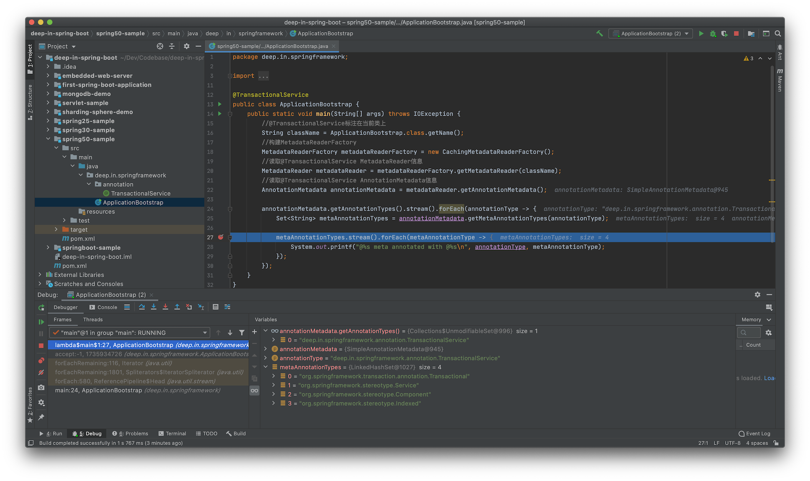

<h3 align="center"><b>Spring 组合注解(Composed Annotation)</b></h3>

## 1. 组合注解说明

Spring Framework的组合注解在官方Github的Wiki中有说明，[可以参考](https://github.com/spring-projects/spring-framework/wiki/Spring-Annotation-Programming-Model)。

>A ***composed annotation*** is an annotation that is *meta-annotated* with one or more annotations with the intent of combining the behavior associated with those meta-annotations into a single custom annotation. For example, an annotation named `@TransactionalService` that is meta-annotated with Spring's `@Transactional` and `@Service` annotations is a composed annotation that combines the semantics of `@Transactional` and `@Service`. `@TransactionalService` is technically also a custom *stereotype annotation*.

Wiki说明，组合注解(Composed annotation)是指某个注解元标注了一个或多个其他注解，来组合这些注解的行为变为单个自定义注解。

同时举例说明了`@TransactionalService`注解标注了`@Transactional`和`@Service`注解，因此`@TransactionalService`组合了这两个注解的语义，并且`@TransactionalService`也是一个自定义的模式注解。

Spring中并没有`@TransactionalService`注解，但根据Wiki可以将其描述为：
```java
package deep.in.springframework.annotation;

import org.springframework.stereotype.Service;
import org.springframework.transaction.annotation.Transactional;

import java.lang.annotation.*;

@Target({ElementType.TYPE})
@Retention(RetentionPolicy.RUNTIME)
@Documented
@Transactional
@Service
public @interface TransactionalService {
}

```

要注意的是`@Service`是Spring模式注解(Stereotype annotation)，而`@Transactional`是Spring事务注解。也就是说，Spring组合注解(Composed annotation)中的元注解允许是Spring模式注解和其他功能性注解的组合。

在Spring Boot中，`@SpringBootApplication`注解在1.2.0时引入，在此之前，通常在引导类上标注`@Configuration`，以表明它是Spring模式注解，再标注`@EnableAutoConfiguration`来开启自动装配，还可以标注`@ComponentScan`指定扫描`@Component`的范围。再引入`@SpringBootApplication`之后，引导类上可以直接标注，综合以上3中特性，是组合注解的体现。

```java
package org.springframework.boot.autoconfigure;
...
@Target(ElementType.TYPE)
@Retention(RetentionPolicy.RUNTIME)
@Documented
@Inherited
@SpringBootConfiguration
@EnableAutoConfiguration
@ComponentScan(excludeFilters = { @Filter(type = FilterType.CUSTOM, classes = TypeExcludeFilter.class),
		@Filter(type = FilterType.CUSTOM, classes = AutoConfigurationExcludeFilter.class) })
public @interface SpringBootApplication {
    ...
}
```

## 2. 理解组合注解

以上面的`@TransactionalService`为例，其元注解层次关系为：
```txt
@TransactionalService
|- @Transactional
|- @Service
   |- @Component
```

按照`@Component`派生性的特点，`@TransactionalService`也是Spring模式注解(`@Component`派生注解)，可以被`ClassPathScanningCandidateComponentProvider`识别，被其子类`ClassPathBeanDefinitionScanner`注册为Spring Bean。而`@Transactional`作为事务注解，是原子注解，不能继续拆分。

`@Transactional`注解定义为：
```java
package org.springframework.transaction.annotation;
...
@Target({ElementType.TYPE, ElementType.METHOD})
@Retention(RetentionPolicy.RUNTIME)
@Inherited
@Documented
public @interface Transactional {
    ...
}
```

在讨论[Spring模式注解](./spring-annotation-stereotype-annotation.md)时，`@Component`派生原理的源码解析中，Spring Framework抽象出了`AnnotationMetadata`接口和实现类`AnnotationMetadataReadingVisitor`，并且从Spring Framework 4.0开始，其关联的`AnnotationAttributesReadingVisitor`采用递归方式查找元注解，支持了多层次元注解信息查找。

Spring通过ASM读取类资源，直接操作其中的字节码，获取相关元信息，相关接口为`MetadataReader`：
```java
package org.springframework.core.type.classreading;

import org.springframework.core.io.Resource;
import org.springframework.core.type.AnnotationMetadata;
import org.springframework.core.type.ClassMetadata;

/**
 * Simple facade for accessing class metadata,
 * as read by an ASM {@link org.springframework.asm.ClassReader}.
 *
 * @author Juergen Hoeller
 * @since 2.5
 */
public interface MetadataReader {

	/**
	 * Return the resource reference for the class file.
	 */
	Resource getResource();

	/**
	 * Read basic class metadata for the underlying class.
	 */
	ClassMetadata getClassMetadata();

	/**
	 * Read full annotation metadata for the underlying class,
	 * including metadata for annotated methods.
	 */
	AnnotationMetadata getAnnotationMetadata();

}
```

`getClassMetadata()`方法用来获取类的元信息，`getAnnotationMetadata()`方法获取注解元信息，`getResource()`方法返回类资源的Resource信息。

其实现类是`SimpleMetadataReader`，当前版本的Spring Framework(5.2.8.RELEASE)仅有此一个实现：
```java
package org.springframework.core.type.classreading;
...
final class SimpleMetadataReader implements MetadataReader {
    ...
	SimpleMetadataReader(Resource resource, @Nullable ClassLoader classLoader) throws IOException {
		SimpleAnnotationMetadataReadingVisitor visitor = new SimpleAnnotationMetadataReadingVisitor(classLoader);
		getClassReader(resource).accept(visitor, PARSING_OPTIONS);
		this.resource = resource;
		this.annotationMetadata = visitor.getMetadata();
	}

	private static ClassReader getClassReader(Resource resource) throws IOException {
		try (InputStream is = resource.getInputStream()) {
			try {
				return new ClassReader(is);
			}
			catch (IllegalArgumentException ex) {
				throw new NestedIOException("ASM ClassReader failed to parse class file - " +
						"probably due to a new Java class file version that isn't supported yet: " + resource, ex);
			}
		}
	}
    ...
}
```

其关联的`ClassMetadata`信息和`AnnotationMetadata`信息在构造阶段完成初始化。`SimpleAnnotationMetadataReadingVisitor`替代了原有的`AnnotationMetadataReadingVisitor`和`AnnotationAttributesReadingVisitor`。

在解析[Spring模式注解](./spring-annotation-stereotype-annotation.md)时，分析到`ClassPathScanningCandidateComponentProvider`的`findCandidateComponents()`方法有读取`MetadataReader`的方式(**5.2.8.RELEASE**)：
```java
MetadataReader metadataReader = getMetadataReaderFactory().getMetadataReader(type);
```
或
```java
MetadataReader metadataReader = getMetadataReaderFactory().getMetadataReader(resource);
```

`getMetadataReaderFactory()`方法为：
```java
	public final MetadataReaderFactory getMetadataReaderFactory() {
		if (this.metadataReaderFactory == null) {
			this.metadataReaderFactory = new CachingMetadataReaderFactory();
		}
		return this.metadataReaderFactory;
	}
```

这里默认使用的是`CachingMetadataReaderFactory`实例，而`getMetadataReader`方法则是定义在`MetadataReaderFactory`接口中：
```java
package org.springframework.core.type.classreading;

import java.io.IOException;
import org.springframework.core.io.Resource;

/**
 * Factory interface for {@link MetadataReader} instances.
 * Allows for caching a MetadataReader per original resource.
 *
 * @author Juergen Hoeller
 * @since 2.5
 * @see SimpleMetadataReaderFactory
 * @see CachingMetadataReaderFactory
 */
public interface MetadataReaderFactory {

	/**
	 * Obtain a MetadataReader for the given class name.
	 * @param className the class name (to be resolved to a ".class" file)
	 * @return a holder for the ClassReader instance (never {@code null})
	 * @throws IOException in case of I/O failure
	 */
	MetadataReader getMetadataReader(String className) throws IOException;

	/**
	 * Obtain a MetadataReader for the given resource.
	 * @param resource the resource (pointing to a ".class" file)
	 * @return a holder for the ClassReader instance (never {@code null})
	 * @throws IOException in case of I/O failure
	 */
	MetadataReader getMetadataReader(Resource resource) throws IOException;

}
```

为了演示，示例代码中可以利用该方法读取`@TransactionalService`注解元信息：
```java
package deep.in.springframework;

import deep.in.springframework.annotation.TransactionalService;
import org.springframework.core.type.AnnotationMetadata;
import org.springframework.core.type.classreading.CachingMetadataReaderFactory;
import org.springframework.core.type.classreading.MetadataReader;
import org.springframework.core.type.classreading.MetadataReaderFactory;

import java.io.IOException;
import java.util.Set;

@TransactionalService
public class ApplicationBootstrap {
    public static void main(String[] args) throws IOException {
        //@TransactionalService标注在当前类上
        String className = ApplicationBootstrap.class.getName();
        //构建MetadataReaderFactory
        MetadataReaderFactory metadataReaderFactory = new CachingMetadataReaderFactory();
        //读取@TransactionalService MetadataReader信息
        MetadataReader metadataReader = metadataReaderFactory.getMetadataReader(className);
        //读取@TransactionalService AnnotationMetadata信息
        AnnotationMetadata annotationMetadata = metadataReader.getAnnotationMetadata();

        annotationMetadata.getAnnotationTypes().stream().forEach(annotationType -> {
            Set<String> metaAnnotationTypes = annotationMetadata.getMetaAnnotationTypes(annotationType);

            metaAnnotationTypes.stream().forEach(metaAnnotationType -> {
                System.out.printf("@%s meta annotated with @%s\n", annotationType, metaAnnotationType);
            });
        });
    }
}
```

运行程序，可以看到运行信息：


当前类仅有一个`Annotation`，是`deep.in.springframework.annotation.TransactionalService`。继续获取当前注解的元注解，分别是：
```txt
0 = "org.springframework.transaction.annotation.Transactional"
1 = "org.springframework.stereotype.Service"
2 = "org.springframework.stereotype.Component"
3 = "org.springframework.stereotype.Indexed"
```

和前面总结的`@TransactionalService`层次关系进行对比：
```txt
@TransactionalService
|- @Transactional
|- @Service
   |- @Component
```

这里的`@Indexed`注解是标注在`@Component`之上的：
```java
package org.springframework.stereotype;
...
@Target(ElementType.TYPE)
@Retention(RetentionPolicy.RUNTIME)
@Documented
@Indexed
public @interface Component {
	String value() default "";
}
```

因为`@TransactionalService`标注在`ApplicationBootstrap`类上，`annotationMetadata.getAnnotationTypes()`方法返回的集合仅包含`@TransactionalService`，而`@TransactionalService`所关联的元注解则是4个，即通过`annotationMetadata.getMetaAnnotationTypes(annotationType)`返回的值。