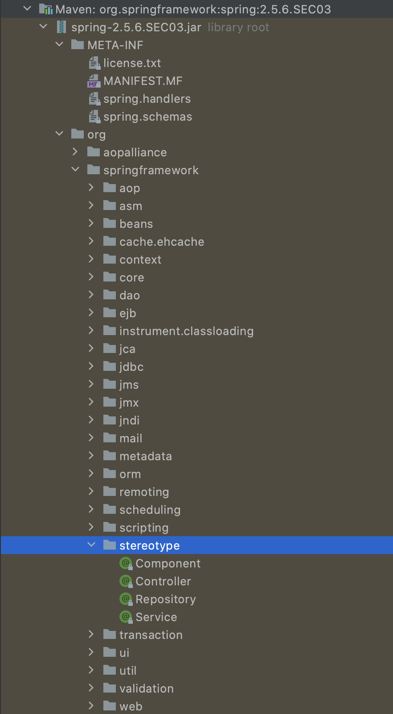
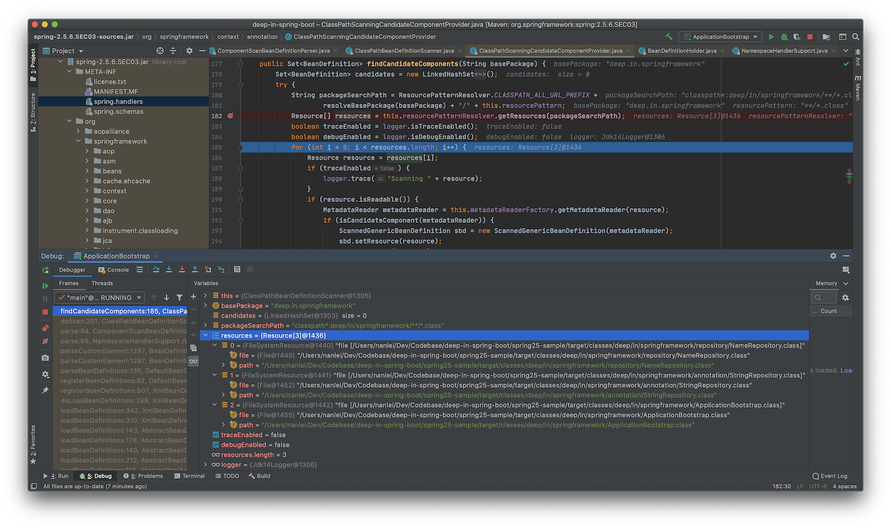
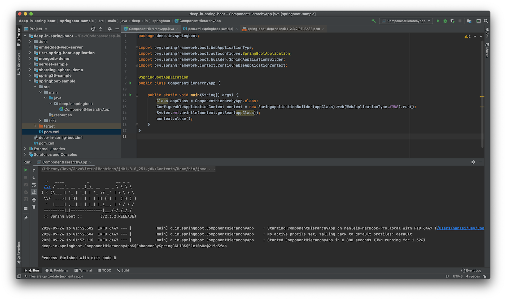
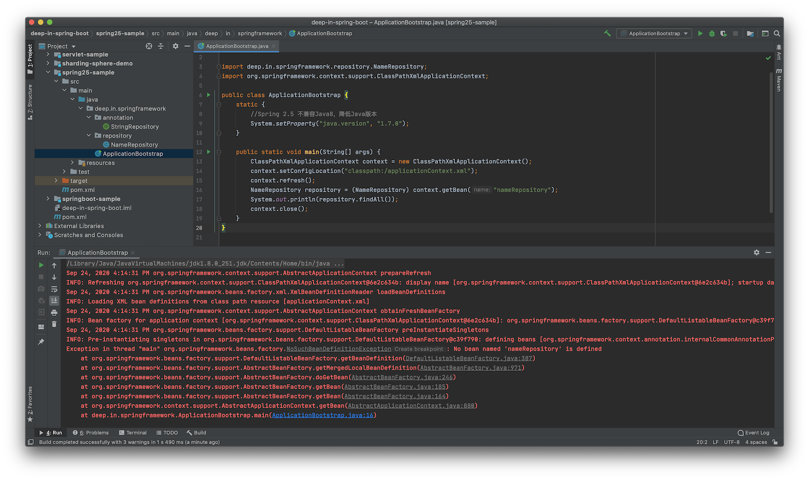
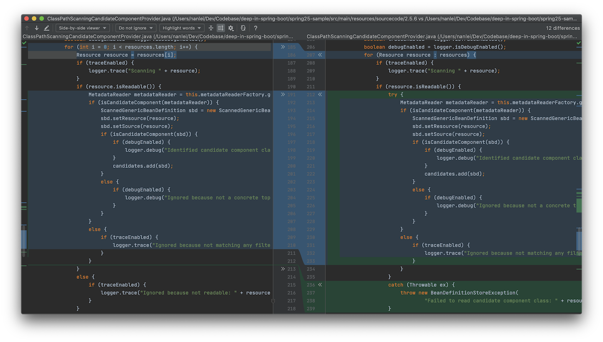
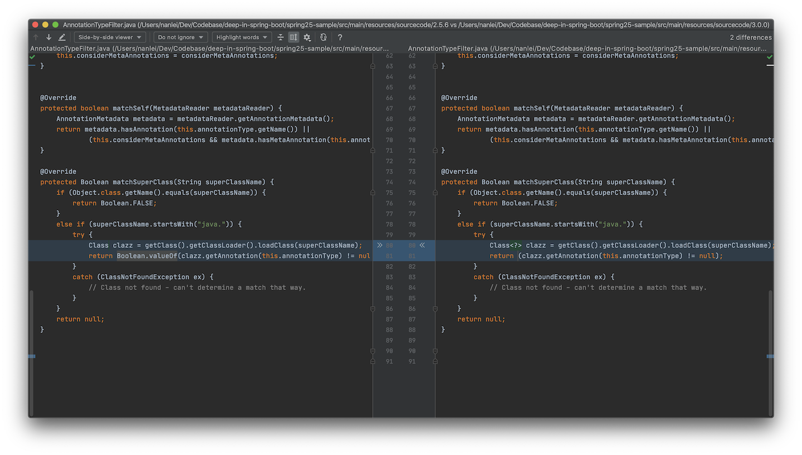
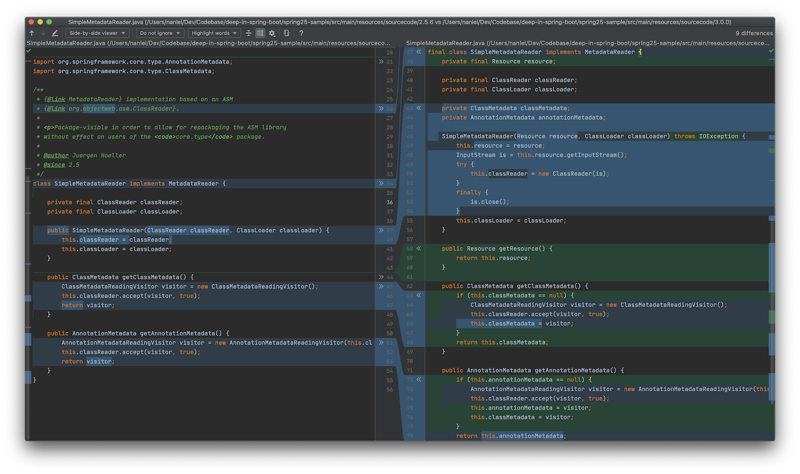
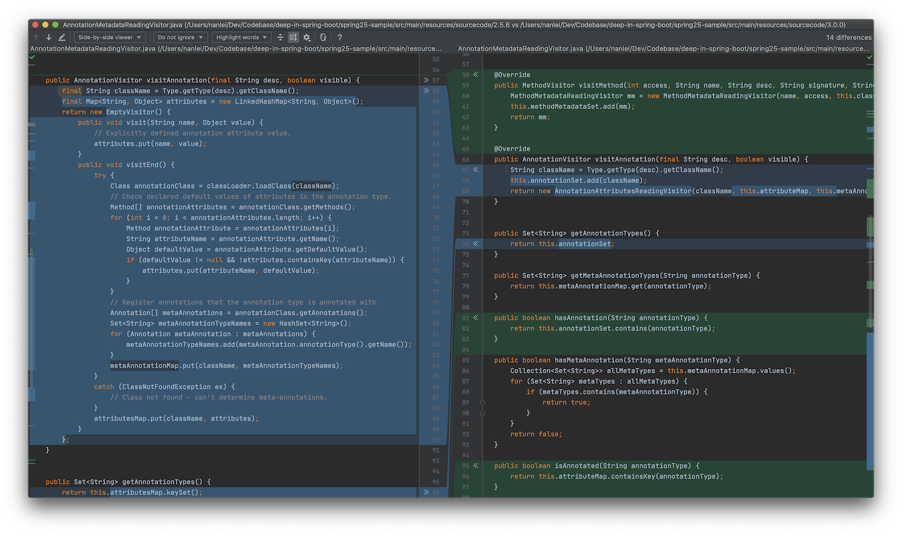

<h3 align="center"><b>Spring 模式注解(Stereotype Annotation)</b></h3>

#### 1. 模式注解说明

Spring Framework的模式注解在官方Github的Wiki中有说明，[可以参考](https://github.com/spring-projects/spring-framework/wiki/Spring-Annotation-Programming-Model)。

>A ***stereotype annotation*** is an annotation that is used to declare the role that a component plays within the application. For example, the `@Repository` annotation in the Spring Framework is a marker for any class that fulfills the role or stereotype of a repository (also known as Data Access Object or DAO).

Wiki说明，模式注解(stereotype annotation)是在应用程序中用来声明组件角色的注解。并举例，`@Repository`注解就是实现仓储模式(或者说是DAO：数据访问对象)类的标记。

>`@Component` is a generic stereotype for any Spring-managed component. Any component annotated with `@Component` is a candidate for component scanning. Similarly, any component annotated with an annotation that is itself meta-annotated with `@Component` is also a candidate for component scanning. For example, `@Service` is meta-annotated with `@Component`.

紧接着，继续说明，`@Component`是Spring管理组件的通用模式注解，任何被`@Component`注解的组件都是候选的组件扫描对象。任何被`@Component`元标注的注解，例如`@Service`，任何组件被它们标注时，也被视作候选的组件扫描对象。

>Core Spring provides several stereotype annotations out of the box, including but not limited to: `@Component`, `@Service`, `@Repository`, `@Controller`, `@RestController`, and `@Configuration`. `@Repository`, `@Service`, etc. are specializations of `@Component`.

Spring Framework核心部分提供了几种模式注解，包括并不限于下列这些：`@Component`, `@Service`, `@Repository`, `@Controller`, `@RestController`和 `@Configuration`，它们都是`@Component`的规范。

当然也可以自定义模式注解，可以理解为模式注解就是`@Component`的派生注解。但Java中的注解不允许继承，[可以参考](https://docs.oracle.com/javase/specs/jls/se8/html/jls-9.html#jls-9.6)，Spring Framework采用元标注的方式来实现派生。

#### 2. 元注解

上述[Wiki](https://github.com/spring-projects/spring-framework/wiki/Spring-Annotation-Programming-Model)在开头直接介绍了元注解：

>A ***meta-annotation*** is an annotation that is declared on another annotation. An annotation is therefore meta-annotated if it is annotated with another annotation. For example, any annotation that is declared to be documented is meta-annotated with `@Documented` from the `java.lang.annotation` package.

元注解指的是一个能声明在其他注解上的注解，同时举例`@Documented`能够作为任何注解的元注解。

可以看出，元注解是Java中的概念，而非Spring专有。而在Spring中，`@Component`可以视作为元注解，由上面的模式注解说明即可看出。

#### 3. `@Component`的派生性

`@Repository`注解在Spring Framework 2.0被引入，可以参考[JavaDoc文档](https://docs.spring.io/spring-framework/docs/2.0.0/javadoc-api/index.html?org/springframework/stereotype/Repository.html)，该注解仅仅作为仓储(DAO)的标记使用。

```java
package org.springframework.stereotype;

import java.lang.annotation.*;

@Target({ElementType.TYPE})
@Retention(RetentionPolicy.RUNTIME)
@Inherited
@Documented
public @interface Repository {

}
```

而到了Spring Framework 2.5，其定义发生了变化，可以参考[JavaDoc文档](https://docs.spring.io/spring-framework/docs/2.5.6/javadoc-api/index.html?org/springframework/stereotype/Repository.html)，其不但是标记注解，而且作为Spring Framework的组件(Component)了。在其定义上也被`@Component`注解标注。

```java
package org.springframework.stereotype;

import java.lang.annotation.*;

@Target({ElementType.TYPE})
@Retention(RetentionPolicy.RUNTIME)
@Documented
@Component
public @interface Repository {

	/**
	 * The value may indicate a suggestion for a logical component name,
	 * to be turned into a Spring bean in case of an autodetected component.
	 * @return the suggested component name, if any
	 */
	String value() default "";

}
```

因为Spring Framework 2.5同时引入了`@Component`注解，可以参考[JavaDoc文档](https://docs.spring.io/spring-framework/docs/2.5.6/javadoc-api/index.html?org/springframework/stereotype/Repository.html)，被标注的类就是Spring的组件，这些类被视作使用注解配置和类路径扫描时，自动探测的候选对象。

```java
package org.springframework.stereotype;

import java.lang.annotation.*;

@Target(ElementType.TYPE)
@Retention(RetentionPolicy.RUNTIME)
@Documented
public @interface Component {

	/**
	 * The value may indicate a suggestion for a logical component name,
	 * to be turned into a Spring bean in case of an autodetected component.
	 * @return the suggested component name, if any
	 */
	String value() default "";

}
```

可以看到，标注了`@Component`的`@Repository`注解中的属性方法和`@Component`保持一致，在Spring Framework 2.5引入的模式注解有：



其中，`@Controller`，`@Repository`，`@Service`都是@`Component`的派生注解。

#### 4. 自定义`@Component`派生注解

以下示例基于**Spring Framework 2.5.6 SEC03**版本进行，添加如下依赖即可：
```xml
    <dependencies>
        <dependency>
            <groupId>org.springframework</groupId>
            <artifactId>spring</artifactId>
            <version>2.5.6.SEC03</version>
        </dependency>
    </dependencies>
```

参照`@Repository`的声明，自定义一个`@StringRepository`注解：
```java
package deep.in.springframework.annotation;

import org.springframework.stereotype.Component;

import java.lang.annotation.*;

@Target({ElementType.TYPE})
@Retention(RetentionPolicy.RUNTIME)
@Documented
@Component
public @interface StringRepository {
    /**
     * 属性方法名称必须与{@link Component#value()}保持一致
     *
     * @return Bean的名称
     */
    String value() default "";
}
```

新建一个Repository类型的类，将其标注为`@StringRepository`：
```java
package deep.in.springframework.repository;

import deep.in.springframework.annotation.StringRepository;

import java.util.Arrays;
import java.util.List;

@StringRepository("nameRepository")
public class NameRepository {
    /**
     * 查找所有的名字
     *
     * @return List
     */
    public List<String> findAll() {
        return Arrays.asList("Tom", "Jerry", "LN");
    }
}
```

Spring Framework 2.5暂不支持`@ComponentScan`注解，只能使用传统的XML方式进行配置：
```xml
<?xml version="1.0" encoding="UTF-8"?>
<beans xmlns="http://www.springframework.org/schema/beans"
       xmlns:xsi="http://www.w3.org/2001/XMLSchema-instance"
       xmlns:context="http://www.springframework.org/schema/context"
       xsi:schemaLocation="http://www.springframework.org/schema/beans
           http://www.springframework.org/schema/beans/spring-beans-2.5.xsd
           http://www.springframework.org/schema/context
           http://www.springframework.org/schema/context/spring-context.xsd">

    <context:component-scan base-package="deep.in.springframework" />
</beans>
```

编写引导类：
```java
package deep.in.springframework;

import deep.in.springframework.repository.NameRepository;
import org.springframework.context.support.ClassPathXmlApplicationContext;

public class ApplicationBootstrap {
    static {
        //Spring 2.5 不兼容Java8，降低Java版本
        System.setProperty("java.version", "1.7.0");
    }

    public static void main(String[] args) {
        ClassPathXmlApplicationContext context = new ClassPathXmlApplicationContext();
        context.setConfigLocation("classpath:/applicationContext.xml");
        context.refresh();
        NameRepository repository = (NameRepository) context.getBean("nameRepository");
        System.out.println(repository.findAll());
        context.close();
    }
}
```

整体项目结构为：
```cmd
$ tree .
.
├── pom.xml
├── src
│   ├── main
│   │   ├── java
│   │   │   └── deep
│   │   │       └── in
│   │   │           └── springframework
│   │   │               ├── ApplicationBootstrap.java
│   │   │               ├── annotation
│   │   │               │   └── StringRepository.java
│   │   │               └── repository
│   │   │                   └── NameRepository.java
│   │   └── resources
│   │       └── applicationContext.xml
│   └── test
│       └── java
└── target
    ├── classes
    │   ├── applicationContext.xml
    │   └── deep
    │       └── in
    │           └── springframework
    │               ├── ApplicationBootstrap.class
    │               ├── annotation
    │               │   └── StringRepository.class
    │               └── repository
    │                   └── NameRepository.class
    └── generated-sources
        └── annotations

20 directories, 9 files
```

运行引导类，即可得到结果：
```txt
Sep 11, 2020 1:43:14 PM org.springframework.context.support.AbstractApplicationContext prepareRefresh
INFO: Refreshing org.springframework.context.support.ClassPathXmlApplicationContext@6e2c634b: display name [org.springframework.context.support.ClassPathXmlApplicationContext@6e2c634b]; startup date [Fri Sep 11 13:43:14 CST 2020]; root of context hierarchy
Sep 11, 2020 1:43:14 PM org.springframework.beans.factory.xml.XmlBeanDefinitionReader loadBeanDefinitions
INFO: Loading XML bean definitions from class path resource [applicationContext.xml]
Sep 11, 2020 1:43:14 PM org.springframework.context.support.AbstractApplicationContext obtainFreshBeanFactory
INFO: Bean factory for application context [org.springframework.context.support.ClassPathXmlApplicationContext@6e2c634b]: org.springframework.beans.factory.support.DefaultListableBeanFactory@c39f790
Sep 11, 2020 1:43:14 PM org.springframework.beans.factory.support.DefaultListableBeanFactory preInstantiateSingletons
INFO: Pre-instantiating singletons in org.springframework.beans.factory.support.DefaultListableBeanFactory@c39f790: defining beans [nameRepository,org.springframework.context.annotation.internalCommonAnnotationProcessor,org.springframework.context.annotation.internalAutowiredAnnotationProcessor,org.springframework.context.annotation.internalRequiredAnnotationProcessor]; root of factory hierarchy
Sep 11, 2020 1:43:14 PM org.springframework.context.support.AbstractApplicationContext doClose
INFO: Closing org.springframework.context.support.ClassPathXmlApplicationContext@6e2c634b: display name [org.springframework.context.support.ClassPathXmlApplicationContext@6e2c634b]; startup date [Fri Sep 11 13:43:14 CST 2020]; root of context hierarchy
Sep 11, 2020 1:43:14 PM org.springframework.beans.factory.support.DefaultSingletonBeanRegistry destroySingletons
INFO: Destroying singletons in org.springframework.beans.factory.support.DefaultListableBeanFactory@c39f790: defining beans [nameRepository,org.springframework.context.annotation.internalCommonAnnotationProcessor,org.springframework.context.annotation.internalAutowiredAnnotationProcessor,org.springframework.context.annotation.internalRequiredAnnotationProcessor]; root of factory hierarchy
[Tom, Jerry, LN]
```

运行结果表明：`@StringRepository`作为`@Component`的派生注解，经Spring Framework扫描注册后，其语义和`@Repository`类似。被标注的类被Spring上下文初始化为Spring Bean并被容器管理。

#### 5. `@Component`派生原理

基于**Spring Framework 2.5.6.SEC03**版本，上例中使用了`<context:component-scan/>`元素进行`@Component`组件扫描。

`context`前缀的处理类可以在`/META-INF/spring.handlers`文件中找到，就是:
```txt
...
http\://www.springframework.org/schema/context=org.springframework.context.config.ContextNamespaceHandler
...
```

`ContextNamespaceHandler`就是`context`对应的处理类：
```java
package org.springframework.context.config;
...
public class ContextNamespaceHandler extends NamespaceHandlerSupport {
    public void init() {
        ...
		registerJava5DependentParser("component-scan",
				"org.springframework.context.annotation.ComponentScanBeanDefinitionParser");
        ...
	}
    ...
}
```

可以得到`<context:component-scan/>`的处理类就是`org.springframework.context.annotation.ComponentScanBeanDefinitionParser`。

`ComponentScanBeanDefinitionParser`是一种Bean定义解析器的实现，当Spring ApplicationContext加载并解析XML配置文件后，解析到`<context:component-scan/>`时，`ComponentScanBeanDefinitionParser.parse(Element, ParserContext)`方法将被调用：
```java
package org.springframework.context.annotation;
...
public class ComponentScanBeanDefinitionParser implements BeanDefinitionParser {
    private static final String BASE_PACKAGE_ATTRIBUTE = "base-package";
    ...
    
    public BeanDefinition parse(Element element, ParserContext parserContext) {
		String[] basePackages =
				StringUtils.commaDelimitedListToStringArray(element.getAttribute(BASE_PACKAGE_ATTRIBUTE));

		// Actually scan for bean definitions and register them.
		ClassPathBeanDefinitionScanner scanner = configureScanner(parserContext, element);
		Set<BeanDefinitionHolder> beanDefinitions = scanner.doScan(basePackages);
		registerComponents(parserContext.getReaderContext(), beanDefinitions, element);

		return null;
	}
}
```

解析到属性`base-package`后，`basePackages`接收将逗号分隔的列表转为字符串数组，之后传入`ClassPathBeanDefinitionScanner.doScan(String...)`方法，并返回`Set<BeanDefinitionHolder>`，而`BeanDefinitionHolder`包含Bean定义(`BeanDefinition`)，bean名称和别名信息：
```java
package org.springframework.beans.factory.config;
...
public class BeanDefinitionHolder implements BeanMetadataElement {

	private final BeanDefinition beanDefinition;

	private final String beanName;

	private final String[] aliases;

    ...
}
```

在上例中，`@StringRepository`标注的`NameRepository`类将被解析为`BeanDefinitionHolder`，其中的`beanName`为`nameRepository`，`deep.in.springframework.repository.NameRepository`即为`BeanDefinition`的类型。之后，Spring ApplicationContext将其初始化为Spring Bean。

在 `doScan(String...)`方法中：
```java
package org.springframework.context.annotation;
...
public class ClassPathBeanDefinitionScanner extends ClassPathScanningCandidateComponentProvider {
    ...
	protected Set<BeanDefinitionHolder> doScan(String... basePackages) {
		Set<BeanDefinitionHolder> beanDefinitions = new LinkedHashSet<BeanDefinitionHolder>();
		for (int i = 0; i < basePackages.length; i++) {
			Set<BeanDefinition> candidates = findCandidateComponents(basePackages[i]);
			for (BeanDefinition candidate : candidates) {
				String beanName = this.beanNameGenerator.generateBeanName(candidate, this.registry);
				if (candidate instanceof AbstractBeanDefinition) {
					postProcessBeanDefinition((AbstractBeanDefinition) candidate, beanName);
				}
				ScopeMetadata scopeMetadata = this.scopeMetadataResolver.resolveScopeMetadata(candidate);
				if (checkCandidate(beanName, candidate)) {
					BeanDefinitionHolder definitionHolder = new BeanDefinitionHolder(candidate, beanName);
					definitionHolder = applyScope(definitionHolder, scopeMetadata);
					beanDefinitions.add(definitionHolder);
					registerBeanDefinition(definitionHolder, this.registry);
				}
			}
		}
		return beanDefinitions;
	}
    ...
}
```

根据`basePackages`依次迭代，通过父类`ClassPathScanningCandidateComponentProvider`提供的`findCandidateComponents(String)`方法，返回候选的`BeanDefinition`集合：
```java
package org.springframework.context.annotation;
...
public class ClassPathScanningCandidateComponentProvider implements ResourceLoaderAware {
    ...
    public Set<BeanDefinition> findCandidateComponents(String basePackage) {
		Set<BeanDefinition> candidates = new LinkedHashSet<BeanDefinition>();
		try {
			String packageSearchPath = ResourcePatternResolver.CLASSPATH_ALL_URL_PREFIX +
					resolveBasePackage(basePackage) + "/" + this.resourcePattern;
			Resource[] resources = this.resourcePatternResolver.getResources(packageSearchPath);
			boolean traceEnabled = logger.isTraceEnabled();
			boolean debugEnabled = logger.isDebugEnabled();
			for (int i = 0; i < resources.length; i++) {
				Resource resource = resources[i];
				if (traceEnabled) {
					logger.trace("Scanning " + resource);
				}
				if (resource.isReadable()) {
					MetadataReader metadataReader = this.metadataReaderFactory.getMetadataReader(resource);
					if (isCandidateComponent(metadataReader)) {
						ScannedGenericBeanDefinition sbd = new ScannedGenericBeanDefinition(metadataReader);
						sbd.setResource(resource);
						sbd.setSource(resource);
						if (isCandidateComponent(sbd)) {
							if (debugEnabled) {
								logger.debug("Identified candidate component class: " + resource);
							}
							candidates.add(sbd);
						}
						else {
							if (debugEnabled) {
								logger.debug("Ignored because not a concrete top-level class: " + resource);
							}
						}
					}
					else {
						if (traceEnabled) {
							logger.trace("Ignored because not matching any filter: " + resource);
						}
					}
				}
				else {
					if (traceEnabled) {
						logger.trace("Ignored because not readable: " + resource);
					}
				}
			}
		}
		catch (IOException ex) {
			throw new BeanDefinitionStoreException("I/O failure during classpath scanning", ex);
		}
		return candidates;
	}
    ...
}
```

其中，
```java
String packageSearchPath = ResourcePatternResolver.CLASSPATH_ALL_URL_PREFIX +
					resolveBasePackage(basePackage) + "/" + this.resourcePattern;
```
将`basePackage`转换为搜索路径，上例中参数转换为：`classpath*:deep/in/springframework/**/*.class`

之后，通过：
```java
Resource[] resources = this.resourcePatternResolver.getResources(packageSearchPath);
```

获取到搜索路径下的所有资源，上例中的运行结果为：


紧接着，迭代获取到的`resources`对象，资源可以被读取，`resource.isReadable()`为`true`时，通过：
```java
MetadataReader metadataReader = this.metadataReaderFactory.getMetadataReader(resource);
```

获取该资源的`MetadataReader`对象：
```java
package org.springframework.core.type.classreading;

import org.springframework.core.type.AnnotationMetadata;
import org.springframework.core.type.ClassMetadata;

public interface MetadataReader {

	/**
	 * Read basic class metadata for the underlying class.
	 */
	ClassMetadata getClassMetadata();

	/**
	 * Read full annotation metadata for the underlying class.
	 */
	AnnotationMetadata getAnnotationMetadata();

}
```

之后进行`isCandidateComponent(MetadataReader)`判断：
```java
package org.springframework.context.annotation;
...
public class ClassPathScanningCandidateComponentProvider implements ResourceLoaderAware {
    ...
	protected boolean isCandidateComponent(MetadataReader metadataReader) throws IOException {
		for (TypeFilter tf : this.excludeFilters) {
			if (tf.match(metadataReader, this.metadataReaderFactory)) {
				return false;
			}
		}
		for (TypeFilter tf : this.includeFilters) {
			if (tf.match(metadataReader, this.metadataReaderFactory)) {
				return true;
			}
		}
		return false;
	}
    ...
}
```

其中使用`excludeFilters`和`includeFilters`两个条件来进行判断，它们的初始化是在：
```java
package org.springframework.context.annotation;
...
public class ComponentScanBeanDefinitionParser implements BeanDefinitionParser {
    ...
	protected ClassPathBeanDefinitionScanner configureScanner(ParserContext parserContext, Element element) {
		...
		boolean useDefaultFilters = true;
		if (element.hasAttribute(USE_DEFAULT_FILTERS_ATTRIBUTE)) {
			useDefaultFilters = Boolean.valueOf(element.getAttribute(USE_DEFAULT_FILTERS_ATTRIBUTE));
		}

		// Delegate bean definition registration to scanner class.
		ClassPathBeanDefinitionScanner scanner = createScanner(readerContext, useDefaultFilters);
    }
    ...
    protected ClassPathBeanDefinitionScanner createScanner(XmlReaderContext readerContext, boolean useDefaultFilters) {
		return new ClassPathBeanDefinitionScanner(readerContext.getRegistry(), useDefaultFilters);
	}
    ...
}
```
中通过`ClassPathBeanDefinitionScanner`的构造方法完成的：
```java
package org.springframework.context.annotation;
...
public class ClassPathBeanDefinitionScanner extends ClassPathScanningCandidateComponentProvider {
	public ClassPathBeanDefinitionScanner(BeanDefinitionRegistry registry, boolean useDefaultFilters) {
		super(useDefaultFilters);

		Assert.notNull(registry, "BeanDefinitionRegistry must not be null");
		this.registry = registry;

		// Determine ResourceLoader to use.
		if (this.registry instanceof ResourceLoader) {
			setResourceLoader((ResourceLoader) this.registry);
		}
	}
}
```

`useDefaultFilters`默认为`true`，则由其父类构造方法：
```java
package org.springframework.context.annotation;
...
public class ClassPathScanningCandidateComponentProvider implements ResourceLoaderAware {
    ...
	public ClassPathScanningCandidateComponentProvider(boolean useDefaultFilters) {
		if (useDefaultFilters) {
			registerDefaultFilters();
		}
	}
    ...
    protected void registerDefaultFilters() {
		this.includeFilters.add(new AnnotationTypeFilter(Component.class));
	}
    ...
}
```
最终完成，可以看到，`includeFilters`对象包含了`@Component`类型的`AnnotationTypeFilter`对象，而没有设置`excludeFilters`对象。也就是说，此时的`AnnotationTypeFilter`可以识别`@Component`，`@Controller`，`@Repository`，`@Service`类型的注解元信息。

判断完候选`Component`后，继续执行：
```java
ScannedGenericBeanDefinition sbd = new ScannedGenericBeanDefinition(metadataReader);
```

`ScannedGenericBeanDefinition`的定义为：
```java
package org.springframework.context.annotation;
...
public class ScannedGenericBeanDefinition extends GenericBeanDefinition implements AnnotatedBeanDefinition {

	private final AnnotationMetadata metadata;

	public ScannedGenericBeanDefinition(MetadataReader metadataReader) {
		Assert.notNull(metadataReader, "MetadataReader must not be null");
		this.metadata = metadataReader.getAnnotationMetadata();
		setBeanClassName(this.metadata.getClassName());
	}

	public final AnnotationMetadata getMetadata() {
		return this.metadata;
	}
}
```

最终，只有资源`deep.in.springframework.repository.NameRepository`被装入`Set<BeanDefinition> candidates`对象中，而`deep.in.springframework.annotation.StringRepository`不被装入是因为`Ignored because not a concrete top-level class`，引导类则是`Ignored because not matching any filter`的原因被排除了。

至此，`deep.in.springframework.repository.NameRepository`作为`BeanDefinition`返回并进行后续的初始化。

同样，在`ClassPathBeanDefinitionScanner`的[JavaDoc文档](https://docs.spring.io/spring-framework/docs/2.5.6/javadoc-api/index.html?org/springframework/stereotype/Repository.html)中，也有说明：

>Candidate classes are detected through configurable type filters. The default filters include classes that are annotated with Spring's `@Component`, `@Repository`, `@Service`, or `@Controller` stereotype

`ClassPathBeanDefinitionScanner`通过默认过滤器引入标记了`@Component`，`@Repository`，`@Service`，或`@Controller`的类，同理，它也能引入所有标记了`@Component`的派生注解，比如上例中的`@StringRepository`。

Spring 3.0引入的`@Configuration`注解，也是`@Component`的派生注解，[可以参考](https://docs.spring.io/spring-framework/docs/3.0.x/javadoc-api/org/springframework/context/annotation/Configuration.html)
```java
package org.springframework.context.annotation;
...
@Target(ElementType.TYPE)
@Retention(RetentionPolicy.RUNTIME)
@Documented
@Component
public @interface Configuration {
    ...
    String value() default "";
    ...
}
```

`ClassPathBeanDefinitionScanner`也允许自定义类型过滤器，可以通过`<context:component-scan/>`的`include-filter`和`exclude-filter`属性来配置。

#### 6. 多层次`@Component`派生性

`@SpringBootApplication` 是Spring Boot中最常见的注解，在[官方文档](https://docs.spring.io/spring-boot/docs/current/reference/htmlsingle/)中，有如下描述：
>A single `@SpringBootApplication` annotation can be used to enable those three features, that is:
>
>+ `@EnableAutoConfiguration`: enable [Spring Boot’s auto-configuration mechanism](https://docs.spring.io/spring-boot/docs/current/reference/htmlsingle/#using-boot-auto-configuration)
>
>+ `@ComponentScan`: enable `@Component` scan on the package where the application is located (see [the best practices](https://docs.spring.io/spring-boot/docs/current/reference/htmlsingle/#using-boot-structuring-your-code))
>
>+ `@Configuration`: allow to register extra beans in the context or import additional configuration classes
>
>```java
>package com.example.myapplication;
>
>import org.springframework.boot.SpringApplication;
>import org.springframework.boot.autoconfigure.SpringBootApplication;
>
>@SpringBootApplication // same as @Configuration @EnableAutoConfiguration @ComponentScan
>public class Application {
>
>    public static void main(String[] args) {
>        SpringApplication.run(Application.class, args);
>    }
>
>}
>```

也就是说使用了`@SpringBootApplication`相当于`@Configuration`，`@ComponentScan`和`@EnableAutoConfiguration`的联合注解.

`@SpringBootApplication`注解的定义为：
```java
package org.springframework.boot.autoconfigure;
...
@Target(ElementType.TYPE)
@Retention(RetentionPolicy.RUNTIME)
@Documented
@Inherited
@SpringBootConfiguration
@EnableAutoConfiguration
@ComponentScan(excludeFilters = { @Filter(type = FilterType.CUSTOM, classes = TypeExcludeFilter.class),
		@Filter(type = FilterType.CUSTOM, classes = AutoConfigurationExcludeFilter.class) })
public @interface SpringBootApplication {
	...
}
```

可以看到，`@ComponentScan`和`@EnableAutoConfiguration`是直接标注的，而`@Configuration`却不是，而在`@SpringBootConfiguration`中：
```java
package org.springframework.boot;
...
/**
 * Indicates that a class provides Spring Boot application
 * {@link Configuration @Configuration}. Can be used as an alternative to the Spring's
 * standard {@code @Configuration} annotation so that configuration can be found
 * automatically (for example in tests).
 * <p>
 * Application should only ever include <em>one</em> {@code @SpringBootConfiguration} and
 * most idiomatic Spring Boot applications will inherit it from
 * {@code @SpringBootApplication}.
 *
 * @author Phillip Webb
 * @author Andy Wilkinson
 * @since 1.4.0
 */
@Target(ElementType.TYPE)
@Retention(RetentionPolicy.RUNTIME)
@Documented
@Configuration
public @interface SpringBootConfiguration {
	...
}
```

其标注了`@Configuration`注解，已知`@Configuration`是`@Component`的派生注解，根据层次关系，可以得到：
+ `@SpringBootApplication`
  + `@SpringBootConfiguration`
     + `@Configuration`
       + `@Component`

根据注释，`@SpringBootConfiguration`是Spring Boot 1.4.0版本引入的，之前`@SpringBootApplication`是直接使用`@Configuration`注解的。

为了验证`@Component`派生性的多层次，可以进行验证：
```java
package deep.in.springboot;

import org.springframework.boot.WebApplicationType;
import org.springframework.boot.autoconfigure.SpringBootApplication;
import org.springframework.boot.builder.SpringApplicationBuilder;
import org.springframework.context.ConfigurableApplicationContext;

@SpringBootApplication
public class ComponentHierarchyApp {

    public static void main(String[] args) {
        Class appClass = ComponentHierarchyApp.class;
        ConfigurableApplicationContext context = new SpringApplicationBuilder(appClass).web(WebApplicationType.NONE).run();
        System.out.println(context.getBean(appClass));
        context.close();
    }
}
```

运行程序，可以得到输出：


所用Spring Boot的版本为2.3.2.RELEASE，其依赖的Spring Framework版本可以从`org/springframework/boot/spring-boot-dependencies/2.3.2.RELEASE/spring-boot-dependencies-2.3.2.RELEASE.pom`中查到，是5.2.8.RELEASE

说明在该版本下，`@Component`派生性是多层次的。

回到**Spring Framework 2.5.6.SEC03**下，将示例代码做如下调整：
```java
package deep.in.springframework.annotation;

import org.springframework.stereotype.Component;
import org.springframework.stereotype.Repository;

import java.lang.annotation.*;

@Target({ElementType.TYPE})
@Retention(RetentionPolicy.RUNTIME)
@Documented
@Repository //替换@Component
public @interface StringRepository {
    /**
     * 属性方法名称必须与{@link Component#value()}保持一致
     *
     * @return Bean的名称
     */
    String value() default "";
}
```

将`@Component`注解替换为`@Repository`注解，再次运行引导程序：



替换注解之后，报错`Exception in thread "main" org.springframework.beans.factory.NoSuchBeanDefinitionException: No bean named 'nameRepository' is defined`。说明Spring不再将`nameRepository`视为Bean。

说明当前版本的Spring Framework不支持多层次派生注解，而上面Spring Boot的示例中，`ComponentHierarchyApp`是支持的，说明是后续Spring版本作出了修改，支持了这一特性。

将Spring版本调整为**3.0.0.RELEASE**：
```xml
    <dependencies>
        <!--        <dependency>-->
        <!--            <groupId>org.springframework</groupId>-->
        <!--            <artifactId>spring</artifactId>-->
        <!--            <version>2.5.6.SEC03</version>-->
        <!--        </dependency>-->
        <dependency>
            <groupId>org.springframework</groupId>
            <artifactId>spring-context</artifactId>
            <version>3.0.0.RELEASE</version>
        </dependency>
    </dependencies>
```

再次运行程序，一切正常，说明该版本中提升了该特性。

#### 7. 多层次`@Component`派生性原理

在上面第5部分分析了`@Component`派生性原理，下面继续分析**2.5.6.SEC03**和**3.0.0.RELEASE**版本中源码的差异，解释对多层次派生的支持。

首先对比`ClassPathScanningCandidateComponentProvider`：
```java
package org.springframework.context.annotation;
...
public class ClassPathScanningCandidateComponentProvider implements ResourceLoaderAware {
	...
	@SuppressWarnings("unchecked")
    protected void registerDefaultFilters() {
        this.includeFilters.add(new AnnotationTypeFilter(Component.class));
        ClassLoader cl = ClassPathScanningCandidateComponentProvider.class.getClassLoader();
        try {
            this.includeFilters.add(new AnnotationTypeFilter(
                    ((Class<? extends Annotation>) cl.loadClass("javax.annotation.ManagedBean")), false));
            logger.info("JSR-250 'javax.annotation.ManagedBean' found and supported for component scanning");
        }
        catch (ClassNotFoundException ex) {
            // JSR-250 1.1 API (as included in Java EE 6) not available - simply skip.
        }
        try {
            this.includeFilters.add(new AnnotationTypeFilter(
                    ((Class<? extends Annotation>) cl.loadClass("javax.inject.Named")), false));
            logger.info("JSR-330 'javax.inject.Named' annotation found and supported for component scanning");
        }
        catch (ClassNotFoundException ex) {
            // JSR-330 API not available - simply skip.
        }
    }
}
```

`registerDefaultFilters()`方法变化较大，开始支持JSR-250的`@ManagedBean`和JSR-330的`@Named`的`AnnotationTypeFilter`

`findCandidateComponents(String)`方法则是小幅改动：



Java 5的增强for循环和一段try-catch控制，并没有本质性变化。

对比`AnnotationTypeFilter`：



仅有Java 5泛型和自动装箱调整，也没有本质性变化。

`SimpleMetadataReader`是接口`MetadataReader`唯一非公有实现类，进行对比：



新增了`classMetadata`和`annotationMetadata`属性，且当方法多次调用时，进行非空判断，避免了重复创建。

至此仍没有本质性变化，就需要继续分析`ClassMetadataReadingVisitor`和`AnnotationMetadataReadingVisitor`了。

3.0.0.RELEASE的`ClassMetadataReadingVisitor`新增了一些`visit*`方法，没有实现层面的变化。

对比`AnnotationMetadataReadingVisitor`：



可以发现，**3.0.0.RELEASE**的变化主要集中在`visitAnnotation`方法上，使用`AnnotationAttributesReadingVisitor`取代了**2.5.6.SEC03**中的`EmptyVisitor`匿名内部类实现。

**2.5.6.SEC03**的主要实现是：
```java
public void visitEnd() {
    try {
        Class annotationClass = classLoader.loadClass(className);
        ...
        // Register annotations that the annotation type is annotated with.
        Annotation[] metaAnnotations = annotationClass.getAnnotations();
        Set<String> metaAnnotationTypeNames = new HashSet<String>();
        for (Annotation metaAnnotation : metaAnnotations) {
            metaAnnotationTypeNames.add(metaAnnotation.annotationType().getName());
        }
        metaAnnotationMap.put(className, metaAnnotationTypeNames);
    }
    catch (ClassNotFoundException ex) {
        // Class not found - can't determine meta-annotations.
    }
    attributesMap.put(className, attributes);
}
```

之前编写的`NameRepository`的注解层次为：
+ `@Component`
  + `@StringRepository`
    + `NameRepository` 

结合上述代码，`annotationClass`就是`@StringRepository`，因为`metaAnnotations`数组仅仅获取当前类所标注的注解，所以此时只有`@Repository`而没有	`@Component`，由于**2.5.6.SEC03**中的实现未使用层次递归获取`Annotation[]`，所以仅支持单层次的	`@Component`派生。

**3.0.0.RELEASE**的实现为：
```java
	public void visitEnd() {
		this.attributesMap.put(this.annotationType, this.localAttributes);
		try {
			Class<?> annotationClass = this.classLoader.loadClass(this.annotationType);
			...
			// Register annotations that the annotation type is annotated with.
			Set<String> metaAnnotationTypeNames = new LinkedHashSet<String>();
			for (Annotation metaAnnotation : annotationClass.getAnnotations()) {
				metaAnnotationTypeNames.add(metaAnnotation.annotationType().getName());
				if (!this.attributesMap.containsKey(metaAnnotation.annotationType().getName())) {
					this.attributesMap.put(metaAnnotation.annotationType().getName(),
							AnnotationUtils.getAnnotationAttributes(metaAnnotation, true));
				}
				for (Annotation metaMetaAnnotation : metaAnnotation.annotationType().getAnnotations()) {
					metaAnnotationTypeNames.add(metaMetaAnnotation.annotationType().getName());
				}
			}
			if (this.metaAnnotationMap != null) {
				this.metaAnnotationMap.put(this.annotationType, metaAnnotationTypeNames);
			}
		}
		catch (ClassNotFoundException ex) {
			// Class not found - can't determine meta-annotations.
		}
	}
```

从代码中可以看出，第一层循环`for (Annotation metaAnnotation : annotationClass.getAnnotations())`是获取第一层元注解数组，第二层循环`for (Annotation metaMetaAnnotation : metaAnnotation.annotationType().getAnnotations())`是在第一层的基础上再次获取元注解数组。

结合`@StringRepository`，第一层元注解`@Repository`是`metaAnnotation`，第二层元注解`@Component`是`metaMetaAnnotation`。

此处的实现仍然存在问题，它指处理了两层`@Component`派生，而没有处理多层`@Component`派生，下面进行验证：

+ 声明`@FirstLevelRepository`和`@SecondLevelRepository`

```java
package deep.in.springframework.annotation;

import org.springframework.stereotype.Repository;

import java.lang.annotation.*;

@Target({ElementType.TYPE})
@Retention(RetentionPolicy.RUNTIME)
@Documented
@Repository
public @interface FirstLevelRepository {
    String value() default "";
}
```

```java
package deep.in.springframework.annotation;

import java.lang.annotation.*;

@Target({ElementType.TYPE})
@Retention(RetentionPolicy.RUNTIME)
@Documented
@FirstLevelRepository
public @interface SecondLevelRepository {
    String value() default "";
}
```

其中`@FirstLevelRepository`是第二层`@Component`注解，`@SecondLevelRepository`是第三层`@Component`注解，整体的派生层次为：

```txt
@SecondLevelRepository
|- @FirstLevelRepository
   |- @Repository
      |- @Component
```

+ 标注`@FirstLevelRepository`和`@SecondLevelRepository`

```java
package deep.in.springframework.repository;

import deep.in.springframework.annotation.FirstLevelRepository;

@FirstLevelRepository("myFirstLevelRepository")
public class MyFirstLevelRepository {
}
```

```java
package deep.in.springframework.repository;

import deep.in.springframework.annotation.SecondLevelRepository;

@SecondLevelRepository("mySecondLevelRepository")
public class MySecondLevelRepository {
}
```

+ 配置`@Component`扫描

```xml
<?xml version="1.0" encoding="UTF-8"?>
<beans xmlns="http://www.springframework.org/schema/beans"
       xmlns:xsi="http://www.w3.org/2001/XMLSchema-instance"
       xmlns:context="http://www.springframework.org/schema/context"
       xsi:schemaLocation="http://www.springframework.org/schema/beans
           http://www.springframework.org/schema/beans/spring-beans.xsd
           http://www.springframework.org/schema/context
           http://www.springframework.org/schema/context/spring-context.xsd">

    <!-- 激活注解驱动特性 -->
    <context:annotation-config/>

    <context:component-scan base-package="deep.in.springframework"/>
</beans>
```

由于Spring Framework 3.0.0.RELEASE还未引入`@ComponentScan`，因此仍然采用XML元素`<context:component-scan>`组件扫描的方式。

+ 编写引导类

```java
package deep.in.springframework;

import org.springframework.context.support.ClassPathXmlApplicationContext;

public class ApplicationBootstrap {
    public static void main(String[] args) {
        ClassPathXmlApplicationContext context = new ClassPathXmlApplicationContext();
        context.setConfigLocation("classpath:/applicationContext.xml");
        context.refresh();
        System.out.println(context.containsBean("myFirstLevelRepository"));
        System.out.println(context.containsBean("mySecondLevelRepository"));
        context.close();
    }
}
```

运行程序，得到结果：
```txt
Oct 14, 2020 11:10:45 PM org.springframework.context.support.AbstractApplicationContext prepareRefresh
INFO: Refreshing org.springframework.context.support.ClassPathXmlApplicationContext@439f5b3d: startup date [Wed Oct 14 23:10:45 CST 2020]; root of context hierarchy
Oct 14, 2020 11:10:45 PM org.springframework.beans.factory.xml.XmlBeanDefinitionReader loadBeanDefinitions
INFO: Loading XML bean definitions from class path resource [applicationContext.xml]
Oct 14, 2020 11:10:45 PM org.springframework.beans.factory.support.DefaultListableBeanFactory preInstantiateSingletons
INFO: Pre-instantiating singletons in org.springframework.beans.factory.support.DefaultListableBeanFactory@3b6eb2ec: defining beans [org.springframework.context.annotation.internalConfigurationAnnotationProcessor,org.springframework.context.annotation.internalAutowiredAnnotationProcessor,org.springframework.context.annotation.internalRequiredAnnotationProcessor,org.springframework.context.annotation.internalCommonAnnotationProcessor,myFirstLevelRepository]; root of factory hierarchy
true
false
Oct 14, 2020 11:10:45 PM org.springframework.context.support.AbstractApplicationContext doClose
INFO: Closing org.springframework.context.support.ClassPathXmlApplicationContext@439f5b3d: startup date [Wed Oct 14 23:10:45 CST 2020]; root of context hierarchy
Oct 14, 2020 11:10:45 PM org.springframework.beans.factory.support.DefaultSingletonBeanRegistry destroySingletons
INFO: Destroying singletons in org.springframework.beans.factory.support.DefaultListableBeanFactory@3b6eb2ec: defining beans [org.springframework.context.annotation.internalConfigurationAnnotationProcessor,org.springframework.context.annotation.internalAutowiredAnnotationProcessor,org.springframework.context.annotation.internalRequiredAnnotationProcessor,org.springframework.context.annotation.internalCommonAnnotationProcessor,myFirstLevelRepository]; root of factory hierarchy

Process finished with exit code 0
```

从结果即可看出，Spring Framework 3.0.0.RELEASE仅仅支持两层`@Component`派生，原因就是`AnnotationAttributesReadingVisitor`没有递归查找所有层次的元注解。

继续查看Spring 3.x的`AnnotationAttributesReadingVisitor`源代码：

+ [3.0.x](https://github.com/spring-projects/spring-framework/blob/3.0.x/org.springframework.core/src/main/java/org/springframework/core/type/classreading/AnnotationAttributesReadingVisitor.java)
+ [3.1.x](https://github.com/spring-projects/spring-framework/blob/3.1.x/org.springframework.core/src/main/java/org/springframework/core/type/classreading/AnnotationAttributesReadingVisitor.java)
+ [3.2.x](https://github.com/spring-projects/spring-framework/blob/3.2.x/spring-core/src/main/java/org/springframework/core/type/classreading/AnnotationAttributesReadingVisitor.java)

若要详细查看各个版本中的源代码，修改`pom.xml`中的版本号即可：
```xml
    <dependencies>
        <dependency>
            <groupId>org.springframework</groupId>
            <artifactId>spring-context</artifactId>
            <version>3.0.0.RELEASE</version>
        </dependency>
    </dependencies>
```

其中的版本号，可以[在此查看](https://docs.spring.io/spring-framework/docs/)

在Spring Framework 3的各版本中，`AnnotationAttributesReadingVisitor`都没有本质的变化，而在Spring Framework 4.0.x中，[代码](https://github.com/spring-projects/spring-framework/blob/4.0.x/spring-core/src/main/java/org/springframework/core/type/classreading/AnnotationAttributesReadingVisitor.java)发生了改变。

```java
	@Override
	public void doVisitEnd(Class<?> annotationClass) {
		super.doVisitEnd(annotationClass);
		List<AnnotationAttributes> attributes = this.attributesMap.get(this.annotationType);
		if (attributes == null) {
			this.attributesMap.add(this.annotationType, this.attributes);
		}
		else {
			attributes.add(0, this.attributes);
		}
		Set<String> metaAnnotationTypeNames = new LinkedHashSet<String>();
		Annotation[] metaAnnotations = AnnotationUtils.getAnnotations(annotationClass);
		if (!ObjectUtils.isEmpty(metaAnnotations)) {
			for (Annotation metaAnnotation : metaAnnotations) {
				if (!AnnotationUtils.isInJavaLangAnnotationPackage(metaAnnotation)) {
					recursivelyCollectMetaAnnotations(metaAnnotationTypeNames, metaAnnotation);
				}
			}
		}
		if (this.metaAnnotationMap != null) {
			this.metaAnnotationMap.put(annotationClass.getName(), metaAnnotationTypeNames);
		}
	}

	private void recursivelyCollectMetaAnnotations(Set<String> visited, Annotation annotation) {
		String annotationName = annotation.annotationType().getName();
		if (!AnnotationUtils.isInJavaLangAnnotationPackage(annotation) && visited.add(annotationName)) {
			// Only do further scanning for public annotations; we'd run into
			// IllegalAccessExceptions otherwise, and we don't want to mess with
			// accessibility in a SecurityManager environment.
			if (Modifier.isPublic(annotation.annotationType().getModifiers())) {
				this.attributesMap.add(annotationName, AnnotationUtils.getAnnotationAttributes(annotation, false, true));
				for (Annotation metaMetaAnnotation : annotation.annotationType().getAnnotations()) {
					recursivelyCollectMetaAnnotations(visited, metaMetaAnnotation);
				}
			}
		}
	}
```

即采用递归方式获取元注解，支持多层次`@Component`派生。

而Spring Boot诞生之初，就基于了Spring Framework 4.1版本，[可以查看](https://docs.spring.io/spring-boot/docs/0.0.x/reference/htmlsingle/#appendix-dependency-versions)，所以Spring Boot与生俱来就支持多层次`@Component`派生性。
